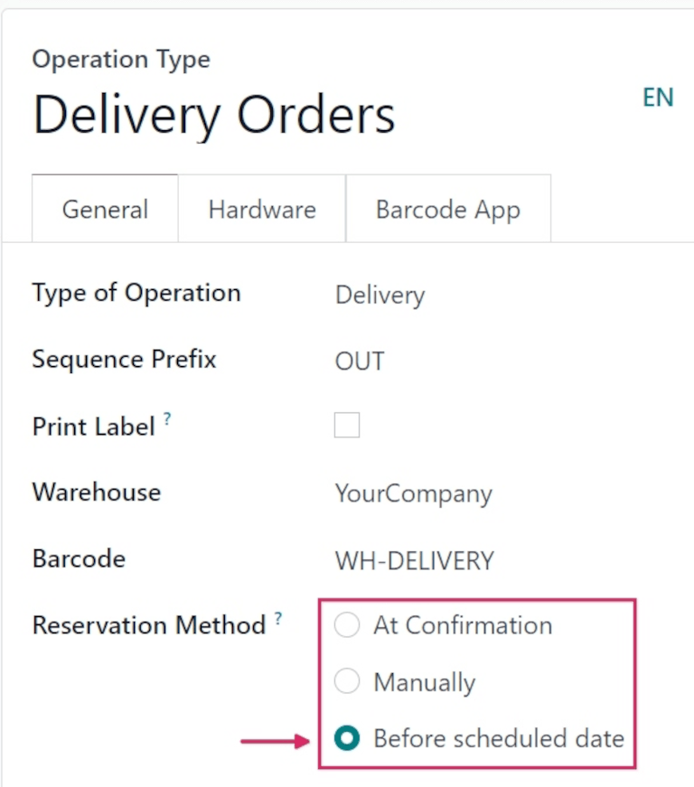
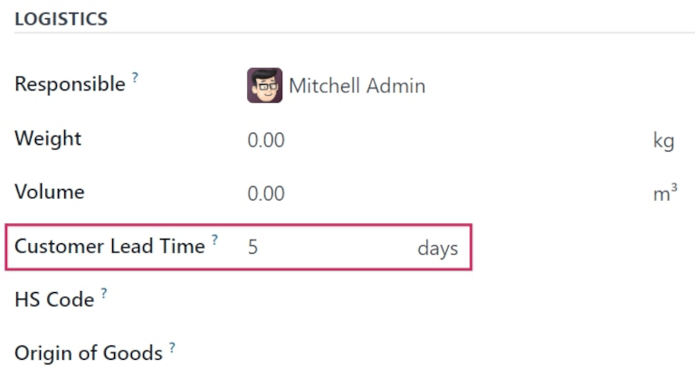
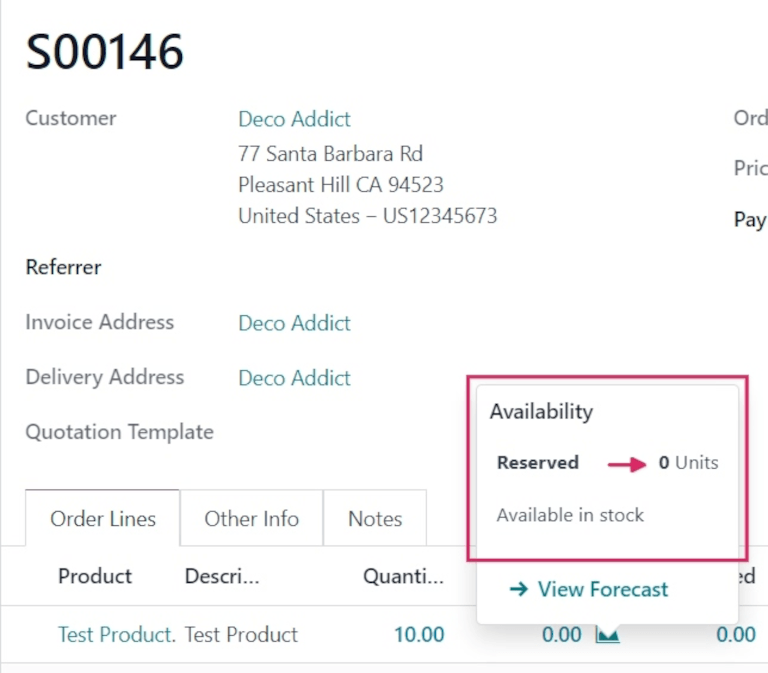
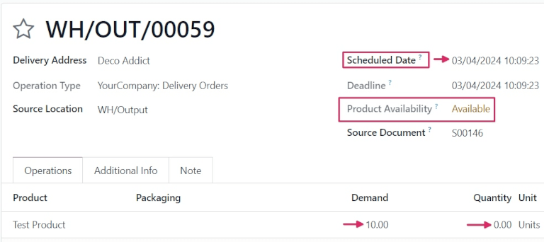

# Before scheduled date reservation

The *Before scheduled date* reservation method allows users to select a specific number of days that
act as the maximum number of days **before** a scheduled delivery date, when products included in a
sales order (SO) should be reserved.

#### SEE ALSO
[About reservation methods](applications/inventory_and_mrp/inventory/shipping_receiving/reservation_methods.md)

## Cấu hình

To set the reservation method to *Before scheduled date*, navigate to Inventory app
‣ Configuration ‣ Operations Types. Then, select the desired Operation Type to
configure, or create a new one by clicking New.

In the General tab, locate the Reservation Method field, and select
Before scheduled date.

#### NOTE
When the Type of Operation is changed to Receipt on an
Operations Type form, reservation methods are **not** available.

Once selected, a new Reserve before scheduled date field appears below. From this field,
the number of days before and days before when starred can be changed from
the default `0`.

Changing the days before value changes the maximum number of days before a scheduled
date that products should be reserved.

Changing the days before when starred value changes the maximum number of days before a
scheduled date that products should be reserved if the transfers are starred (favorited).

### Edit product form

Before the *Before scheduled date* reservation method can be used, ensure that a *customer lead
time* is added to products that plan to be sold with this method.

To do that, navigate to Inventory app ‣ Products ‣ Products, and select the
desired product to configure.

On the product form, click the Inventory tab, and under the Logistics
section, change the value in the Customer Lead Time field.

For this example workflow, change it to `5` days.

This sets the scheduled delivery date for this specific product to five days after the creation date
of the sales order.

## Quy trình

To see the *Before scheduled date* reservation method in action, create a new  by navigating to
Sales app ‣ New.

Add a customer in the Customer field, then, in the Order Lines tab, click
Add a product, and select a product from the drop-down menu that has a configured
*customer lead time*, to add to the quotation form.

Finally, in the Quantity column, adjust the desired quantity of the product to sell.

For this sample workflow, set the Quantity to `10`.

Once ready, click Confirm to confirm the sales order.

Click the green 📈 (area graph) icon on the product line to reveal the product's
Availability tooltip. This tooltip reveals the reserved number of units for this order.
Because the reservation method is set to *Before scheduled date*, the Reserved quantity
reads `0 Units`.

However, below that quantity reads `Available in stock`. This is because the quantity is available,
but the scheduled date, for this example workflow, is five days from the order date.

Since reservation is not until two days before the scheduled delivery, it will not reserve the
products until then.

#### NOTE
If there is **not** sufficient quantity of stock for the product included in the , the
📈 (area graph) icon is red, instead of green.

Instead of revealing the reserved number of units for the order, the Availability
tooltip reads Reserved, and reveals the available number of units (e.g., `0 Units`).

Additionally, unless there is a set replenishment or a live receipt, it also reads No
future availability, in red text.

Click the Delivery smart button to see the delivery order form.

On the delivery order form, the status in the Product Availability field is listed as
`Available`, in yellow text, instead of green. This is because there is sufficient stock on-hand for
this order, but no quantity has been reserved yet.

Note the Scheduled Date field, above the Product Availability field,
displays the date five days from the order creation date. This indicates that the products are not
reserved until three days from today's date (two days before the scheduled delivery date).

In the Operations tab on the Product line, the numbers in the
Demand column and the Quantity column do not match (in this case, the
Demand column lists `10.00`, while the Quantity column lists `0`).

The Quantity column lists `0` because the products aren't reserved until two days
*before* their delivery date. Odoo automatically reserves the products once the scheduled date
arrives, at which point the Demand and Quantity columns will match.

#### SEE ALSO
- [Manual reservation](applications/inventory_and_mrp/inventory/shipping_receiving/reservation_methods/manually.md)
- [At confirmation reservation](applications/inventory_and_mrp/inventory/shipping_receiving/reservation_methods/at_confirmation.md)
