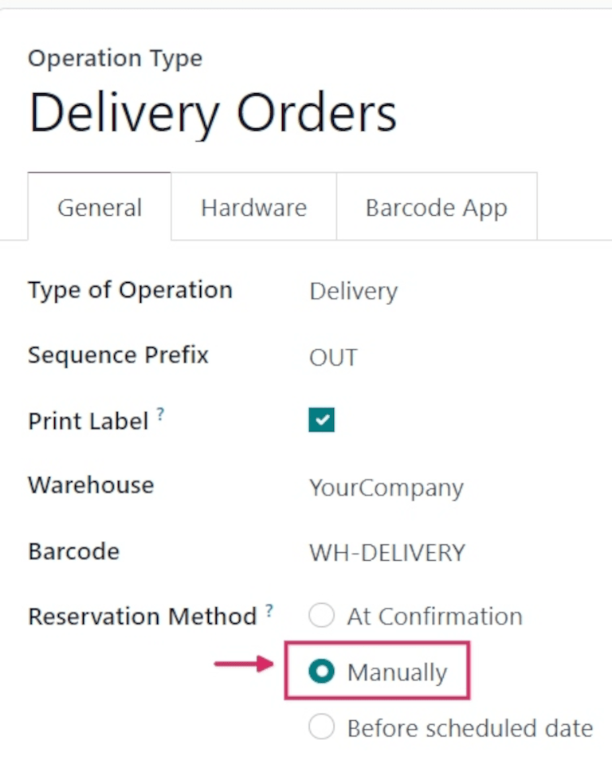
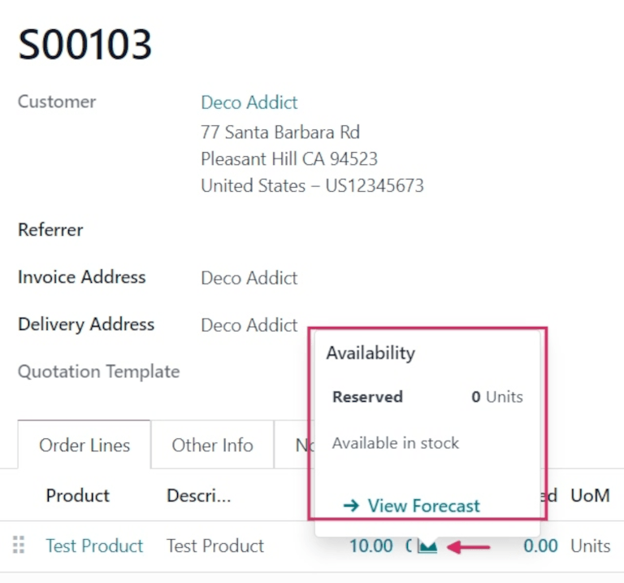
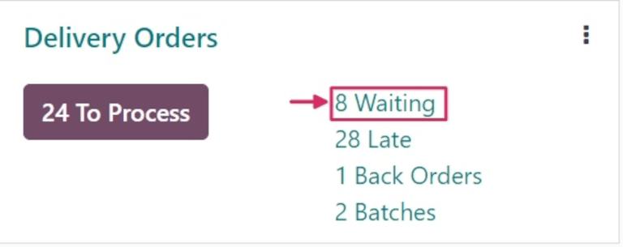
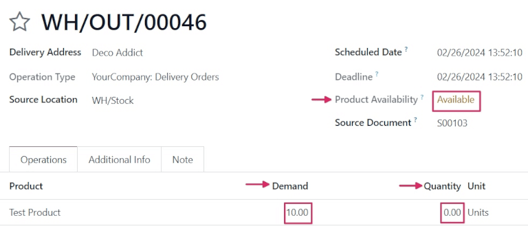

# Manual reservation

Unlike the *At Confirmation* reservation method, the *Manually* reservation method does **not**
reserve products automatically.

Instead, once a sales order (SO) is confirmed, product availability **must** be checked manually,
and the required quantity **must** be reserved manually.

#### SEE ALSO
[About reservation methods](../reservation_methods.md)

## Cấu hình

To set the reservation method to *Manually*, navigate to Inventory app ‣
Configuration ‣ Operations Types. Then, select the desired Operation Type to be
configured, or create a new one by clicking New.

In the General tab, locate the Reservation Method field, and select
Manually.

#### NOTE
When the Type of Operation is changed to Receipt on an
Operations Type form, reservation methods are **not** available.

## Quy trình

To see the *Manually* reservation method in action, create a new  by navigating to
Sales app ‣ New.

Add a customer in the Customer field. Then, in the Order Lines tab, click
Add a product, and select a product to add to the quotation from the drop-down menu.
Finally, in the Quantity column, adjust the desired quantity of the product to sell.

Once ready, click Confirm to confirm the sales order.

Click the green 📈 (area graph) icon on the product line to reveal the product's
Availability tooltip. This tooltip reveals the reserved number of units for this order.
Because the reservation method is set to *Manually*, the Reserved quantity reads `0
Units`.

However, below that quantity reads `Available in stock`. This is because the quantity is available,
but must be manually reserved.

#### NOTE
If there is **not** sufficient quantity of stock for the product included in the , the
📈 (area graph) icon is red, instead of green.

Instead of revealing the reserved number of units for the order, the Availability
tooltip reads Reserved, and reveals the available number of units (e.g., `0 Units`).

Additionally, unless there is a set replenishment or a live receipt, it also reads No
future availability, in red text.

Once the  is confirmed, navigate to the Inventory app, and locate the
Delivery Orders card on the Inventory Overview page.

The Delivery Orders card displays the current status of live orders, including those
with a Waiting status. Orders with this status indicate that the products in those
orders have either not been reserved yet, or are not in stock at all.

To see the  created previously, click the (#) Waiting button on the card (in this
case, `8 Waiting`).

Locate the delivery order (DO) tied to the  that was previously created, and click the line to
view it.

On the Delivery Order form, the status in the Product Availability field is
listed as `Available`, in yellow text, instead of green. This is because there is sufficient stock
on hand for this order, but no quantity has been reserved yet.

In the Operations tab, on the Product line, the numbers in the
Demand column and the Quantity column do *not* match.

In this case, the Demand column lists `10.00`, while the Quantity column
lists `0`.

To manually reserve the specified quantity of the product for this order, click the
Check Availability button at the top of the form. Doing so turns the `Available` status
in the Product Availability field green, and changes the number in the
Quantity column to match the Demand column.

This is because there is sufficient quantity in stock to reserve for the order.

Once ready, click Validate.

#### SEE ALSO
- [At confirmation reservation](at_confirmation.md)
- [Before scheduled date reservation](before_scheduled_date.md)
