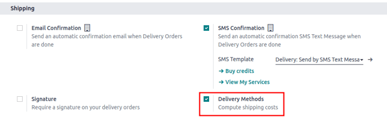
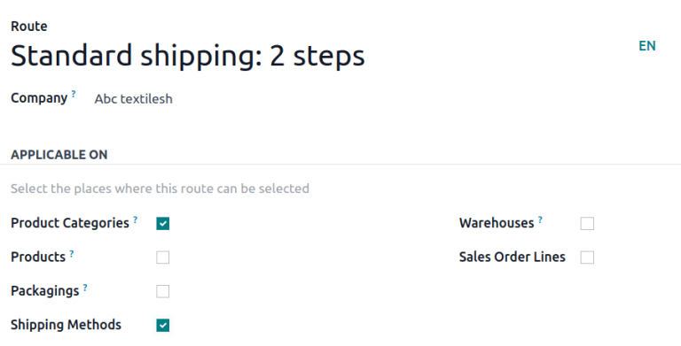
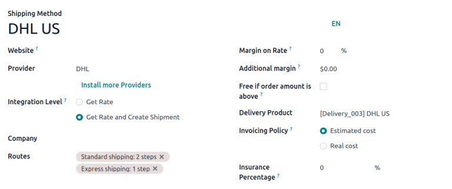

# Delivery methods

When activated in Odoo, the *Delivery Methods* setting adds the option of calculating the cost of
shipping on sales orders and e-commerce shopping carts.

When integrated with a [third-party carrier](applications/inventory_and_mrp/inventory/shipping_receiving/setup_configuration/third_party_shipper.md#inventory-shipping-third-party), shipping prices
are calculated based on the carrier's pricing and packaging information.

#### SEE ALSO
- [Third-party shipping carrier setup](applications/inventory_and_mrp/inventory/shipping_receiving/setup_configuration/third_party_shipper.md#inventory-shipping-third-party)
- [Odoo Tutorials: Delivery Prices](https://www.odoo.com/slides/slide/delivery-prices-613?fullscreen=1)

## Cấu hình

To calculate shipping on sales orders and e-commerce, the *Delivery Costs* module must be installed.
To do so, navigate to the Apps application from the main Odoo dashboard.

Then, remove the Apps filter, and type in `Delivery Costs` in the Search...
bar. After finding the Delivery Costs module, click Activate to install it.

## Thêm phương thức vận chuyển

To configure delivery methods, go to Inventory app ‣ Configuration ‣ Shipping
Methods.

#### NOTE
If the Shipping Methods option is not available from the Configuration
drop-down menu, verify whether the feature is enabled by following these steps:

1. Go to Inventory app ‣ Configuration ‣ Settings.
2. Scroll to the Shipping section and enable the Delivery Methods feature
   by checking the corresponding checkbox.

On the Shipping Methods page, add a method by clicking New. Doing so opens
a form to provide details about the shipping provider, including:

- Shipping Method (*Required field*): the name of the delivery method (e.g. `flat-rate
  shipping`, `same day delivery`, etc.).
- Provider (*Required field*): choose the delivery service, like Fedex, if using a
  [third-party carrier](applications/inventory_and_mrp/inventory/shipping_receiving/setup_configuration/third_party_shipper.md#inventory-shipping-third-party). Ensure the integration with the
  shipping carrier is properly installed and select the provider from the drop-down menu.

  For more details on configuring custom shipping methods, such as [fixed price](#inventory-shipping-fixed), [based on rules](#inventory-shipping-rules), or [pickup in
  store](#inventory-shipping-pickup) options, refer to their respective sections below.
- Website: configure shipping methods for an e-commerce page. Select the applicable
  website from the drop-down menu, or leave it blank to apply the method to all web pages.
- Company: If the shipping method should apply to a specific company, select it from the
  drop-down menu. Leave the field blank to apply the method to all companies.
- Routes: select the applicable route(s) to define different delivery methods, such as
  standard or express shipping, based on varying lead times. For more information, jump
  to the [Set routes on shipping method](#inventory-shipping-receiving-shipping-route) section.

- Delivery Product (*Required field*): the product listed on the [sales order line](#inventory-shipping-sales-order) as the delivery charge.
- Free if order amount is above: checking this box enables free shipping if the customer
  spends above the specified amount.

For examples on how to configure specific shipping methods, refer to the sections below.

### Giá cố định

To configure a shipping price that is the same for all orders, go to Inventory app
‣ Configuration ‣ Shipping Methods. Then, click New, and on the shipping method
form, set the Provider to the Fixed Price option. Selecting this option
makes the Fixed Price field become available, which is where the fixed rate shipping
amount is defined.

To enable free shipping if the amount of the order exceeds a specified amount, check the box
Free if order amount is above and fill in the amount.

### Based on rules

To calculate the price of shipping based on pricing rules, set the Provider field to the
Based on Rules option. Optionally, adjust Margin on Rate and
Additional margin to include additional shipping costs.

#### Create pricing rules

Navigate to the Pricing tab and click Add a line. Doing so opens the
Create Pricing Rules window, where the Condition related to the product
weight, volume, price, or quantity is compared to a defined amount to calculate the
Delivery Cost.

Once finished, click either Save & New to add another rule, or Save & Close.

To restrict shipping to specific destinations on the eCommerce website, in the shipping method form,
navigate to the Destination Availability tab and define the Countries,
States, and Zip Prefixes. Leave these fields empty if all locations apply.

#### Calculate delivery cost

Shipping cost is the Delivery cost specified in the rule that satisfies the
Condition, plus any extra charges from the Margin on rate and
Additional margin.

$$
Total = Rule's~Delivery~Cost + (Margin~on~rate \times Rule's~Delivery~Cost) + Additional~margin

$$

### Lấy hàng tại cửa hàng

To configure in-store pickup, select Pickup in store in the Provider field
and specify the pickup location in Warehouse.

To invoice the customer for the shipping cost to the pickup location, choose the Get Rate
and Create Shipment option in the Integration Level field. Then, pick either the
Estimated cost or Real cost radio options in the Invoicing
Policy field to decide whether the added shipping charge on the sales order is the precise cost
from the shipping carrier.

#### SEE ALSO
[Invoice cost of shipping](applications/inventory_and_mrp/inventory/shipping_receiving/setup_configuration/invoicing.md)

### Route on shipping method

Optionally, set different warehouse delivery processes for a shipping method by configuring
different [routes](applications/inventory_and_mrp/inventory/shipping_receiving/daily_operations/use_routes.md) for it.

To set up routes, go to Inventory app ‣ Configuration ‣ Routes. Click
New, or select the desired route.

On the route form, in the Applicable On section, tick the Shipping Methods
checkbox.

Then, go to Inventory app ‣ Configuration ‣ Shipping Methods, and select the
desired shipping method.

On the shipping method form, in the Routes field, select the available fulfillment
routes from the drop-down menu.

#### NOTE
If the desired route is not selectable, check that the *Shipping Methods* option is enabled in
the route's *Applicable On* section.

## Add shipping

Shipping methods can be added to sales orders in the form of delivery products, which appear as
individual line items. First, navigate to the desired sales order by going to Sales
app ‣ Orders ‣ Orders.

On the sales order, click the Add shipping button, which opens the Add a
shipping method pop-up window. Then, choose a Shipping Method from the list.

The Total Order Weight is pre-filled based on product weights (that are defined in the
Inventory tab for each product form). Edit the field to specify the exact weight, and
then click Add to add the shipping method.

#### NOTE
The amount defined in Total Order Weight overwrites the total product weights defined
on the product form.

The shipping cost is added to the *sales order line* as the Delivery Product detailed on
the shipping method form.

### Delivery order

The shipping method added to the sales order is linked to the shipping carrier details on the
delivery order. To add or change the delivery method on the delivery itself, go to the
Additional Info tab and modify the Carrier field.

* [Third-party shipping carriers](applications/inventory_and_mrp/inventory/shipping_receiving/setup_configuration/third_party_shipper.md)
* [Print shipping labels](applications/inventory_and_mrp/inventory/shipping_receiving/setup_configuration/labels.md)
* [Tích hợp Bpost](applications/inventory_and_mrp/inventory/shipping_receiving/setup_configuration/bpost.md)
* [Tích hợp DHL](applications/inventory_and_mrp/inventory/shipping_receiving/setup_configuration/dhl_credentials.md)
* [Tích hợp FedEx](applications/inventory_and_mrp/inventory/shipping_receiving/setup_configuration/fedex.md)
* [Sendcloud integration](applications/inventory_and_mrp/inventory/shipping_receiving/setup_configuration/sendcloud_shipping.md)
* [Vận chuyển Starshipit](applications/inventory_and_mrp/inventory/shipping_receiving/setup_configuration/starshipit_shipping.md)
* [Tích hợp UPS](applications/inventory_and_mrp/inventory/shipping_receiving/setup_configuration/ups_credentials.md)
* [Zebra label configuration](applications/inventory_and_mrp/inventory/shipping_receiving/setup_configuration/zebra.md)
* [How to cancel a shipping request to a shipper?](applications/inventory_and_mrp/inventory/shipping_receiving/setup_configuration/cancel.md)
* [Shipping cost invoicing](applications/inventory_and_mrp/inventory/shipping_receiving/setup_configuration/invoicing.md)
* [Change shipping label size](applications/inventory_and_mrp/inventory/shipping_receiving/setup_configuration/label_type.md)
* [Multi-package shipments](applications/inventory_and_mrp/inventory/shipping_receiving/setup_configuration/multipack.md)
* [Printable delivery PDFs](applications/inventory_and_mrp/inventory/shipping_receiving/setup_configuration/print_on_validation.md)
