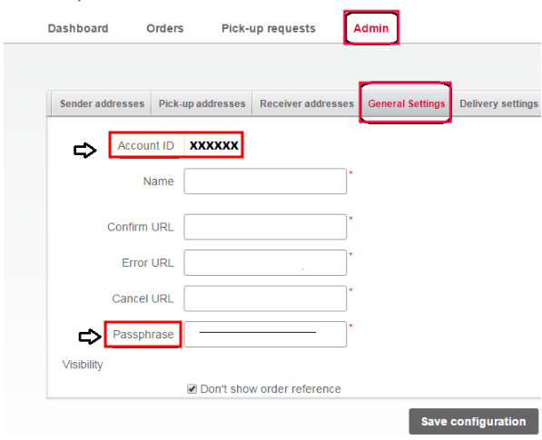

# Tích hợp Bpost

Set up the *Bpost* shipping connector in Odoo to manage Bpost shipments to clients directly within
Odoo. To configure it, complete these steps:

1. Create a Bpost account.
2. Get the [Account ID and passphrase](#inventory-shipping-receiving-bpost-account).
3. [Set up the shipping method in Odoo](#inventory-shipping-receiving-bpost-method).

Upon completion, it is possible to calculate the cost of shipping, based on package size and weight,
have the charges applied directly to a Bpost business account, and automatically print Bpost
tracking labels through Odoo.

#### SEE ALSO
- [Third-party shipping carriers](third_party_shipper.md)
- [Delivery methods](../setup_configuration.md)
- [Tích hợp DHL](dhl_credentials.md)
- [Tích hợp UPS](ups_credentials.md)

## Account setup

To begin, go to the [Bpost website](https://parcel.bpost.be/en/home/business) to create, or log
into, the company's Bpost business account. When creating the Bpost account, have the company's VAT
number and mobile phone number ready.

Follow the website's steps to complete registration, and sign up for shipping services. Doing so
submits a request to enter a contractual business relationship between the company and Bpost.

#### IMPORTANT
Odoo **cannot** be integrated with [non-business Bpost](https://www.odoo.com/r/Z4wZ) accounts.

After completing the setup, get the Bpost account ID and passphrase, by navigating to the
Shipping Manager menu item.

On the Shipping Manager page, go to the Admin tab, then the
General Settings tab, to find the Account ID and Passphrase
needed to configure Odoo's shipping method.

## Shipping method configuration

With those necessary credentials, configure the Bpost shipping method in Odoo by going to
Inventory app ‣ Configuration ‣ Shipping Methods.

On the Shipping Methods page, click Create.

In the Provider field, select Bpost from the drop-down menu. Doing so
reveals the Bpost Configuration tab at the bottom of the form, where the Bpost
credentials can be entered.

For details on configuring the other fields on the shipping method, such as Delivery
Product, refer to the [Configure third-party carrier](third_party_shipper.md) documentation.

#### NOTE
To generate Bpost [shipping labels](labels.md) through Odoo, ensure the Integration
Level option is set to Get Rate and Create Shipment.

In the Bpost Configuration tab, complete the following fields:

- Bpost Account Number (required field): enter the company's unique [account ID](#inventory-shipping-receiving-bpost-account) from the Bpost website.
- Passphrase (required field): enter the [passphrase](#inventory-shipping-receiving-bpost-account) from the Bpost website.
- Bpost Delivery Nature: select either Domestic or International
  shipping services. Choosing Domestic shows the Options section, while
  International enables the Bpost Shipment Type and Bpost Parcel
  Return Instructions fields.
- Bpost Package Type: select the type of shipping service from the drop-down menu.

  For [domestic delivery](https://www.odoo.com/r/uOVM), the options are: bpack 24h
  Pro, bpack 24h business, or bpack Bus.

  For [international delivery](https://www.odoo.com/r/s6G), the options are: bpack
  World Express Pro, bpack World Business, or bpack Europe Business.
- Bpost Shipment Type (required field): for international deliveries, declare the type
  of goods in the package as SAMPLE, GIFT, GOODS,
  DOCUMENTS, or OTHER.
- Bpost Parcel Return Address: return address when an international shipment fails to
  deliver. Select from the drop-down menu: Destroy, Return to sender by air,
  or Return to sender by road.
- Label Type: choose A6 or A4 label sizes from the drop-down
  menu.
- Label Format: choose PDF or PNG from the drop-down menu.

For domestic deliveries, these features are available in the Options section:

- Enable the Delivery on Saturday feature to include Saturdays as possible delivery
  dates. Depending on the Bpost Package Type selected, this option might incur
  additional costs to the company.
- Enable the Generate Return Label feature to automatically print a return label upon
  validating the delivery order.

