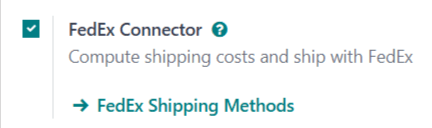
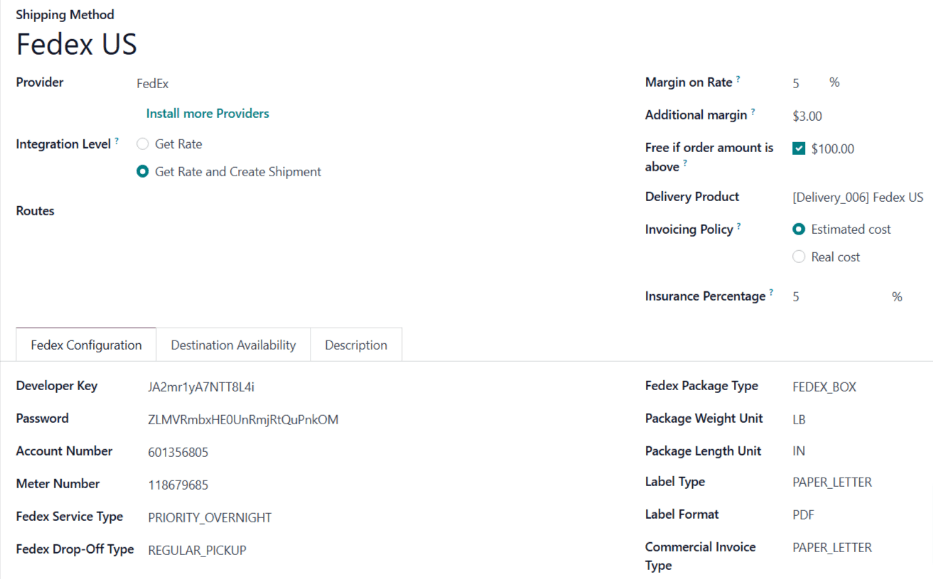

# Tích hợp FedEx

Integrating a FedEx account with Odoo's **Inventory** app makes it possible to [calculate
shipping rates](applications/inventory_and_mrp/inventory/shipping_receiving/setup_configuration.md), and [generate shipping labels](applications/inventory_and_mrp/inventory/shipping_receiving/setup_configuration/labels.md) within Odoo.
This is accomplished by enabling the FedEx *shipping connector*, then configuring at least one
*shipping method*.

#### NOTE
This documentation contains configuration details specific to FedEx integration. See the
documentation on [third-party shippers](applications/inventory_and_mrp/inventory/shipping_receiving/setup_configuration/third_party_shipper.md) for general shipper
integration instructions.

## Enable shipping connector

To enable the shipping connector for FedEx, navigate to Inventory app ‣
Configuration ‣ Settings. Scroll down to the Shipping Connectors section, and tick
the checkbox next to FedEx Connector.

Finally, click Save to save the changes. After doing so, a <i class="oi oi-arrow-right"></i>
FedEx Shipping Methods button appears below FedEx Connector.

## Configure shipping method

Once the FedEx shipping connector is enabled, it is necessary to configure at least one shipping
method. After doing so, the shipping method can be included in sales orders (SOs), and used to
compute shipping costs, and print shipping labels.

To enable a shipping method, navigate to Inventory app ‣ Configuration ‣
Settings, and click the FedEx Shipping Methods button below the FedEx
Connector checkbox. Doing so opens a page that shows all existing FedEx shipping methods.

#### NOTE
To see all shipping methods for every shipper with a connector enabled, navigate to
Inventory app ‣ Configuration ‣ Shipping Methods.

Select a shipping method to open its form. Alternatively, click New to open a blank
form, and configure a new shipping method.

#### IMPORTANT
Enabling the FedEx shipping connector automatically creates two default shipping methods:
FedEx US and FedEx International. Each of these methods are
pre-configured with test credentials, allowing them to be used for testing purposes.

Before the shipping method can be used to create actual shipments, the test credentials must be
replaced with credentials from a valid FedEx account.

### General information

At the very top of a shipping method form are fields used to configure the way the method operates
in Odoo. In the Provider field, select FedEx from the drop-down menu, if it
is not already selected.

The rest of the fields in this section are general to all shipping providers. For details on how to
fill them out, see the documentation on [third-party shippers](applications/inventory_and_mrp/inventory/shipping_receiving/setup_configuration/third_party_shipper.md).

### Fedex Configuration tab

The options in the Fedex Configuration tab of a FedEx shipping method form are used to
connect the method to a FedEx account, and configure the shipping details associated with the method
(drop-off type, package type, etc.).

A FedEx business account is required to obtain the information needed to fill out the fields in this
tab. To create a new account, navigate to FedEx's [Open Account](https://www.fedex.com/en-us/open-account.html) page, click on Create Account, and
follow the instructions.

#### Developer Key and Meter Number fields

A *developer key* is used to integrate a FedEx account with an external service, like the Odoo
**Inventory** app. A *meter number* is a unique ID number used by FedEx to identify negotiated
shipping rates for each account.

To get a developer key and meter number, begin by navigating to FedEx's [Developer Resource Center](https://www.fedex.com/en-us/developer/web-services.html). Then, click on the FedEx Web
Services drop-down menu.

Click Get Test Key to start the process of getting a developer key and meter number
which can be used to configure a shipping method for testing purposes.

Click Get Production Key to start the process of getting a developer key and meter
number, which can be used to configure a shipping method that generates real shipments with FedEx.

After clicking either option, follow the instructions until the Confirmation screen is
reached. This screen displays the developer key and meter number.

Once the developer key and meter number are determined, enter them in the Developer Key
and Meter Number fields on the Fedex Configuration tab of the shipping
method form.

#### Password and Account Number fields

A *password* is used, along with a username, to log into a FedEx account. An *account number* is the
unique number assigned to each FedEx account.

To find a FedEx account number, log in to a FedEx account at [https://www.fedex.com](https://www.fedex.com). Click on the
account holder's name in the top-right corner of the screen, and select My Profile
from the drop-down menu.

On the profile page, click Account Management on the left side of the screen. The
account number is displayed on this screen.

Once the password and account number are determined, enter them in the Password and
Account Number fields on the Fedex Configuration tab of the shipping method
form.

#### Thông tin vận chuyển

The main section of the Fedex Configuration tab includes a number of additional fields
used provide information about the shipping method:

- Fedex Service Type: The FedEx service used to ship a package.
- Fedex Drop-Off Type: The method for getting a package into FedEx's possession.
- Fedex Package Type: The type of package used for the shipping method.
- Package Weight Unit: The unit of measure used to weigh packages.
- Package Length Unit: The unit of measure used to determine the dimensions of packages.
- Label Type: The type of shipping label used for packages.
- Label Format: The file format used by Odoo to generate shipping labels.
- Commercial Invoice Type: The dimensions and type of the paper used to print invoices.

#### IMPORTANT
The options that should be selected on the Fedex Configuration tab of a shipping
method depend on the negotiated shipping services of the associated FedEx account. To confirm the
available services for a FedEx account, visit the *Account Management* page after logging in to
the FedEx website, or speak with a customer service representative.

#### Phần Tuỳ chọn

The Options section of the Fedex Configuration tab provides a few additional
options to further configure the shipping method:

- Saturday Delivery: Tick the checkbox to allow packages shipped with the delivery
  method to be delivered on Saturdays.
- Generate Return Label: Tick the checkbox to automatically generate a return label upon
  validation of a delivery order.
- Duties paid by: Use the drop-down menu to select whether duty charges should be paid
  by the Sender or Recipient.

## Activate shipping method

By default, shipping methods in Odoo are created within a *test environment*. This means they can
only be used for testing purposes, and are unable to generate actual shipping orders.

To activate a shipping method in a *production environment*, click the <i class="fa fa-stop"></i>
Test Environment smart button at the top of the shipping method form. After doing so,
the smart buttons changes to read <i class="fa fa-play"></i> Production Environment.

With the production environment enabled, validating a delivery order using the shipping method
generates an actual shipping label with FedEx.

Click the <i class="fa fa-play"></i> Production Environment smart button to return the shipping
method to a test environment.

#### WARNING
**Do not** enable the production environment for a shipping method before it is ready to be used
for actual shipping orders. Doing so may lead to the creation of unwanted charges with FedEx.
