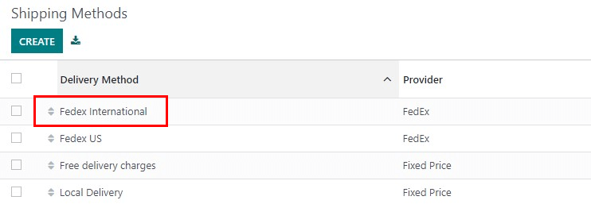
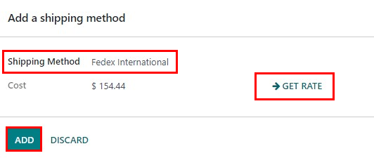

# Change shipping label size

## Tổng quan

In Odoo, there are a variety of different types of shipping labels that can be selected for delivery
orders. Depending on the types of shipping packages used, different label sizes may be more
appropriate, and can be configured to fit the package.

## Cấu hình

In the Inventory module, go to Configuration ‣ Delivery ‣
Shipping Methods. Click on a delivery method to choose it. For the following example, *FedEx
International* will be used.

In the Configuration tab, under Label Type, choose one of the label types
available. The availability varies depending on the carrier.

When a sales order with the corresponding shipping company is confirmed and a delivery order is
validated, the shipping label will be automatically created as a PDF and appear in the
Chatter.

## Create a sales order

In the Sales application, click Create and select an international
customer. Click Add A Product and select an item. Click Add Shipping, select
a shipping method, then click Get Rate, and finally, click Add.

Once the quotation is confirmed by clicking Confirm, a Delivery smart button
will appear.

Once the delivery order is validated by clicking Validate in the delivery order, the
shipping documents appear in the Chatter.

## Example labels

The default Label Type is Paper Letter. An example of a FedEx letter sized
label is:

For comparison, an example of a FedEx bottom-half label is:

