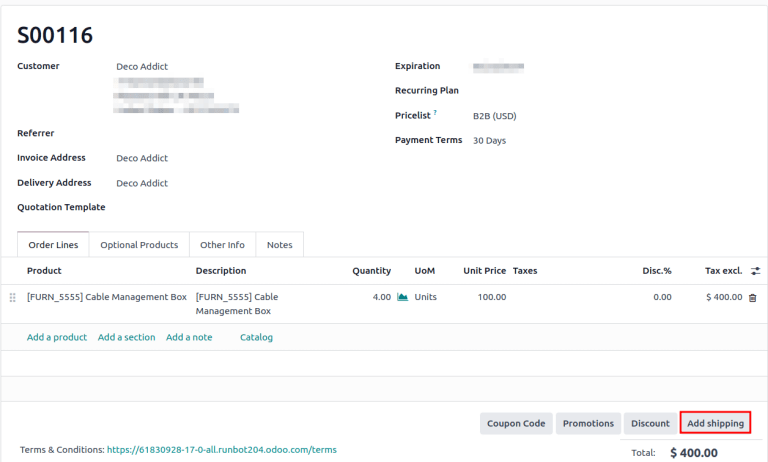

# Print shipping labels

Integrate Odoo with [third-party shipping carriers](third_party_shipper.md) to automatically generate shipping labels that
includes prices, destination addresses, tracking numbers, and barcodes.

#### SEE ALSO
[Automatically print shipping carrier labels](print_on_validation.md#inventory-shipping-receiving-carrier-labels)

## Cấu hình

To generate labels for a third-party shipping carrier, first [install the third-party shipping
connector](third_party_shipper.md). Then, configure and activate the
[delivery method](third_party_shipper.md#inventory-shipping-receiving-configure-delivery-method), being sure to set
the Integration Level to Get Rate and Create Shipment to generate shipping
labels. Finally, provide the company's [source address](third_party_shipper.md#inventory-shipping-receiving-configure-source-address) and [product weights](third_party_shipper.md#inventory-shipping-receiving-configure-weight).

#### SEE ALSO
[Third-party shipping carriers](third_party_shipper.md)

### Labels for multi-step

For companies using [two](../daily_operations/receipts_delivery_two_steps.md) or [three step
delivery](../daily_operations/delivery_three_steps.md), labels can be triggered to print after
validating the picking or packing operation. To do that, go to Inventory app ‣
Configuration ‣ Operations Types, and choose the desired operation.

On the Operation Type configuration page, tick the Print Label checkbox.
Enabling this feature ensures that the third-party shipping label is printed upon validating this
operation.

## Print tracking labels

Tracking labels are printed when specific operations are validated. By default, validating a
delivery order (DO) generates a tracking label in the chatter.

#### NOTE
For companies using two or three step delivery, refer to the [printing labels for multi-step
delivery](#inventory-shipping-receiving-picking-config) section to learn how to print the label
after validating a picking or packing operation.

Khi cả hai ứng dụng *Bán hàng* và *Tồn kho* đều được cài đặt, hãy bắt đầu từ ứng dụng Bán hàng và đi đến báo giá hoặc đơn bán hàng (SO) mong muốn. Tại đó, hãy [thêm phí vận chuyển](#inventory-shipping-receiving-add-shipping-quote) vào đơn hàng. Sau đó, chuyển đến  liên kết - hoặc loại hoạt động khác khi sử dụng giao hàng nhiều bước - để xác nhận hoạt động và in nhãn.

If only the *Inventory* app is installed, create  directly in the
Inventory app, [add the third-party carrier](#inventory-shipping-receiving-validate-print-label) in the Carrier field, and validate
the .

### Add shipping on quotation

To generate a tracking label for an order, begin by creating a quotation in Sales
app ‣ Orders ‣ Quotations, clicking New, and filling out the quotation form. Then,
click the Add Shipping button in the bottom-right corner of the quotation.

In the resulting pop-up window, select the intended carrier from the Shipping Method
drop-down menu. The Total Order Weight field is automatically populated, based on the
[weight of products in the order](third_party_shipper.md#inventory-shipping-receiving-configure-weight). Modify this
field to overwrite the predicted weight, and use this weight to estimate the cost of shipping.

Next, click Get Rate to display the shipping cost for the customer, via the third-party
carrier in the Cost field.

#### IMPORTANT
If clicking Get Rate results in an error, ensure the [warehouse's address](third_party_shipper.md#inventory-shipping-receiving-configure-source-address) and [weight of products in the
order](third_party_shipper.md#inventory-shipping-receiving-configure-weight) are properly configured.

Click Add to add the cost to the quotation, which is listed as the [configured
delivery product](./#inventory-shipping-receiving-delivery-product). Finally, click
Confirm on the quotation, and click the Delivery smart button to access the
.

### Validate delivery order

On a delivery order form, navigate to the Additional Info tab to ensure the third-party
shipping carrier has been added to the Carrier field.

#### IMPORTANT
If the *Sales* app is not installed, the third-party carrier is set in the Carrier
field.

After the items in the order have been packed, click Validate to get the shipping
carrier's tracking number, and generate the shipping label.

#### NOTE
Create or select an existing delivery order by going to the Inventory app, and
selecting the Delivery Orders card.

The Tracking Reference number is generated in the Additional Info tab of the
delivery order. Click the Tracking smart button to access the tracking link from the
shipping carrier's website.

The tracking label is found in PDF format in the chatter.

#### NOTE
For multi-package shipping, one label is generated per package. Each label appears in the
chatter.

#### SEE ALSO
- lập hoá đơn
- nhiều kiện hàng
