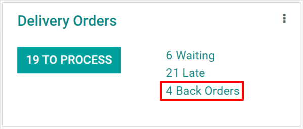

# Multi-package shipments

Trong một số trường hợp, lệnh giao hàng với nhiều mặt hàng có thể cần được vận chuyển thành nhiều kiện hàng. Điều này có thể cần thiết nếu các mặt hàng quá lớn để đóng chung một kiện, hoặc nếu một số mặt hàng không thể đóng gói cùng nhau. Việc chia một lệnh giao hàng thành nhiều kiện giúp linh hoạt trong cách đóng gói từng mặt hàng mà không cần tạo nhiều lệnh giao hàng riêng biệt.

## Cấu hình

In order to split a delivery order across multiple packages, the *Packages* setting must be enabled.
To do so, navigate to Inventory ‣ Configuration ‣ Settings, then enable the
checkbox next to Packages. Click Save to confirm the change.

## Ship items in multiple packages

To split items in the same delivery order across multiple packages, begin by navigating to
Inventory ‣ Delivery Orders, then select a delivery order that has multiple
items, a multiple quantity of the same item, or both.

On the Operations tab, select the ⁞≣ (menu) icon in the line of the product
that will be shipped in the first package.

This makes a Detailed Operations pop-up window appear. In the table at the bottom of the
pop-up window, the Reserved column shows the total quantity of the product included in
the delivery order.

Nếu toàn bộ số lượng sẽ được giao trong kiện hàng đầu tiên, hãy nhập số từ cột Hoàn tất vào cột Đã giữ trữ. Nếu chỉ giao một phần số lượng trong kiện hàng đầu tiên, hãy nhập một số nhỏ hơn so với số xuất hiện trong cột Đã dự trữ. Nhấp Xác nhận để xác nhận số lượng Hoàn tất và đóng cửa sổ bật lên.

Repeat the same steps for every item quantity that is included in the first package. Then, click
Put In Pack to create a package with all of the selected items.

For the next package, follow the same steps as detailed above, marking the quantity of each item to
be included in the package as Done before clicking Put In Pack on the
delivery order. Continue doing so until the full quantity of all items are added to a package.

Finally, after all of the packages have been shipped, click Validate to confirm that the
delivery order has been completed.

## Create a backorder for items to be shipped later

If some items will be shipped at a later date than others, there is no need to put them in a package
until they are ready to be shipped. Instead, create a backorder for the items being shipped later.

Bắt đầu bằng cách giao các mặt hàng sẽ được giao ngay. Nếu chúng sẽ được vận chuyển trong nhiều kiện hàng, hãy làm theo [các bước trên](#inventory-shipping-multiple-packages) để đóng gói theo yêu cầu. Nếu chúng sẽ được vận chuyển trong một kiện hàng duy nhất, chỉ cần đánh dấu số lượng của từng mặt hàng được vận chuyển trong cột Hoàn tất, nhưng **không** nhấp vào nút Đóng hàng thành kiện.

After all quantities being shipped immediately are marked as Done, click the
Validate button, and a Create Backorder? pop-up window appears. Then, click
the Create Backorder button. Doing so confirms the items being shipped immediately and
creates a new delivery order for the items that will be shipped later.

The backorder delivery order will be listed in the chatter of the original delivery order in a
message that reads The backorder WH/OUT/XXXXX has been created.. Click on
WH/OUT/XXXXX in the message to view the backorder delivery order.

The backorder delivery order can also be accessed by navigating to Inventory,
clicking the # Back Orders button on the Delivery Orders card, and selecting
the delivery order.

Once the remaining items are ready to be shipped, navigate to the backorder delivery order. The
items can be shipped in a single package by clicking Validate and selecting
Apply on the Immediate Transfer? pop-up window that appears, or shipped in
multiple packages by following the steps detailed in the section above.

It is also possible to ship out some of the items while creating another backorder for the rest. To
do so, simply follow the same steps used to create the first backorder.
