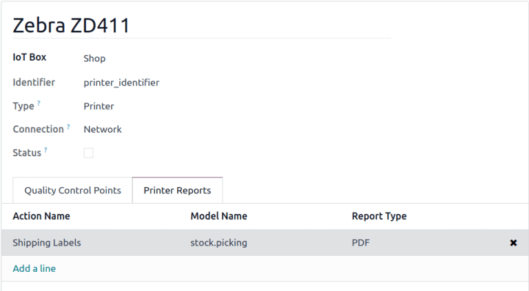
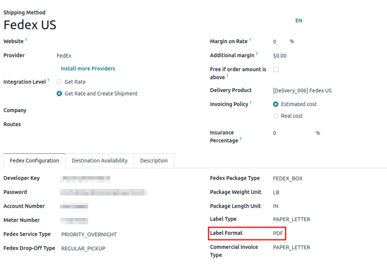

# Printable delivery PDFs

Automatically print delivery-related PDFs documents and labels in Odoo, containing package recipient
details, contents, or handling instructions.

The following PDFs can be configured to print upon validating an *Inventory* operation (e.g.
receipt, picking, delivery orders, quality checks):

1. [Phiếu giao hàng](#inventory-shipping-receiving-delivery-slip)
2. [Phiếu trả hàng](#inventory-shipping-receiving-return-slip)
3. [Product labels of items in the order](#inventory-shipping-receiving-product-labels)
4. [Lot and serial number labels](#inventory-shipping-receiving-lot-sn-labels)
5. [Nhãn đơn vị vận chuyển](#inventory-shipping-receiving-carrier-labels)
6. [Xuất tài liệu](#inventory-shipping-receiving-export-doc)
7. [Thành phần kiện hàng](#inventory-shipping-receiving-package-content)
8. [Nhãn kiện hàng](#inventory-shipping-receiving-package-label)

To automatically print these forms, navigate to Inventory app ‣ Configuration ‣
Operations Types, and select the desired operation type.

In the Hardware tab, tick each of the desired options available in the Print
on Validation section to download the PDF of those selected documents automatically after
validating the Operation Type. For details on what each of the checkbox options do, jump
to the related section.

## Delivery slip

A *delivery slip* contains recipient and package details, usually placed inside (or attached to) the
package.

#### SEE ALSO
- [Bảng kê hàng hoá](applications/inventory_and_mrp/inventory/shipping_receiving/picking_methods/batch.md#inventory-warehouses-storage-barcode-picking)
- [Nhãn theo dõi](applications/inventory_and_mrp/inventory/shipping_receiving/setup_configuration/labels.md)

After [enabling the Delivery Slip setting](#inventory-shipping-receiving-print-setup) in the
Hardware tab configuration options, clicking Validate on the desired
operation type downloads a PDF of the delivery slip.

The delivery slip shows products, quantities, the delivery order reference number, and the total
order weight.

## Phiếu trả hàng

Print a *return slip* to include in a delivery for customer return packages. It identifies the
return, links to the sales order, and includes item details and customer information. It can also
include specific return instructions for the customer.

After [enabling the Return Slip setting](#inventory-shipping-receiving-print-setup) in the
Hardware tab configuration options, clicking Validate on the desired
operation type downloads a PDF of the return slip.

The return slip displays the company's return address, along with barcodes for both the order and
the return operation.

## Product labels

Print *product labels* to affix to items in an order, providing essential information, such as
product name, barcode, and price.

After navigating to the intended operation type (Inventory app ‣ Configuration ‣
Operations Types), in the Hardware tab, tick the Product Labels option.

Doing so makes the Print label as: drop-down menu visible, where each product label can
be printed as:

- 2 x 7 with price: PDF displays product name, barcode, and price, fitting two rows and
  seven columns of product labels per page.
- 4 x 7 with price: displays product name, barcode, and price, fitting four rows and
  seven columns of product labels per page.
- 4 x 12: displays product name and barcode. Fits four rows and twelve columns of
  product labels per page.
- 4 x 12 with price: displays product name, barcode, and price. Fits four rows and
  twelve columns of product labels per page.
- ZPL Labels: prints labels in the Zebra Programming Language (ZPL) containing the
  product name and barcode. Readable for Zebra printers to automatically print labels.
- ZPL Labels with price: prints labels in the 
  containing the product name, barcode, and price.

#### NOTE
Product labels can be manually printed from any delivery order, by clicking the Print
Labels button.

## Nhãn số lô/sê-ri

Print *lot/SN labels* to affix to items in an order, providing essential information, such as
product name, lot or serial number, and the barcode.

To automatically print this PDF, navigate to the intended operation type's options page
(Inventory app ‣ Configuration ‣ Operations Types). Then, in the
Hardware tab, tick the Lot/SN Labels option.

Doing so makes the Print label as: drop-down menu visible, where each product label can
be printed as:

- 4 x 12 - One per lot/SN: PDF with labels for unique lot/serial numbers in the order,
  including product name, lot/serial number, and barcode. Fits four rows and twelve columns per
  page.
- 4 x 12 - One per unit: PDF with labels matching the quantity of items, displaying the
  product name, lot/serial number, and barcode. Fits four rows and twelve columns per page.
- ZPL Labels - One per lot/SN: prints labels in , containing the product name, lot/serial number, and barcode.
- ZPL Labels - One per unit: prints labels with the quantity of items in , containing the product name, lot/serial number, and barcode.

## Carrier labels

To automatically print a *carrier label* with the recipient address, tracking number, and carrier
details for specific third-party shipping carriers, complete the following setup:

1. Tick the Carrier Labels checkbox in the [operation type settings](#inventory-shipping-receiving-print-setup).
2. [Connect a printer](applications/general/iot/devices/printer.md) to Odoo's *IoT* app.
3. [Assign the carrier label to the printer](#inventory-shipping-receiving-assign-printer).
4. Configure the shipping method's [label type](#inventory-shipping-receiving-label-type).

### Assign printer

Refer to the [Connect a printer](applications/general/iot/devices/printer.md) documentation for
details on connecting a printer to Odoo's *IoT* app. Upon completion, assign the carrier label to
the printer, by navigating to IoT app ‣ Devices, and selecting the desired
printer.

In the printer configuration form, go to the Printer Reports tab to configure the types
of documents the printer automatically prints. Click Add a line to open the
Add: Reports pop-up window. In the Search... bar, type `Shipping`, and
select Shipping Labels.

#### NOTE
The Shipping Documents report is for [export documents](#inventory-shipping-receiving-export-doc).

After adding the Shipping Labels report in the Printer Reports tab, ensure
the Report Type matches the IoT-connected printer's type.

- For laser printers, set the Report Type to PDF.
- For Zebra printers, set the Report Type to Text.

### Shipping carrier label type

Next, complete the setup for the [third-party shipping connector](applications/inventory_and_mrp/inventory/shipping_receiving/setup_configuration/third_party_shipper.md). After that, go to Inventory app ‣
Configuration ‣ Shipping Methods, and select the desired shipping method.

On the shipping method configuration form, in the [carrier name] Configuration tab,
ensure the Label Format matches the [report type assigned earlier](#inventory-shipping-receiving-assign-printer):

- For laser printers, set the Label Format to PDF.
- For Zebra printers, set the Label Format to ZPL2.

### Example carrier label

After validating the operation, the carrier label is generated in the chatter, and printed using the
IoT-connected printer.

#### SEE ALSO
[Print carrier labels](applications/inventory_and_mrp/inventory/shipping_receiving/setup_configuration/labels.md)

## Export document

An *export document*, required by customs to ship packages from one country to another, can be
automatically printed in Odoo by following these steps:

1. Tick the Export Documents checkbox in the [operation type settings](#inventory-shipping-receiving-print-setup).
2. [Connect a printer](applications/general/iot/devices/printer.md) to Odoo's *IoT* app.
3. Assign the export document to the printer.

### Assign printer

Similar to the [printer assignment instructions for carrier labels](#inventory-shipping-receiving-assign-printer), after connecting a compatible printer to the Odoo
*IoT* app, go to IoT app ‣ Devices, and select the desired printer.

In the printer configuration form, go to the Printer Reports tab, and click
Add a line. In the Add: Reports pop-up window that appears, add the
Shipping Documents report to assign the export document to the printer.

## Package content

A *package content* PDF includes the package's barcode, packed date, along with a list of contained
products and quantities.

To print this form automatically, go to Inventory app ‣ Configuration ‣
Operation Types, and select the desired operation type. Then, go to the Hardware tab,
and tick the Package Contents checkbox.

#### IMPORTANT
If the option is not available, enable the [Packages](applications/inventory_and_mrp/inventory/product_management/configure/package.md) feature, by going to Inventory app
‣ Configuration ‣ Settings, ticking the Packages checkbox, and clicking
Save.

After enabling the feature in the Hardware tab, validating the operation prints a PDF of
the package contents.

## Package label

A *package label* that shows the package's barcode and pack date can be configured to print upon
clicking the *Put in Pack* button.

#### IMPORTANT
The Put in Pack button is available **only** when the [Packages](applications/inventory_and_mrp/inventory/product_management/configure/package.md) feature is enabled in
Inventory app ‣ Configuration ‣ Settings.

After it is enabled, the Put in Pack button is available on all inventory operations
(e.g. receipt, pickings, internal transfers, delivery orders, etc.).

To automatically print the package label when the Put in Pack button is clicked, go to
Inventory app ‣ Configuration ‣ Operation Types. Select the desired operation
type, and tick the Package Label checkbox in the Hardware tab. Labels can be
printed in PDF or ZPL file formats, as defined in the Print label
as field.
