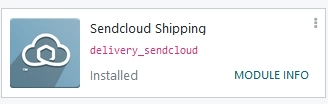

# Sendcloud integration

Sendcloud is a shipping service aggregator that facilitates the integration of European shipping
carriers with Odoo. Once integrated, users can select shipping carriers on inventory operations in
their Odoo database.

#### SEE ALSO
[Sendcloud integration documentation](https://support.sendcloud.com/hc/en-us/articles/360059470491-Odoo-integration)

## Thiết lập trong Sendcloud

### Create an account and activate carriers

To get started, go to [Sendcloud's platform](https://www.sendcloud.com) to configure the account
and generate the connector credentials. Log in with the Sendcloud account, or create a new one if
needed.

#### NOTE
For new account creation, Sendcloud will ask for a 
number or  number. After
completing the account setup, activate (or deactivate) the shipping carriers that will be used
in the Odoo database.

#### IMPORTANT
Odoo integration of Sendcloud works on free Sendcloud plans *only* if a bank account is linked,
since Sendcloud won't ship for free. To use shipping rules, or individual custom carrier
contacts, a paid plan of Sendcloud is **required**.

### Warehouse configuration

Once logged into the Sendcloud account, navigate to Settings ‣ Shipping ‣
Addresses, and fill in the field for Warehouse address.

To allow Sendcloud to process returns as well, a Return Address is required. Under the
Miscellaneous section, there is a field called Address Name (optional). The
Odoo warehouse name should be entered here, and the characters should be exactly the same.

### Generate Sendcloud credentials

In the Sendcloud account, navigate to Settings ‣ Integrations in the menu on the
right. Next, search for Odoo Native. Then, click on Connect.

After clicking on Connect, the page redirects to the Sendcloud API settings
page, where the Public and Secret Keys are produced. The next step is to name the
Integration. The naming convention is as follows: `Odoo CompanyName`, with the user's
company name replacing `CompanyName` (e.g. `Odoo StealthyWood`).

Then, check the box next to Service Points and select the shipping services for this
integration. After saving, the Public and Secret Keys are generated.

## Thiết lập trong Odoo

To ensure seamless Sendcloud integration with Odoo, [install](#inventory-shipping-receiving-sendcloud-module) and [link](#inventory-shipping-receiving-link-sendcloud-module) the Sendcloud shipping connector to the
Sendcloud account. Then, [configure Odoo fields](#inventory-shipping-receiving-sendcloud-shipping-info), so Sendcloud can accurately pull shipping
data to generate labels.

### Install Sendcloud shipping module

After the Sendcloud account is set up and configured, it's time to configure the Odoo database. To
get started, go to Odoo's Apps module, search for the `Sendcloud Shipping` integration,
and install it.

### Sendcloud shipping connector configuration

Once installed, activate the Sendcloud Shipping module in Inventory ‣
Configuration ‣ Settings. The Sendcloud Connector setting is found under the
Shipping Connectors section.

After activating the Sendcloud Connector, click on the Sendcloud Shipping
Methods link below the listed connector. Once on the Shipping Methods page, click
Create.

Fill out the following fields in the New Shipping Method form:

- Shipping Method: type `Sendcloud DPD`.
- Provider: select Sendcloud from the drop-down menu.
- Delivery Product: set the product that was configured for this shipping method or
  create a new product.
- In the SendCloud Configuration tab, enter the Sendcloud Public Key.
- In the SendCloud Configuration tab, enter the Sendcloud Secret Key.
- Manually Save the form by clicking the cloud icon next to the Shipping
  Methods / New breadcrumbs.

After configuring and saving the form, follow these steps to load the shipping products:

- In the SendCloud Configuration tab of the New Shipping Method form, click
  on the Load your SendCloud shipping products link.
- Select the shipping products the company would like to use for deliveries and returns.
- Nhấp Chọn.

### Thông tin vận chuyển

To use Sendcloud to generate shipping labels, the following information **must** be filled out
accurately and completely in Odoo:

1. **Customer information**: when creating a quotation, ensure the selected Customer has
   a valid phone number, email address, and shipping address.

   To verify, select the Customer field to open their contact page. Here, add their
   shipping address in the Contact field, along with their Mobile number and
   Email address.
2. **Product weight**: ensure all products in an order have a specified Weight in the
   Inventory tab of their product form. Refer to the [Product weight section](third_party_shipper.md#inventory-shipping-receiving-configure-weight) of this article for detailed instructions.
3. **Warehouse address**: ensure the warehouse name and address in Odoo match the [previously
   defined warehouse](#inventory-shipping-receiving-sendcloud-warehouse-config) in the Sendcloud
   setup. For details on warehouse configuration in Odoo, refer to the [warehouse configuration
   section](third_party_shipper.md#inventory-shipping-receiving-configure-source-address) of the third-party shipping
   documentation.

## Generate labels with Sendcloud

When creating a quotation in Odoo, add shipping and a Sendcloud shipping product. Then,
Validate the delivery. Shipping label documents are automatically generated in the
chatter, which include the following:

1. Shipping label(s) depending on the number of packages.
2. Return label(s) if the Sendcloud connector is configured for returns.
3. Customs document(s) should the destination country require them.

Additionally, the tracking number is now available.

#### IMPORTANT
When return labels are created, Sendcloud automatically charges the configured Sendcloud
account.

### Quy tắc vận chuyển

Optionally, create shipping rules to automatically generate shipping labels tailored to different
product needs. For example, a shipping rule can be created for customers shipping expensive jewelry
items to purchase insurance.

#### NOTE
Shipping rules do **not** affect [shipping rate calculations](third_party_shipper.md#inventory-shipping-receiving-third-party-rate), and are only used to improve the process of
[generating shipping labels](labels.md).

To use shipping rules, navigate to Inventory app ‣ Configuration ‣ Delivery:
Shipping Methods, and select the intended `Sendcloud` shipping method.

Under the Sendcloud Configuration tab, in the OPTIONS section, choose the
kind of shipments the shipping rules apply to, via the Use Sendcloud shipping rules
field.

From here, choose either: Shipping to customers, Returns from customers, or
Both.

Then, in the Sendcloud website, navigate to Settings ‣ Shipping rules. Create a
new shipping rule by clicking Create New.

In the Actions section, set a Condition to determine when the rule applies.
Then, configure what to do when packages meet the condition.

#### SEE ALSO
[Create shipping rules on Sendcloud](https://support.sendcloud.com/hc/en-us/articles/10274470454292-How-to-create-shipping-rules#examples-smart-shipping-rules)

## Câu hỏi thường gặp

### Shipment is too heavy

If the shipment is too heavy for the Sendcloud service that is configured, then the weight is split
to simulate multiple packages. Products will need to be put in different Packages to
Validate the transfer and generate labels.

Rules can also be set up in Sendcloud to use other shipping methods when the weight is
too heavy. However, note that these rules will not apply to the shipping price calculation on the
calculation on the sales order.

### Personal carrier contract

Use custom prices from a direct carrier contract, via CSV upload, by first logging into Sendcloud,
navigating to Settings ‣ Carriers ‣ My contracts, and then selecting the
intended contract.

Under the Contract prices section, click Download CSV and fill out the
contract prices in the price column of the CSV file template.

#### WARNING
Ensure the CSV file includes the correct prices to avoid any inaccuracies.

Upload the completed CSV file to Sendcloud, then click Save these prices.

#### SEE ALSO
[Sendcloud: How to upload contract prices with carriers](https://support.sendcloud.com/hc/en-us/articles/5163547066004)

### Measuring volumetric weight

Many carriers have several measures for weight. There is the actual weight of the products in the
parcel, and there is the *volumetric weight* ().

#### SEE ALSO
[Sendcloud: How to calculate & automate parcel volumetric weight](https://support.sendcloud.com/hc/en-us/articles/360059644051-How-to-calculate-automate-parcel-volumetric-weight)

### Unable to calculate shipping rate

First, verify that the product being shipped has a weight that is supported by the selected shipping
method. If this is set, then verify that the destination country (from the customer address) is
supported by the carrier. The country of origin (warehouse address) should also be supported by the
carrier.
