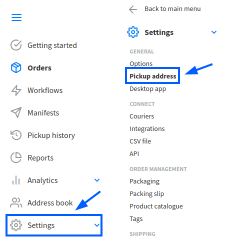
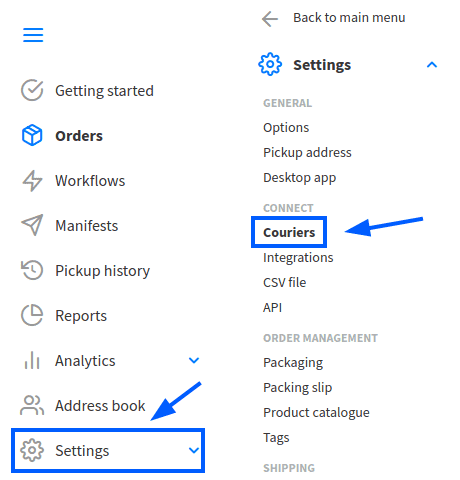
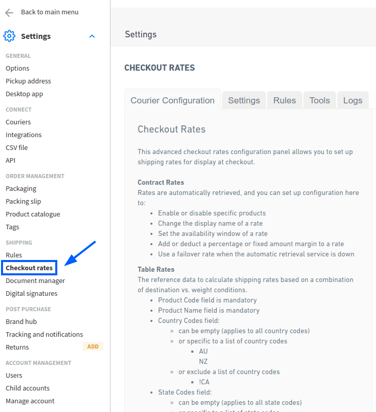
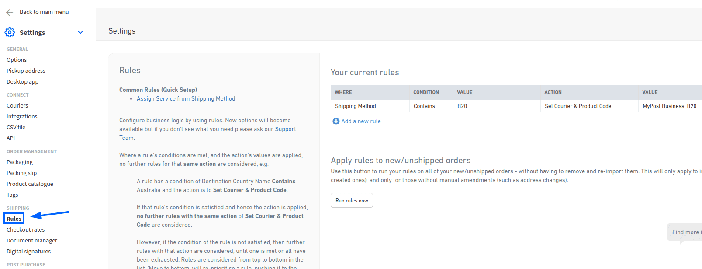
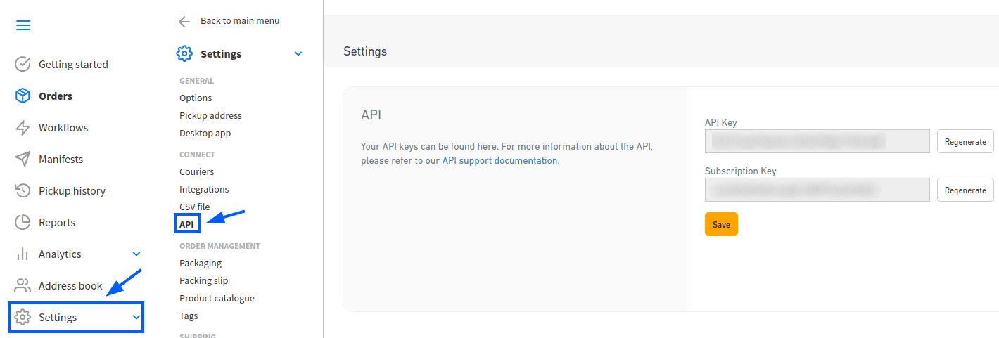
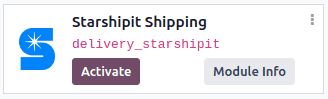
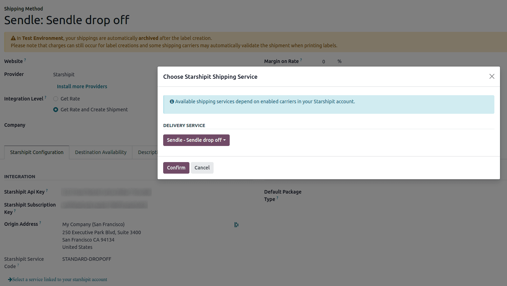
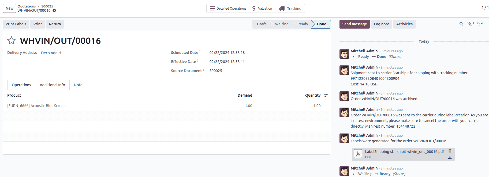

# Vận chuyển Starshipit

Starshipit is a shipping service operator that facilitates the integration of Australasian
shipping couriers with Odoo. Once integrated, users can create shipping methods that will
automatically get rates from specific couriers (such as Australia Post, NZ Post, DHL,...)
based on predefined conditions.

#### SEE ALSO
- [Automatically calculate shipping](../setup_configuration.md)
- [Integrate other third-party couriers](third_party_shipper.md)

## Setup in Starshipit

### Create an account and activate couriers

To get started, go to [Starshipit's platform](https://starshipit.com/) to configure the account
and generate the connector credentials. Log in with the Starshipit account, or create a new one if
needed.

### Pickup address configuration

Once logged into the Starshipit account, navigate to Settings ‣ Pickup address,
and fill in the Pickup address. Ensure this field matches the warehouse address.

### Couriers configuration

To integrate with third-party couriers, navigate to Settings ‣ Couriers, and
select Couriers.

### Checkout rates

To configure shipping rate calculations, navigate to Settings ‣ Checkout rates.
The selected delivery costs are automatically applied in Odoo when calculating shipping costs.

### Starshipit API key

Configure shipping rules to assign the correct shipping methods to orders based on specific
conditions.

To create a rule, go to Settings ‣ Rules and click Add a new rule.

While there are multiple ways to configure rules, it is recommended to set:

1. Condition to Contains
2. Value to the product code
3. Action to Set Courier & Product Code

### Finding Starshipit API credentials

In the Starshipit account, navigate to Settings ‣ API in the side menu.
This page contains the  keys needed to connect to
Odoo.

## Thiết lập trong Odoo

### Cài đặt

After the Starshipit account is set up, integrate it with the Odoo database. To do that, go to
Odoo's Apps module, search for the Starshipit Shipping module, and click
Activate to install it.

### Cấu hình

Once installed, activate the feature by going to Inventory ‣ Configuration ‣
Settings. Under the Shipping Connectors section, activate the Starshipit
Connector option.

After activating Starshipit Connector, click the Starshipit Shipping Methods
link below the listed connector. Once on the Shipping Methods page, click
Create.

Configure Starshipit in Odoo by filling out the fields on the Shipping Methods form as
follows:

- Shipping Method: type `Starshipit`.
- Provider: select Starshipit from the drop-down menu.
- Delivery Product: assign or create the delivery product that will appear on the sales
  order line when the cost of shipping is computed.

  #### NOTE
  The fields discussed in this section are specific to configuring Starshipit. For more information
  about the other fields, refer to [Delivery methods](../setup_configuration.md).

In the Starshipit Configuration tab, fill out these fields:

- Starshipit API Key: enter the  key
  [obtained from Starshipit](#inventory-shipping-receiving-star-api).
- Starshipit Subscription Key: enter the subscription key obtained from the same place
  as the [API key](#inventory-shipping-receiving-star-api).
- Origin Address: Enter the address where products are shipped from. This field is
  crucial for calculating shipping rates and [generating shipping labels](#inventory-shipping-receiving-star-label).
- Default Package Type: Set a default package type to include the weight of the empty
  package when automatically calculating shipping rates.

#### IMPORTANT
To set a default package type, the *Packages* feature **must** be enabled in
Inventory ‣ Configuration ‣ Settings.

- Manually Save the form by clicking the cloud icon next to the Shipping
  Methods / New breadcrumbs.

To load the newly configured shipping products, click the Select a service linked to the
Starshipit account link at the bottom of the Starshipit Configuration tab.

Doing so opens the Choose Starshipit Shipping Service pop-up window. In the
Delivery Service field, choose the desired shipping service for deliveries and returns
from the drop-down menu. Finally, click Confirm.

The chosen delivery service will populate in the Service Name field.

### Generate a label with Starshipit

When creating a quotation in Odoo, add the Starshipit shipping method by clicking the Add
shipping button.

In the Add a shipping method pop-up window, select Starshipit in the Shipping
Method field.

Calculate the shipping rate by clicking Get rate.
Finally, click Add to include the cost of shipping to the sales order line, labeled as
the *delivery product*.

#### NOTE
Automatically calculate shipping costs for Starshipit in **both** Odoo *Sales* and *eCommerce*
applications.

Then, Validate the delivery. Shipping label documents are automatically generated in the
chatter, which includes the following:

1. Shipping label(s) depending on the number of packages.
2. Tracking number(s) if the selected courier supports it.
3. Return label(s) if the Starshipit connector is configured for returns.

#### IMPORTANT
Package weight in Odoo is calculated by adding the weights of the products plus the empty package
saved in the database. Ensure the correct shipping option is selected, as the package weight is
not automatically verified.

Verify the destination address, as Starshipit checks it when the order is created.

Finally, some couriers may require other information, such as an email address or phone number.
Please ensure that all necessary information are set upon sending a shipping order.

### Trả hàng

Starshipit allows returns with the following couriers:
: * Australia Post eParcel
  * TNT
  * Couriers Please
  * Aramex
  * StarTrack
  * DHL Express
  * NZ Post Domestic

This can be done by clicking the Return smart button on the intended delivery order.
If the selected courier supports returns, the Print Return Label button will be
available.

### Huỷ

If a delivery order is cancelled in Odoo, it will be automatically archived in Starshipit.
However, the cancellation will not be sent to the courier itself, so make sure to log onto the
courier's platform to handle the cancellation manually.
