# Tích hợp UPS

UPS is a shipping carrier service that integrates with Odoo to coordinate shipping to all regions.
Once integrated, users can create shipping methods that estimate shipping costs and [generate
labels](labels.md).

#### SEE ALSO
[Third-party shipping carriers](third_party_shipper.md)

To set up the UPS shipping connector in Odoo, complete these steps:

1. Create a UPS account to get [account number](#inventory-shipping-receiving-ups-account-number)
2. Create UPS developer account to get [client credentials](#inventory-shipping-receiving-ups-client-id)
3. Set up shipping method in Odoo

## UPS account setup

To get started, go to the [UPS website](https://www.ups.com) and click the Log In
button in the top-right corner to log in or create a UPS account.

After logging in, click the profile icon in the top-right corner, and select Accounts and
Payment from the drop-down menu.

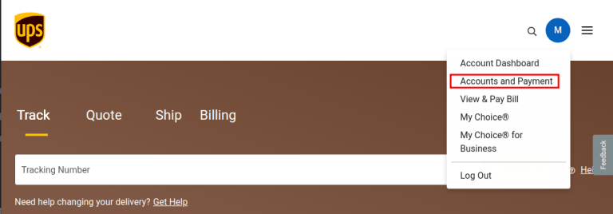

On the Accounts and Payment Options page, two accounts must be configured: an Odoo
shipment account and a payment card.

### Shipping account

To add an Odoo shipment account, select Add New Account from the Add a
Payment Method drop-down menu, and click Add.

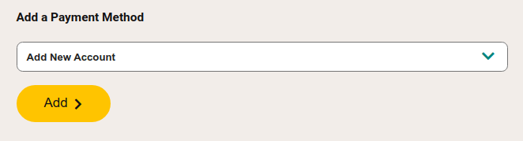

On the next screen, labeled Open a Shipping Account, complete the forms to configure the
shipping account type (e.g. Business) and if any regulated items will be shipped. Then
finish the remaining three steps in the wizard to Add Addresses, Verify
Identity, and Explore Discounts, with the last option being optional.

When complete, submit the application on the last page of the wizard to finish setting up the
shipping account.

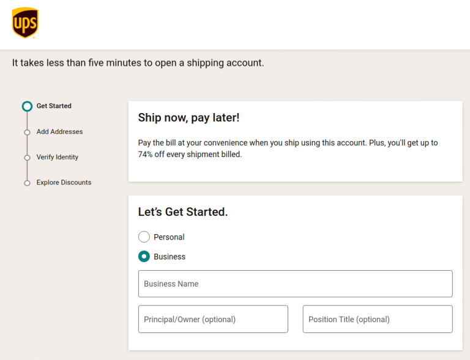

### Get account number

With the shipping account set up, the UPS Account Number becomes available. To access
it, navigate to Profile ‣ Accounts and Payment and refer to the shipping
account's Number field.

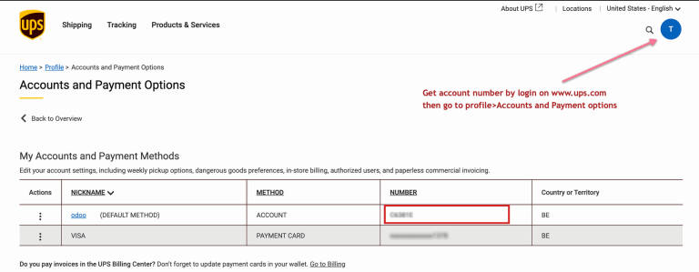

### Thẻ thanh toán

Navigate back to the Accounts and Payments page and select the Add Payment
Card option from the Add a Payment Method drop-down menu. Then, complete the form to
add the credit card information.

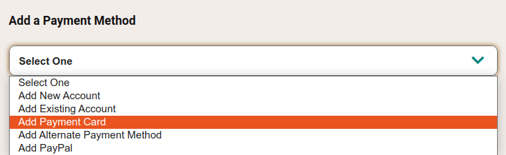

## UPS developer account setup

Next, log into the [UPS developer account](http://developer.ups.com/) to generate the developer
key. To begin, click the profile icon in the top-right corner, and choose the Apps
option from the drop-down menu.

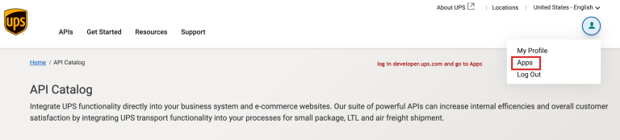

### Thêm ứng dụng

Then, click the Add Apps button to begin filling out the form. In the I need
API credentials because \* field, select I want to integrate UPS technology into my
business.

Under the next label, Choose an account to associate with these credentials. \*, select
Add existing account from the drop-down menu in the corresponding field, and then select
the [account number](#inventory-shipping-receiving-ups-account-number) linked to the UPS
account created in the previous step.

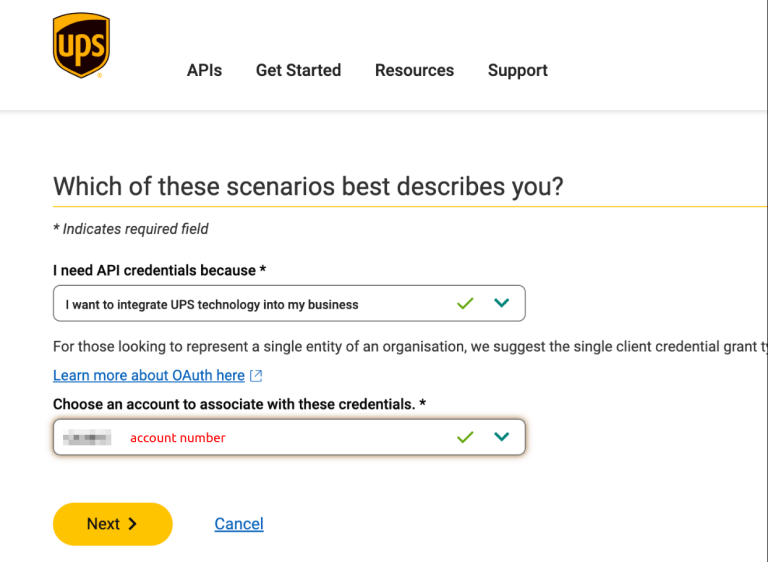

Click Next, and proceed to the Add App form, and fill out the fields:

- App Name: Type the name to identify the app by.
- Callback URL: Type the URL of the Odoo database, in the format:
  `https://databaseName.odoo.com`. Do **not** include `www` in the URL.

In the Add Products section on the right, search for and click the + (plus)
icon to add the following products to the app:

- Authorization (O Auth): Used to generate the authorization token to request
  information from the UPS API.
- Address Validation: Validates addresses at the street level in the United States and
  Puerto Rico.
- Locator: Enables search for UPS shipping locations based on type and available
  services.
- Paperless Documents: Enables the upload of document images to link to shipments.
- Shipping: Enables UPS shipping services, such as preparing packages for shipment,
  managing returns, and canceling scheduled shipments.
- Rating: Compare delivery services and shipping rates.

Finally, click Save and accept UPS's terms and conditions.

#### SEE ALSO
[UPS API Catalog](https://developer.ups.com/catalog?loc=en_US)

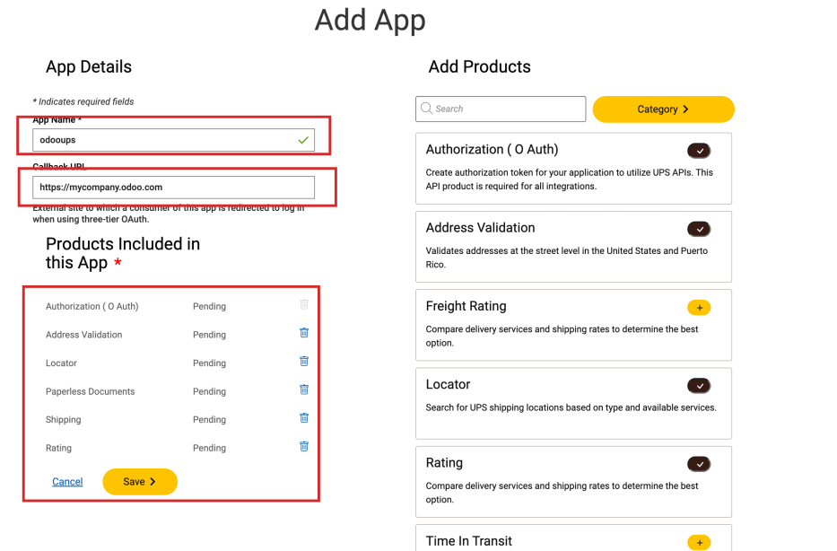

### Client ID and Client Secret

With the new app created, in the Profile ‣ My Apps ‣ App page, select the app
from the Credentials section to view the UPS credentials.

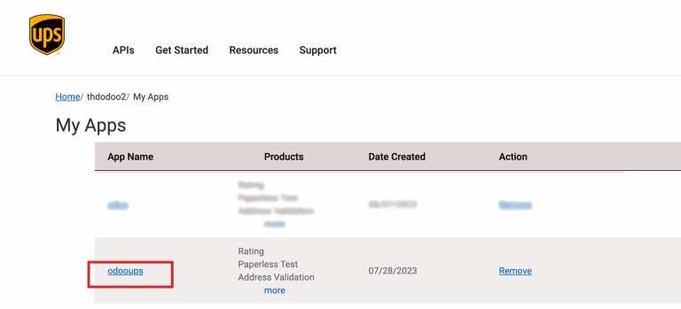

In the Credentials section, copy the Client ID and Client Secret
key.

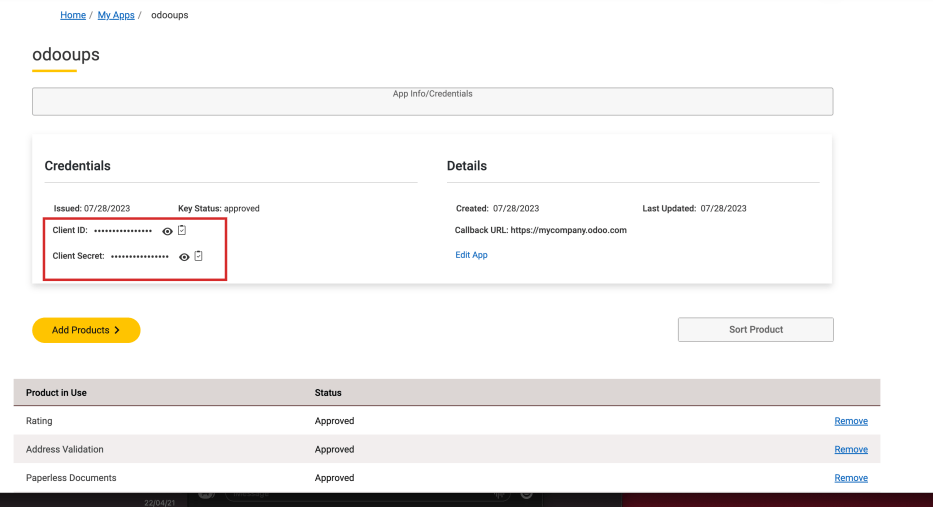

## Thiết lập trong Odoo

With the credentials obtained, configure the UPS shipping method in Odoo by going to
Inventory app ‣ Configuration ‣ Shipping Methods.

On the Shipping Methods page, click the New button.

#### NOTE
For existing UPS shipping methods whose Provider is UPS Legacy, archive
it and create a new shipping method using UPS.

In the Provider field, select UPS. Doing so reveals the UPS
Configuration tab, where various fields must be entered. For details instructions on configuring
the other fields on the shipping method, refer to the [Configure third-party carrier](third_party_shipper.md) documentation.

In the UPS Configuration tab, complete the following fields:

- UPS Account Number: (*required*) Get the [account number](#inventory-shipping-receiving-ups-account-number) from the UPS portal.
- UPS Client ID: (*required*) Get the [Client ID](#inventory-shipping-receiving-ups-client-id) from the UPS developer website.
- UPS Client Secret: (*required*) Get the [Client Secret](#inventory-shipping-receiving-ups-client-id) key from the UPS developer website.
- UPS Service Type: Select from the drop-down menu the type of shipping service.
- UPS Package Type: (*required*) Select from the drop-down menu the [package type](../../product_management/configure/package.md) that is supported for the shipping service.
- Package Weight Unit: The unit of measure for the package weight.
- Package Size Unit: The unit of measure for the package dimensions.
- Label Format: Choose the label format shipping labels: PDF,
  ZPL, EPL, or SPL.

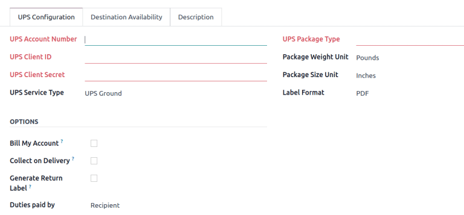

In the Options section, the following features are available:

- Bill My Account: Charge the user's UPS account for shipping in the *eCommerce* app.
- Collect on Delivery: Collect payment from customers for shipping after the shipment is
  delivered.
- Generate Return Label: Print the return label for the order after the delivery order
  is validated.
- Duties paid by: Select whether duties or other fees are charged to the
  Sender or Recipient of the order.
