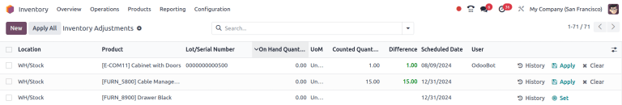

# Điều chỉnh tồn kho

In any warehouse management system, the recorded inventory counts in the database might not always
match the actual inventory counts in the warehouse. The discrepancy between the two counts can be
due to damages, human errors, theft, or other factors. As such, inventory adjustments must be made
to reconcile the differences, and ensure that the recorded counts in the database match the actual
counts in the warehouse.

## Inventory Adjustments page

To view the *Inventory Adjustments* page, navigate to Inventory app ‣ Operations
‣ Physical Inventory.

In the Inventory Adjustments table, all products that are currently in stock are listed,
with each product line containing the following information:

- Location: the specific location in the warehouse where a product is stored. This field
  needs to be enabled my going to Inventory app ‣ Configuration ‣ Settings and
  ticking the Storage Locations checkbox.
- Product: the product whose quantity is listed on the inventory adjustment line.
- Lot/Serial Number: the tracking identifier assigned to the specific product listed. It
  can contain letters, numbers, or a combination of both.
- UoM: the *unit of measure* in which the product is measured. Unless otherwise
  specified (i.e., in Pounds or Ounces), the default  is Units.
- Counted Quantity: the real quantity counted during an inventory count. This field is
  left blank by default but can be changed, depending on if it matches the On Hand
  Quantity or not.
- Difference: the difference between the On Hand Quantity and
  Counted Quantity, once an inventory adjustment is made. The difference is
  automatically calculated after every inventory adjustment.

#### NOTE
If a specific product has a quantity of more than `1.00` in stock, and more than one serial
number (or lot number) is assigned, each uniquely-identified product is displayed on its own
product line with its own lot/serial number, under the Lot/Serial Number column.

The fields below are optional and can be made visible by clicking the <i class="oi oi-settings-adjust"></i>
(settings) icon in the top right of the Inventory Adjustments page.

- Inventory Frequency (Days): the frequency, in days, for inventory counts. The default
  value of this field is set to `0`.
- Favorite: adds a clickable star icon next to each product. Adding a favorite will
  bring the line item to the top of the dashboard.
- Product Category: the category assigned internally to a specific product. Unless
  otherwise specified (i.e., as Consumable or Rental), the default *Product
  Category* is set to All.
- Expiration Date: the date a product will expire, if it is a perishable good. Only
  products that are tracked using lots and serial numbers can be assigned expiration information.
- Last Count Date: the date on which the last inventory count occurred.
- Available Quantity: the quantity of a specific product that is currently available,
  based on any outstanding/uncompleted sales orders, purchase orders, or manufacturing orders that
  might change the available quantity once fulfilled.
- On Hand Quantity: the quantity of the product currently recorded in the database.
- Accounting Date: the date on which the adjustments will be accounted for in the Odoo
  **Accounting** app.
- Scheduled Date: the date at which a count should be made. If not otherwise specified,
  this date defaults to the 31st of December of the current year.
- User: the person assigned to the count in the database. This can either be the person
  physically counting the inventory, or applying the count in the database.
- Company: the company whose database these inventory adjustments are being made on. The
  company is listed in the top-right corner of the database, next to the user currently logged in.

#### SEE ALSO
- [Product type](../../product_management/configure/type.md)
- [Tracking with lots, serial numbers, and expiration dates](../../product_management/product_tracking.md)

### Create an inventory adjustment

To create a new inventory adjustment from the [Inventory Adjustments](#inventory-inventory-adjustments-page) page, click New. Doing so creates a new, blank
inventory adjustment line at the bottom of the page.

On this blank inventory adjustment line, define the Location where the product is
stored. This is necessary to ensure the accuracy of the inventory adjustment, as the same product
can be stored in multiple locations.

Next, click the drop-down menu under the Product column, and select a product. If the
selected product is tracked using either lots or serial numbers, the desired lot or serial number
can also be chosen from the drop-down menu under the Lot/Serial Number column.

Next, set the value in the Counted Quantity column to the quantity counted for that
product during the inventory adjustment process.

To the right of the Counted Quantity column, the Scheduled Date and
User can also be changed via their respective drop-down menus. Changing the
Scheduled Date changes the date that the inventory adjustment should be processed on,
and selecting a responsible User assigns a user to the specific inventory adjustment
(for traceability purposes).

Once all changes have been made to the new inventory adjustment line, click away from the line.
Doing so saves the adjustment, and moves the line to the top of the page.

If the Counted Quantity is greater than the On Hand Quantity, the value in
the Difference column is **green**. If the Counted Quantity is less than the
On Hand Quantity, the value in the Difference column is **red**. If the
quantities match, and haven't been changed at all, no value appears in the Difference
column.

At this stage, the count () is recorded, but not yet applied. This means
that the quantity on hand before the adjustment has not yet been updated to match the new, real
counted quantity.

There are two ways to apply the new inventory adjustment. The first way is to click the
<i class="fa fa-save"></i> Apply button on the line at the far right of the page. The second way is
to click the checkbox on the far left of the line. Doing so reveals new button options at the top of
the page, one of which is an Apply button. Clicking this button instead causes an
Inventory Adjustment pop-up window to appear.

From this pop-up menu, a reference or reason can be assigned to the inventory adjustment. By
default, the Inventory Reason field is pre-populated with the date the adjustment is
being made on, but can be changed to reflect whatever reference or reason is desired.

Once ready, click Apply to apply the inventory adjustment.

#### NOTE
Applying an inventory adjustment simultaneously creates a [stock move line (SML)](../reporting/moves_history.md) in the *Moves History* report for traceability.

## Đếm sản phẩm

Counting products (or stock-taking) is a recurring warehouse process to verify the physical quantity
of items against internal inventory records. The values recorded on file versus what is actually
counted in real life sometimes do not match, so inventory adjustments can be made on the *Inventory
Adjustments* dashboard.

Once a count is complete, go to Inventory app ‣ Operations ‣ Physical Inventory
to verify and update product Count Quantities, as it is necessary to do so.

On each product line, identify whether the value in the On Hand Quantity column recorded
in the database matches the newly-counted value. If the recorded value and the counted value do
match, select the product using the checkbox, click the Actions button, then
Set to quantity on hand.

Doing so copies the value from the On Hand Quantity column over to the
Counted Quantity column, and sets the value of the Difference column to
`0.00`. Subsequently, once applied, an inventory move with `0.00` Quantity Done is
recorded in the product's inventory adjustment history.

If the newly-counted value for a given product does **not** match the value in the On
Hand Quantity recorded in the database, instead of clicking the Set button, record the
real value in the field in the Counted Quantity column.

To do so, click the field in the Counted Quantity column on the specific inventory
adjustment line for the product whose count is being changed. This automatically assigns a
Counted Quantity of `0.00`.

To change this value, type in a new value that matches the real, newly-counted value. Then, click
away from the line. Doing so saves the adjustment, and automatically adjusts the value in the
Difference column.

Subsequently, once applied, a move with the difference between the On Hand Quantity and
the Counted Quantity is recorded in the product's inventory adjustment history.

The Actions menu appears when one or more products' checkboxes are selected. The
Actions menu includes the option to Set to quantity on hand, which sets the
selected products' Counted Quantity to the On Hand Quantity, and
Set to 0, which sets the selected products' Counted Quantity to zero.

#### IMPORTANT
Đôi khi việc kiểm kê được thực hiện nhưng không thể áp dụng ngay vào cơ sở dữ liệu. Trong khoảng thời gian giữa kiểm kê thực tế và khi thực hiện điều chỉnh tồn kho, các điều chuyển hàng hóa có thể xảy ra. Khi đó, số lượng tồn kho hiện có trong cơ sở dữ liệu có thể thay đổi và không còn khớp với số lượng đã kiểm kê. Để đảm bảo độ chính xác, Odoo sẽ yêu cầu xác nhận trước khi áp dụng điều chỉnh tồn kho.

### Plan inventory counts

To plan inventory counts, such as a full count of everything currently in stock, first navigate to
Inventory app ‣ Operations ‣ Physical Inventory.

Then, select the desired products to be counted by clicking the checkbox on the far left of each
product line.

Once all desired products have been selected, click the Request a Count button at the
top of the page. Doing so opens the Request a Count pop-up window, where the following
information can be filled:

- Inventory Date: the planned date of the count.
- User: the user responsible for the count.
- Accounting Date: the date at which the inventory adjustment will be accounted.
- Count: to leave the on-hand quantity of each product line blank, select
  Leave Empty. To pre-fill the on-hand quantity of each product line with the current
  value recorded in the database, select Set Current Value.

Finally, once ready, click Confirm to request the count.

#### IMPORTANT
In the Odoo **Barcode** app, users can only view inventory counts that are assigned to **them**,
and are scheduled for **today** or **earlier**.

#### SEE ALSO
[Đếm theo chu kỳ](cycle_counts.md)
