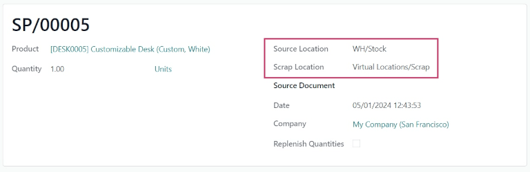
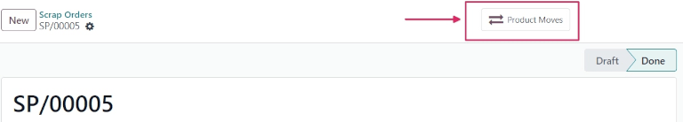
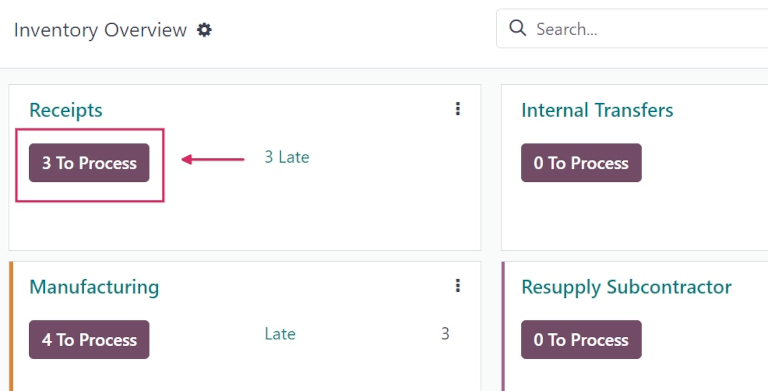
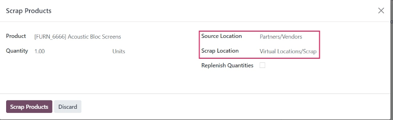
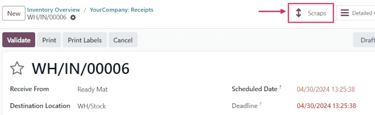

# Scrap inventory

Sometimes, products in a company's warehouse stock might be found to be damaged or defective, past
the point of being reparable. If it is not possible to repair the product, or return the product to
a vendor, it can be scrapped.

Odoo *Inventory* allows users to scrap inventory, designating goods or materials that are no longer
usable or sellable for disposal (or recycling).

Scrapping inventory in a database helps stock counts remain accurate, by removing scrapped products
from physical inventory, and placing it in a virtual scrap location (*Virtual Locations/Scrap*).

#### NOTE
*Virtual locations* in Odoo are **not** real, physical spaces in a warehouse. Rather, they are
designated locations in a database that provide tracking of items that shouldn't be counted in a
physical inventory.

For more information about virtual locations, see the documentation about the different types of
[location types](applications/inventory_and_mrp/inventory/warehouses_storage/inventory_management.md#inventory-warehouses-storage-location-type).

## Scrap from stock

To create a new scrap order (SP) for an in-stock product, navigate to Inventory app
‣ Operations ‣ Scrap, and click New. This opens a new  form.

Click the drop-down menu in the Product field, and select the product that should be
scrapped from inventory. In the Quantity field, change the value to the quantity of the
product that should be scrapped (by default, this value is set to `1.00`).

The Source Location defaults to the location where the product is currently stored. The
Scrap Location defaults to the designated scrap location (Virtual
Locations/Scrap). Either of these locations can be changed by selecting a different location from
their respective drop-down menus.

If the scrapping is tied to a specific existing operation, specify the operation in the
Source Document field.

The Company field displays the company whose warehouse this product belongs to. If a
replenishment rule is set up for the product being scrapped, and if the product should be
replenished, tick the checkbox for Replenish Quantities.

Once ready, click Validate to complete the new . Once validated, a
Product Moves smart button appears at the top of the form. Click the smart button to
view the details of the scrap operation.

## Scrap from an existing operation

Scrap orders (SPs) can *also* be created from existing operations, such as receipts, delivery
orders, and internal transfers, before they are entered into, or removed from, stock for an
operation.

To scrap a product during an operation, navigate to the Inventory app. From the
Inventory Overview, click the # To Process button on an operation's task
card (i.e. the Receipts task card).

Then, select an operation to process from the resulting list of existing orders. Doing so opens that
operation's form.

Click the <i class="fa fa-cog"></i> (cog) icon, and select Scrap from the resulting
drop-down menu. This opens a Scrap Products pop-up window.

From this pop-up window, click the drop-down menu in the Product field, and select the
products from the operation that should be scrapped. Adjust the value in the Quantity
field, if necessary.

If the Product selected is tracked using a lot or serial number, a
Lot/Serial field appears. Specify the tracking number in that field.

The Source Location and Scrap Location can be changed, if needed. If a
replenishment rule is set up for the product being scrapped, and if the product should be
replenished, tick the checkbox for Replenish Quantities.

Once ready, click Scrap Products. A Scraps smart button appears at the top
of the operation form. Click this smart button to view the details of all scrap orders created from
this specific operation.

