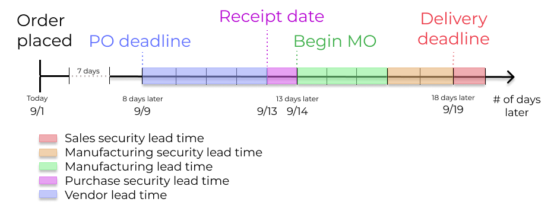

# Lead times

Accurately forecasting delivery dates is vital for fulfilling customer expectations. In Odoo, the
**Inventory** app allows for comprehensive lead time configuration, allowing coordination and planning
of manufacturing orders, deliveries, and receipts.

## Lead time types

Different lead times for different operations can impact various stages of the order fulfillment
process. Here's a summary of the types of lead times in Odoo:

- [Customer lead time](#inventory-warehouses-storage-customer-lt): default time frame for
  fulfilling customer orders. The customer lead time is the number of days from the date the sales
  order (SO) is confirmed to the date the products are shipped from the warehouse. This is also
  known as *delivery lead time*.
- [Thời gian dự phòng bán hàng](#inventory-warehouses-storage-sales-security-lt): đẩy sớm *ngày giao hàng dự kiến* lên một số ngày được chỉ định. Nó đóng vai trò như thời gian đệm để bạn có đủ thời gian chuẩn bị lô hàng sớm hơn, đề phòng trường hợp có chậm trễ trong quá trình xử lý đơn hàng.
- [Purchase lead time](#inventory-warehouses-storage-purchase-lt): number of days from the
  confirmation of a purchase order (PO) to the receipt of products. It provides insight on the time
  it takes for products to arrive at the warehouse, facilitating effective scheduling and planning
  of supplier deliveries.
- [Thời gian dự phòng mua hàng](#inventory-warehouses-storage-purchase-security-lt): giúp đẩy sớm thời hạn đặt hàng trên  lên một số ngày được chỉ định. Cách tiếp cận chủ động này giúp giảm thiểu rủi ro chậm trễ từ nhà cung cấp hoặc vận chuyển. Do đó, đối với các sản phẩm được thiết lập bổ sung theo đơn hàng, nhu cầu sẽ xuất hiện trên *Báo cáo bổ sung hàng* sớm hơn, theo số ngày đã xác định.
- [Days to Purchase](#inventory-warehouses-storage-days-to-purchase): days needed for the
  vendor to receive a request for quotation (RFQ) and confirm it. It advances the deadline to
  schedule a  by a specified number of days.
- [Manufacturing lead time](#inventory-warehouses-storage-manuf-lt): number of days needed to
  complete a manufacturing order (MO) from the date of confirmation. This lead time includes
  weekends (non-working hours in Odoo), and is used to forecast an approximate production date for a
  finished good.
- [Days to prepare manufacturing order](#inventory-warehouses-storage-prepare-manufacturing-order): number of days needed to replenish
  components, or manufacture sub-assemblies of the product. Either set one directly on the bill of
  materials (BoM), or click *Compute* to sum up purchase and manufacturing lead times of components
  in the .
- [Thời gian dự phòng sản xuất](#inventory-warehouses-storage-manuf-security-lt): đẩy ngày đã lên lịch của  lên sớm hơn một số ngày được chỉ định. Khi sử dụng kết hợp với [bổ sung theo đơn đặt hàng](applications/inventory_and_mrp/inventory/warehouses_storage/replenishment.md#inventory-management-products-strategies), thời gian dự phòng giúp hiển thị nhu cầu sớm hơn trên báo cáo bổ sung hàng.

## Sales lead times

Thời gian hoàn thành và thời gian dự phòng bán hàng có thể được cấu hình để tự động tính toán *ngày giao hàng dự kiến* trên . Ngày giao hàng dự kiến đảm bảo tính toán được *ngày giao hàng* thực tế cho các lô hàng xuất từ kho.

Odoo issues a warning message if the set delivery date is earlier than the expected date, as it may
not be feasible to fulfill the order by that time, which would impact other warehouse operations.

The following sections demonstrate how to automatically compute expected delivery dates.

### Customer lead time

Đặt thời gian hoàn thành trên từng mẫu sản phẩm bằng cách đi đến trang sản phẩm. Để thực hiện, đi tới Ứng dụng Bán hàng ‣ Sản phẩm ‣ Sản phẩm. Từ đó, chọn sản phẩm mong muốn và chuyển sang tab Tồn kho. Sau đó, dưới trường Thời gian hoàn thành, nhập số ngày theo lịch cần thiết để hoàn thành đơn giao hàng từ khi bắt đầu đến khi hoàn tất.

### Thời gian dự phòng bán hàng

*Thời gian dự phòng bán hàng* được cấu hình chung cho toàn doanh nghiệp tại Ứng dụng Tồn kho ‣ Cấu hình ‣ Cài đặt.

Trên trang cấu hình, dưới tiêu đề Lên lịch nâng cao, tìm ô Thời gian dự phòng cho bán hàng và tích vào hộp kiểm để kích hoạt tính năng này.

Tiếp theo, nhập số ngày theo lịch mong muốn. Thời gian dự phòng này là một khoảng thời gian đệm nhằm thông báo cho nhân viên phụ trách chuẩn bị hàng cần giao sớm hơn ngày dự kiến.

### Deliver several products

For orders that include multiple products with different lead times, the lead times can be
configured directly from the quotation itself. On a quotation, click the Other Info tab,
and set the Shipping Policy to:

1. As soon as possible to deliver products as soon as they are ready. The
   Scheduled Date of the  is determined by adding today's
   date to the shortest lead time among the products in the order.
2. When all products are ready to wait to fulfill the entire order at once. The
   Scheduled Date of the  is determined by adding today's
   date to the longest lead time among the products in the order.

## Purchase lead times

Automatically determining the dates on which to place orders from suppliers can help simplify the
procurement process.

Odoo tính toán *ngày nhận hàng* từ nhà cung cấp và hạn chót  dựa trên ngày cần có sản phẩm trong kho. Bằng cách tính ngược từ ngày nhận hàng, hệ thống sẽ xem xét thời gian hoàn thành của nhà cung cấp và thời gian dự phòng mua hàng để xác định hạn chót cho .

This deadline is the date by which the order should be confirmed, in order to ensure timely arrival
by the expected receipt date.

#### SEE ALSO
[PO scheduling with reordering rules](applications/inventory_and_mrp/inventory/warehouses_storage/replenishment/reordering_rules.md)

### Vendor lead time

To set a vendor lead time for orders arriving in the warehouse from a vendor location, begin by
navigating to a product form through Purchase app ‣ Products ‣ Products.

Next, select the desired product, and switch to the Purchase tab. In the editable vendor
pricelist, click the Add a line button to add vendor details, such as the
Vendor name, Price offered for the product, and lastly, the
Delivery Lead Time.

#### NOTE
Multiple vendors and lead times can be added to the vendor pricelist. The default vendor and lead
time selected will be the entry at the top of the list.

By setting the vendor lead time, the expected arrival date of the item is automatically determined
as the date of the  confirmation, plus the vendor lead time. This ensures
that warehouse employees are notified, if the products do **not** arrive within the expected
timeframe.

### Thời gian dự phòng mua hàng

*Thời gian dự phòng mua hàng* được cấu hình chung cho toàn doanh nghiệp tại Ứng dụng Tồn kho ‣ Cấu hình ‣ Cài đặt.

Trên trang Cài đặt, trong phần Lên lịch nâng cao, tích vào hộp kiểm dành cho Thời gian dự phòng cho mua hàng.

Tiếp theo, nhập số ngày theo lịch mong muốn. Bằng cách cấu hình thời gian dự phòng, một khoảng thời gian đệm được thiết lập để phòng ngừa các sự chậm trễ có thể xảy ra trong quá trình nhà cung cấp giao hàng. Sau đó, nhấp vào Lưu.

### Days to purchase lead time

To set it up, go to Inventory app ‣ Configuration ‣ Settings. Under the
Advanced Scheduling section, in the Days to Purchase field, specify the
number of days required for the vendor to confirm a  after receiving it from the company.

## Manufacturing lead times

Lead times can help simplify the procurement process for consumable materials and components used in
manufactured products with bills of materials (BoMs).

Thời hạn ,  thời hạn bắt đầu quy trình sản xuất để hoàn thành sản phẩm theo ngày giao hàng dự kiến - có thể được xác định bằng cách cấu hình thời gian hoàn thành sản xuất và thời gian dự phòng sản xuất.

### Manufacturing lead time

Manufacturing lead times for products are configured from a product's bill of materials (BoM) form.

To add a lead time to a , navigate to Manufacturing app ‣ Products ‣ Bills
of Materials, and select the desired  to edit.

On the  form, click the Miscellaneous tab. Change the value (in days) in the
Manuf. Lead Time field to specify the calendar days needed to manufacture the product.

#### NOTE
If the selected  is a multi-level , the manufacturing lead times of the components are
added.

If the  product is subcontracted, the Manuf. Lead Time can be used to determine
the date at which components should be sent to the subcontractor.

Establish a  deadline, based on the *expected delivery date*, indicated in the
Scheduled Date field of the .

The  deadline, which is the Scheduled Date field on the , is calculated as the
*expected delivery date* subtracted by the manufacturing lead time.

This ensures the manufacturing process begins on time, in order to meet the delivery date.

However, it is important to note that lead times are based on calendar days. Lead times do **not**
consider weekends, holidays, or *work center capacity* ().

#### SEE ALSO
- [Lập kế hoạch sản xuất](applications/inventory_and_mrp/manufacturing/workflows/use_mps.md)
- [Schedule MOs with reordering rules](applications/inventory_and_mrp/inventory/warehouses_storage/replenishment/reordering_rules.md)

### Days to prepare manufacturing order

Configure the days required to gather components to manufacture a product by going to its . To
do that, go to Manufacturing app ‣ Products ‣ Bills of Materials, and select
the desired .

In the Miscellaneous tab of the , specify the calendar days needed to obtain
components of the product in the Days to prepare Manufacturing Order field. Doing so
creates  in advance, and ensures there is enough time to either replenish components, or
manufacture semi-finished products.

### Thời gian dự phòng sản xuất

*Thời gian dự phòng sản xuất* được thiết lập chung cho doanh nghiệp tại Ứng dụng Sản xuất ‣ Cấu hình ‣ Cài đặt. Trong phần Kế hoạch, tích vào hộp kiểm cho Thời gian dự phòng.

Tiếp theo, nhập số ngày theo lịch mong muốn. Bằng cách cấu hình thời gian dự phòng, một khoảng thời gian đệm được thiết lập để phòng ngừa các sự chậm trễ có thể xảy ra trong quá trình sản xuất. Sau đó, nhấp vào Lưu.

## Global example

See the following example to understand how all the lead times work together to ensure timely order
fulfillment:

- **Thời gian dự phòng bán hàng**: 1 ngày
- **Thời gian dự phòng sản xuất**: 2 ngày
- **Manufacturing lead time**: 3 days
- **Thời gian dự phòng mua hàng**: 1 ngày
- **Vendor lead time**: 4 days

The customer places an order for a manufactured product on September 1st, and the scheduled delivery
date from the warehouse is on September 20th. Odoo uses lead times and automated reordering rules to
schedule the necessary operations, based on the outgoing shipment delivery date, September 20th:

- **September 1st**: Sales order created, confirmed by salesperson.
- **September 9th**: Deadline to order components to ensure they arrive in time when manufacturing
  begins (4-day supplier lead time).
- **Ngày 13 tháng 9**: Ngày dự kiến nhận thành phần. Ban đầu được đặt là ngày 14 tháng 9, nhưng do thời gian dự phòng mua hàng là 1 ngày nên ngày nhận đã được đẩy sớm hơn 1 ngày.
- **Ngày 14 tháng 9**: Hạn chót bắt đầu sản xuất. Được tính bằng cách lấy ngày giao hàng dự kiến vào ngày 19 tháng 9 trừ đi thời gian sản xuất (3 ngày) và thời gian dự phòng sản xuất (2 ngày).
- **Ngày 19 tháng 9**: Ngày đã lên lịch trên biểu mẫu lệnh giao hàng thể hiện ngày giao hàng dự kiến đã được cập nhật, vốn ban đầu được đặt là ngày 20 tháng 9. Nhưng thời gian dự phòng bán hàng đã đẩy ngày này sớm lên một ngày.

Odoo's replenishment planning maps a business' order fulfillment process, setting pre-determined
deadlines and raw material order dates, including buffer days for potential delays. This ensures
products are delivered on time.
