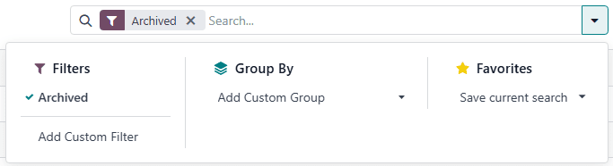
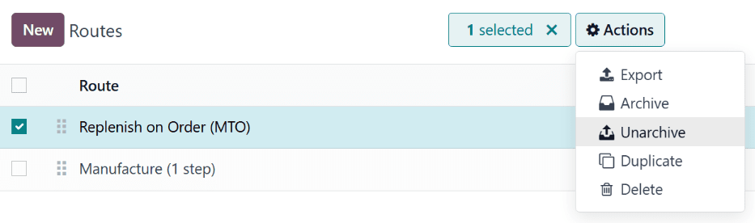
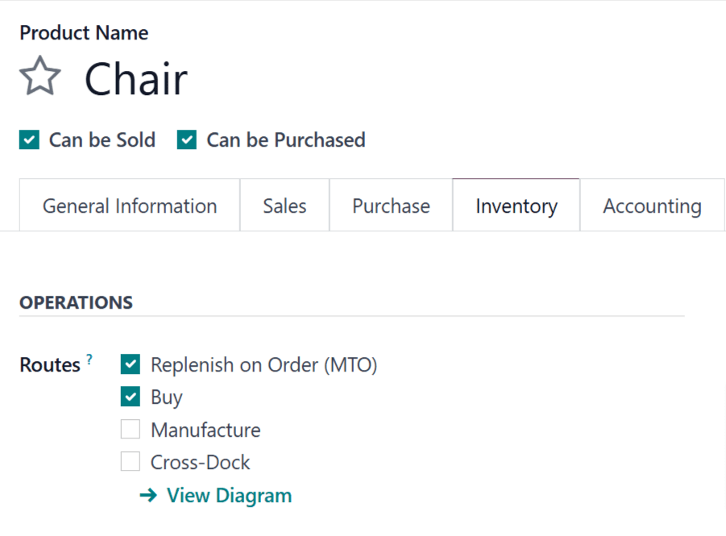

# Replenish on order (MTO)

*Replenish on order*, also known as *MTO* (make to order), is a replenishment strategy that creates
a draft order for a product every time it is required to fulfill a sales order (SO), or when it is
needed as a component in a manufacturing order (MO).

Đối với các sản phẩm mua từ nhà cung cấp, một yêu cầu báo giá (RFQ) sẽ được tạo ra để bổ sung hàng, trong khi một  sẽ được tạo ra cho các sản phẩm được sản xuất. Việc tạo  hoặc  xảy ra mỗi khi một  hoặc  yêu cầu sản phẩm đó được xác nhận, bất kể mức tồn kho hiện tại của sản phẩm đang được đặt hàng.

#### IMPORTANT
In order to use the  route, the Multi-Step Routes feature must be enabled. To do
so, navigate to Inventory app ‣ Configuration ‣ Settings, and tick the
checkbox next to Multi-Step Routes, under the Warehouse heading.

Finally, click Save to save the change.

## Unarchive MTO route

By default, Odoo sets the  route as *archived*. This is because  is a somewhat niche
workflow that is only used by certain companies. However, it is easy to unarchive the route in just
a few simple steps.

To do so, begin by navigating to Inventory app ‣ Configuration ‣ Routes. On the
Routes page, click the <i class="fa fa-caret-down"></i> (down arrow) icon on the right
side of the search bar, and click the Archived filter to enable it.

After enabling the Archived filter, the Routes page shows all routes which
are currently archived. Tick the checkbox next to Replenish on Order (MTO), then click
the <i class="fa fa-cog"></i> Actions button to reveal a drop-down menu. From the drop-down menu,
select Unarchive.

Finally, remove the Archived filter from the search bar. The Routes page now
shows all unarchived routes, including Replenish on Order (MTO), which is selectable on
the *Inventory* tab of each product page.

## Configure product for MTO

With the  route unarchived, products can now be properly configured to use replenish on order.
To do so, begin by going to Inventory app ‣ Products ‣ Products, then select an
existing product, or click New to configure a new one.

On the product page, select the Inventory tab and enable the Replenish on
Order (MTO) route in the Routes section, along with the Buy or
Manufacture route.

#### IMPORTANT
The Replenish on Order (MTO) route **does not** work unless another route is selected
as well. This is because Odoo needs to know how to replenish the product when an order is placed
for it (buy or manufacture it).

If the product is purchased from a vendor to fulfill , enable the Can be Purchased
checkbox under the product name. Doing so makes the Purchase tab appear alongside the
other tabs below.

Click the Purchase tab and specify a Vendor and the Price they
sell the product for.

#### IMPORTANT
Specifying a vendor is essential for this workflow, because Odoo cannot generate an  without
knowing who the product is purchased from.

If the product is manufactured, make sure it has a bill of materials (BOM) configured for it. To do
so, click the Bill of Materials smart button at the top of the screen, then click
New on the Bill of Materials page to configure a new  for the product.

#### SEE ALSO
For a full overview of  creation, see the documentation on [bills of materials](applications/inventory_and_mrp/manufacturing/basic_setup/bill_configuration.md).

## Replenish using MTO

After configuring a product to use the  route, a replenishment order is created for it every
time an  or  including the product is confirmed. The type of order created depends on the
second route selected in addition to .

For example, if *Buy* was the second route selected, then a  is created upon confirmation of an
.

#### IMPORTANT
When the  route is enabled for a product, a replenishment order is always created upon
confirmation of an  or . This is the case, even if there is enough stock of the product
on-hand to fulfill the , without buying or manufacturing additional units of it.

While the  route can be used in unison with the *Buy* or *Manufacture* routes, the *Buy* route
is used as the example for this workflow. Begin by navigating to the Sales app,
then click New, which opens a blank quotation form.

On the blank quotation form, add a Customer. Then, click Add a product under
the Order Lines tab, and enter a product configured to use the *MTO* and *Buy* routes.
Click Confirm, and the quotation is turned into an .

A Purchase smart button now appears at the top of the page. Clicking it opens the 
associated with the .

Click Confirm Order to confirm the , and turn it into a . A purple
Receive Products button now appears above the . Once the products are received,
click Receive Products to open the receipt order, and click Validate to
enter the products into inventory.

Return to the  by clicking the SO breadcrumb, or by navigating to
Sales app ‣ Orders ‣ Orders, and selecting the|SO|.

Finally, click the Delivery smart button at the top of the order to open the delivery
order. Once the products have been shipped to the customer, click Validate to confirm
the delivery.

#### SEE ALSO
For information on workflows that include the  route, see the following documentation:

- [Inter-warehouse replenishment](applications/inventory_and_mrp/inventory/warehouses_storage/replenishment/resupply_warehouses.md)
- [Basic subcontracting](applications/inventory_and_mrp/manufacturing/subcontracting/subcontracting_basic.md)
- [Quản lý bán thành phẩm](applications/inventory_and_mrp/manufacturing/advanced_configuration/sub_assemblies.md)
