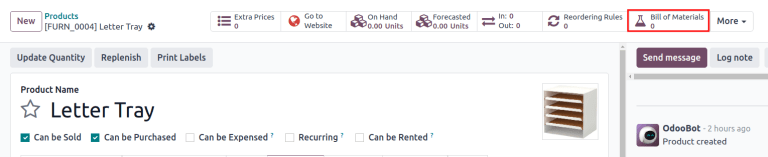
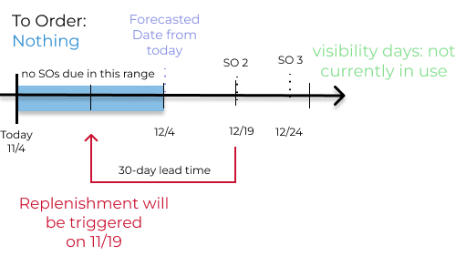

# Quy tắc tái đặt hàng

*Reordering rules* are used to keep forecasted stock levels above a certain threshold without
exceeding a specified upper limit. This is accomplished by specifying a minimum quantity that stock
should not fall below and a maximum quantity that stock should not exceed.

Quy tắc tái đặt hàng có thể được cấu hình cho từng sản phẩm dựa trên tuyến được sử dụng để bổ sung sản phẩm đó. Nếu sản phẩm sử dụng tuyến *Mua hàng*, một *yêu cầu báo giá* (RFQ) sẽ được tạo khi quy tắc tái đặt hàng được kích hoạt. Thay vào đó, nếu sản phẩm sử dụng tuyến *Sản xuất*, thì một *lệnh sản xuất* (MO) sẽ được tạo ra. Điều này áp dụng bất kể tuyến bổ sung hàng nào được chọn.

#### SEE ALSO
- [Odoo Tutorials: Automatic Reordering Rules](https://www.youtube.com/watch?v=XEJZrCjoXaU)
- [Odoo Tutorials: Manual Reordering Rules](https://www.youtube.com/watch?v=deIREJ1FFj4)

To set up reordering rules for the first time, refer to:

- [Reordering rules setup](#inventory-warehouses-storage-configure-rr)
- [Trigger](#inventory-product-management-trigger)
- [Preferred route](#inventory-warehouses-storage-route)

To understand and optimize replenishment using advanced features, see:

- [Just-in-time logic](#inventory-warehouses-storage-just-in-time)
- [Visibility days](#inventory-product-management-visibility-days)

## Reordering rules setup

To configure automatic and manual reordering rules, complete the following:

1. [Product type configuration](#inventory-warehouses-storage-set-product-type)
2. [Create rule](#inventory-warehouses-storage-rr-fields)

### Product type configuration

A product must be configured correctly to use reordering rules. Begin by navigating to
Inventory app ‣ Products ‣ Products, then select an existing product, or create
a new one by clicking New.

On the product form, under the General Information tab, set the Product Type
to Storable Product. This is necessary because Odoo only tracks stock quantities for
storable products, and quantities are needed to trigger reordering rules.

Next, click the Inventory tab and select one or more routes from the Routes
section. Doing so tells Odoo which route to use to replenish the product.

If the product is reordered using the Buy route, confirm that the Can be
Purchased checkbox is enabled under the product name. This makes the Purchase tab
appear. Click on the Purchase tab, and specify at least one vendor, and the price that
they sell the product for, so that Odoo knows which company the product should be purchased from.

If the product is replenished using the Manufacture route, it needs to have at least one
*bill of materials* (BoM) associated with it. This is necessary because Odoo only creates
manufacturing orders for products with a .

If a  does not already exist for the product, select the Bill of Materials smart
button at the top of the product form, then click New to configure a new .

### Create new reordering rules

To create a new reordering rule, navigate to
Inventory app ‣ Operations ‣ Replenishment, then click New,
and fill out the following fields for the new reordering rule line item:

- Product: The product that requires replenishment.
- Location: The specific location where the product is stored.
- Min Quantity: The minimum amount of product that should be available. When inventory
  levels goes below this number, the replenishment is triggered.
- Max Quantity: The amount of product that should be available after replenishing the
  product.
- Multiple Quantity: If the product should be ordered in specific quantities, enter the
  number that should be ordered. For example, if the Multiple Quantity is set to `5`,
  and only 3 are needed, 5 products are replenished.

#### NOTE
To learn how the On Hand, Forecast, and To Order fields are
calculated using on-hand quantities and future demand, see the [Just-in-time logic](#inventory-warehouses-storage-just-in-time) section.

For advanced usage of reordering rules, learn about the following reordering rule fields:

- [Trigger](#inventory-product-management-trigger)
- [Preferred route](#inventory-warehouses-storage-route)
- [Nhà cung cấp](#inventory-warehouses-storage-set-vendor)
- [Bill of materials](#inventory-warehouses-storage-set-bom-field)
- [Procurement group](#inventory-warehouses-storage-procurement-grp)
- [Visibility days](#inventory-product-management-visibility-days)

#### NOTE
The fields above are not available by default, and must be enabled by selecting the
<i class="oi oi-settings-adjust"></i> (adjust) icon in the far-right corner and selecting the
desired column from the drop-down menu.

### 0/0/1 reordering rule

The *0/0/1* reordering rule is a specialty rule used to replenish a product that is not kept
on-hand, each time a sales order (SO) is confirmed for that product.

#### IMPORTANT
The 0/0/1 reordering rule is similar to the *Replenish on Order (MTO)* route, in that both
workflows are used to replenish a product upon confirmation of an .

The main difference between the two methods is that the *Replenish on Order* route automatically
reserves the product for the  that caused it to be replenished. This means the product
**cannot** be used for a different .

The 0/0/1 reordering rule does not have this limitation. A product replenished using the rule is
not reserved for any specific , and can be used as needed.

Another key difference is that replenishment orders created by the *Replenish on Order* route are
linked to the original  by a smart button at the top of the order. When using the 0/0/1
reordering rule, a replenishment order is created, but is not linked to the original .

See the [Replenish on Order (MTO)](applications/inventory_and_mrp/inventory/warehouses_storage/replenishment/mto.md) documentation for a full overview of the MTO route.

To create a 0/0/1 reordering rule, navigate to Inventory app ‣ Products ‣
Products, and select a product.

At the top of the product's page, click the <i class="fa fa-refresh"></i> Reordering Rules smart
button to open the Reordering Rules page for the product. On the resulting page, click
New to begin configuring a new reordering rule.

In the Location field of the new reordering rule, select the location in which
replenished products should be stored. By default, this location is set to WH/Stock.

In the Route field, select the route the rule should use to replenish the item. For
example, if the product should be purchased from a vendor, select the Buy route.

In the Min Quantity field and Max Quantity field, leave the values set to
`0.00`. In the To Order field, enter a value of `1.00`.

With the reordering rule configured using these values, each time an  causes the forecasted
quantity of the product to fall below the Min Quantity of `0.00`, the selected
Route is used to replenish the product in one-unit increments, back up to the
Max Quantity of `0.00`.

## Bộ khởi động

A reordering rule's *trigger* can be set to *automatic* or *manual*. While both function the same
way, the difference between the two types of reordering rules is how the rule is launched:

- [Auto](#inventory-warehouses-storage-auto-rr): A purchase or manufacturing order is
  automatically created when the forecasted stock falls below the reordering rule's minimum
  quantity. By default, the Auto trigger is selected.
- [Manual](#inventory-warehouses-storage-manual-rr): The [Replenishment report](applications/inventory_and_mrp/inventory/warehouses_storage/replenishment/report.md)
  lists products needing replenishment, showing current/forecasted stock, lead times, and arrival
  dates. Users can review forecasts before clicking *Order Once*.

To enable the Trigger field, go to Inventory app ‣ Operations ‣
Replenishment or Inventory app ‣ Configuration ‣ Reordering Rules. Then, click
the <i class="oi oi-settings-adjust"></i> (adjust) icon, located to the far-right of the column
titles, and tick the Trigger checkbox.

In the Trigger column, select Auto or Manual. Refer to the
sections below to learn about the different types of reordering rules.

### Tự động

*Automatic reordering rules*, enabled by setting the reordering rule's Trigger field to
Auto, generate purchase or manufacturing orders when either:

1. The scheduler runs, and the *Forecasted* quantity is below the minimum, or
2. A sales order is confirmed, and lowers the *Forecasted* quantity of the product below the
   minimum.

If the Buy route is selected, then an  is generated. To view and manage ,
navigate to Purchase app ‣ Orders ‣ Requests for Quotation.

If the Manufacture route is selected, then an  is generated. To view and manage
, navigate to Manufacturing app ‣ Operations ‣ Manufacturing Orders.

When no route is selected, Odoo selects the Route specified in the Inventory
tab of the product form.

### Thủ công

*Manual reordering rules*, configured by setting the reordering rule's Trigger field to
Manual, list a product on the [replenishment dashboard](applications/inventory_and_mrp/inventory/warehouses_storage/replenishment/report.md) when the
forecasted quantity falls below a specified minimum. Products on this dashboard are called *needs*,
because they are needed to fulfill upcoming sales orders, for which the forecasted quantity is not
enough.

The replenishment dashboard, accessible by navigating to Inventory app ‣
Operations ‣ Replenishment, considers sales order deadlines, forecasted stock levels, and vendor
lead times. It displays needs **only** when it is time to reorder items, thanks to the To
Reorder filter.

When a product appears on the replenishment dashboard, clicking the Order Once button
generates the purchase or manufacturing order with the specified amounts To Order.

## Quy trình

Odoo allows for multiple routes to be selected as replenishment methods under the
Inventory tab on each product form. For instance, it is possible to select both
Buy and Manufacture, indicating to Odoo that the product can be bought or
manufactured.

Odoo also enables users to set a preferred route for a product's reordering rule. This is the route
that the rule defaults to, if multiple are selected. To select a preferred route, begin by
navigating to Inventory app ‣ Configuration ‣ Reordering Rules.

By default, the Route column is hidden on the Reordering Rules page.

Reveal the Route column by selecting the (slider) icon to the far-right of
the column titles, and checking the Route option from the drop-down menu that appears.

Click inside of the column on the row of a reordering rule, and a drop-down menu shows all available
routes for that rule. Select one to set it as the preferred route.

#### IMPORTANT
If multiple routes are enabled for a product but no preferred route is set for its reordering
rule, the product is reordered using the selected route that is listed first on the
Inventory tab of the product form.

### Advanced uses

Pairing Preferred Route with one of the following fields on the replenishment report
unlocks advanced configurations of reordering rules. Consider the following:

- Vendor: When the selected Preferred Route is Buy, setting the
  Vendor field to one of the multiple vendors on the vendor pricelist indicates to Odoo
  that the vendor is automatically populated on  when a reordering rule triggers the creation
  of a purchase order.

- Bill of Materials: When the Preferred Route is set to
  Manufacture, and there are multiple  in use, specifying the desired  in the
  replenishment report, draft manufacturing orders are created with this  in use.

- Procurement Group: This is a way to group related  or  that are tied to
  fulfilling a specific demand, like an  or a project. It helps organize and track which orders
  are linked to a particular demand.

  #### NOTE
  Procurement groups link replenishment methods to demand, enabling smart buttons to appear when
  using the [MTO route](applications/inventory_and_mrp/inventory/warehouses_storage/replenishment/mto.md).
  

  In the context of reordering rules:
  - Reordering rules do not automatically assign a procurement group, which is why there are no
    smart buttons that link  to , unlike the  route.
  - To enable smart buttons for products replenished by reordering rules (not ), with specific quantities linked to specific demands (e.g. ), assign a procurement
    group.
  - Without a procurement group, demands for the same product can be combined into a single ,
    even if the reordering rule is executed multiple times for those demands. This allows for more
    efficient procurement by consolidating demands into fewer orders.

  Selecting a procurement group in the Procurement Group field on the replenishment
  report ensures that all linked orders are grouped under the same demand, based on the defined
  route.

## Just-in-time logic

*Just-in-time logic* in Odoo minimizes storage costs by placing orders precisely to meet deadlines.
This is achieved using the [forecasted date](#inventory-warehouses-storage-forecasted-date),
which determines when replenishment is necessary to avoid overstocking.

Ngày dự kiến: là **ngày sớm nhất có thể** để nhận hàng nếu quá trình bổ sung hàng được bắt đầu ngay lập tức. Ngày này được tính bằng cách cộng dồn thời gian hoàn thành liên quan đến quá trình bổ sung hàng, bao gồm: [thời gian hoàn thành của nhà cung cấp](applications/inventory_and_mrp/inventory/warehouses_storage/replenishment/lead_times.md#inventory-warehouses-storage-purchase-lt) và [độ trễ mua hàng](applications/inventory_and_mrp/inventory/warehouses_storage/replenishment/lead_times.md#inventory-warehouses-storage-purchase-security-lt) khi mua hàng, hoặc [thời gian hoàn thành sản xuất](applications/inventory_and_mrp/inventory/warehouses_storage/replenishment/lead_times.md#inventory-warehouses-storage-manuf-lt) khi sản xuất. Cả quy tắc đặt hàng tự động và thủ công đều hoạt động theo cách này.

Important considerations:

- **If this feels risky**, consider adding buffer time or [adjusting lead times](applications/inventory_and_mrp/inventory/warehouses_storage/replenishment/lead_times.md)
  for more flexibility.
- While lead times and just-in-time logic provide additional control, **reordering rules work
  perfectly fine without them**. Keeping delivery dates on sales orders as their *creation date*
  ensures purchases are immediately triggered when needed

### Forecasted date and To Order quantity

To view the *forecasted date*, go to the replenishment report and click the <i class="fa fa-info-circle"></i>
(info) icon for the desired reordering rule. The Replenishment Information
pop-up window displays the Forecasted Date and various lead times.

The *forecasted date* is the total time needed to procure a product in Odoo. It is calculated by
summing the lead times linked to the product's replenishment process. The total of these lead times,
added to the current date, determines when Odoo checks for demanded stock.

#### IMPORTANT
The forecasted date is the **earliest possible date** the customer can receive the product if the
replenishment process began right **now**. It is calculated by adding all lead times related to
the product to the current date.

The *just-in-time* logic ensures replenishment happens only when it's necessary for the forecasted
date's demand, helping avoid overstocking.

Ví dụ:

- If the forecasted quantity drops below the minimum **on** the forecasted date, replenishment must
  begin immediately to avoid shortages.
- If the quantity drops below the minimum **after** the forecasted date, replenishment can wait.

The **To Order** quantity is the total demand on the forecasted date.

By timing purchase orders based on the combined lead times, Odoo optimizes stock levels, keeping
inventory minimal while ensuring future requirements are ordered at the last possible
moment—strategic procrastination without the stress!

### Common confusion about forecasted quantities

 due **after** the Forecasted Date are not accounted for in the
Forecast quantities of the reordering rule.

They are, however, accounted for on the forecasted report that is opened by clicking the
<i class="fa fa-area-chart"></i> (graph) icon on the replenishment report, as this one represents
the **long-term forecasted quantity**.

## Ngày khả năng hiển thị

*Visibility days* enable the ability to determine if additional quantities should be added to the
planned replenishment. Odoo checks if forecasted stock on the forecasted date will drop below the
minimum in the reordering rule. **Only if** it is time to reorder, visibility days check additional
future demand by the specified number of days.

This feature helps consolidate orders by grouping immediate and near-future needs, reducing
transport costs and enabling supplier discounts for larger orders.

To set visibility days to incorporate orders for a specified number of days in the future, navigate
to Inventory app ‣ Operations ‣ Replenishment, or by clicking the *Reordering
Rules* smart button from the product form.

Next, enable the Visibility Days field by clicking the <i class="oi oi-settings-adjust"></i>
(adjust) icon to the far right and choosing the feature from the drop-down menu. Then,
enter the desired visibility days.

#### IMPORTANT
The forecasted date is never pushed forward or extended; Odoo only checks the extra visibility
days if the stock falls below the minimum threshold on the forecasted date.

### Example where visibility days is triggered

A product shipped from Asia has a combined vendor lead time of 30 days and a shipping cost of $100
(including [landed costs](applications/inventory_and_mrp/inventory/product_management/inventory_valuation/landed_costs.md) and
tariffs).

- November 4: Current date. The forecasted date is December 4 (30 days later).
-  1: Requires the product by Dec 4. Odoo places the order today, costing $100.
-  2: Requires the product by Dec 19. Normally, Odoo would order on Nov 19, costing an
  additional $100.
-  3: Requires the product by Dec 25. Normally, Odoo would order on Nov 25, costing another
  $100.

Ordering separately for these sales orders totals $300 in shipping costs.

Setting Visibility Days to `20.0` allows Odoo to "look ahead" 20 days from December 4
( 1's forecasted date) to December 24.

- It groups  2's order with  1, reducing shipping costs by consolidating orders.
-  3, which is due on Dec 25, is one day late and is not grouped with the other two orders.

### Counterexample where visibility days is not triggered

Considering the example above, if  1 does not exist, then:

- **November 4**: Current date. The forecasted date is December 4 (30 days later).
- **November 5**: The forecasted date shifts to December 5.
-  2: Requires the product by December 19. Odoo will only trigger the order on November 19,
  meaning the user will not see a replenishment notification until then.

This shows that visibility days complement just-in-time logic by optimizing it to balance
replenishment costs more effectively.

