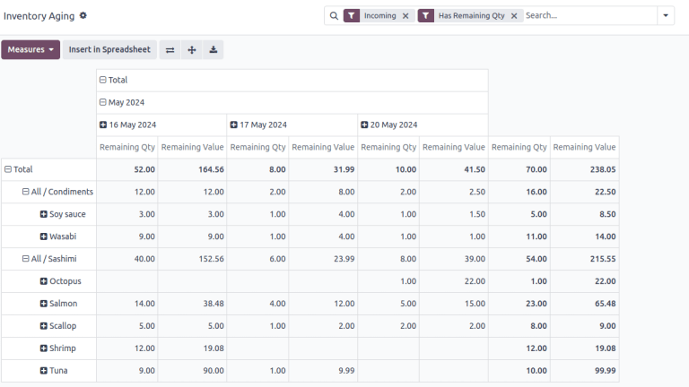
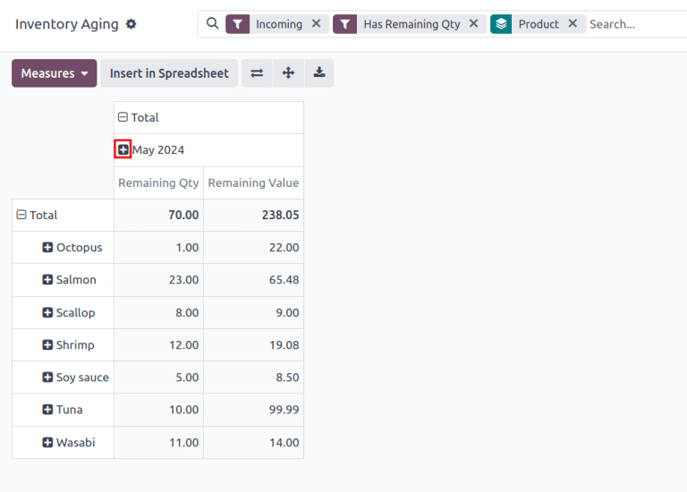

# Inventory aging report

The inventory aging report evaluates all items in stock, providing insights into potentially sunken
purchase costs and delays in profitability.

Create customized pivot tables to analyze product, operation types, month, or company breakdowns.
This helps identify products in stock that are at risk of passing their expiration or viability
dates, or instances of rot/decay for fast-expiring items.

#### NOTE
The *Reporting* menu in *Inventory* is only accessible to users with [admin access](../../../../general/users/access_rights.md).

To access the inventory aging report, go to Inventory app ‣ Reporting ‣
Inventory Aging.

## Navigate the inventory aging report

By default, the Inventory Aging report displays a pivot table, with the month in
columns, and product category in rows. The default filters, Incoming and Has
Remaining Qty, show only products from receipts, and are currently in stock.

Remaining Qty displays the number of on-hand items, and Remaining Value
displays the total cost of purchasing these items.

Clicking the <i class="fa fa-plus-square"></i> (plus) icon in each column or row reveals options to
expand the pivot table and show a detailed breakdown of the Remaining Qty and
Remaining Value by Product, Product Category, Date,
or Company. Clicking the <i class="fa fa-minus-square-o"></i> (minus) icon collapses it
back to its previous state.

#### NOTE
Records in the Inventory Aging report are *stock valuation layers* (SVLs),
representing product moves that impact stock valuation.

Inventory adjustments do **not** create ; only items purchased from vendors do.

## Generate reports

After learning how to [navigate the inventory aging report](#inventory-warehouses-storage-aging-report), it can be used to create and share different reports.

A few common reports that can be created using the Inventory Aging report are detailed
below.

### Rotating stock report

To create a report to identify items that have been in stock for a while, follow these steps:

1. Navigate to Inventory app ‣ Reporting ‣ Inventory Aging.
2. On the Inventory Aging report, click the <i class="fa fa-caret-down"></i> (caret
   down) icon in the Search... bar to see a drop-down list of Filters,
   Group By, and Favorite options.
3. Choose Product under the Group By section. Doing so expands the pivot
   table to show a product in each row.
4. Click the <i class="fa fa-plus-square"></i> (plus) icon to the left of the date column. Hover
   over Date from the drop-down menu and choose Year, Quarter,
   Month, Week, or Day. Doing so expands the columns to show the
   Remaining Qty and Remaining Value by the selected time period.
   
5. The report now displays the on-hand stock of items, and their total purchasing cost, for each
   time period.
