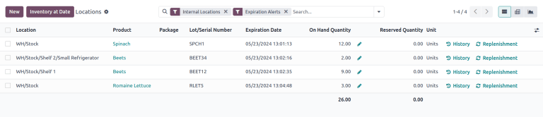
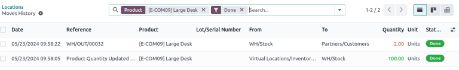

# Locations dashboard

The *Locations* dashboard in the *Inventory* application provides an overview of on-hand storage
locations for company products. Use this report to see where stock is stored, identify
[misplaced items](#inventory-warehouse-storage-stranded), or view past inventory to see product
locations on specific dates.

#### NOTE
The *Reporting* menu in *Inventory* is only accessible to users with [admin access](../../../../general/users/access_rights.md).

To access the locations report, the *Storage Locations* feature must be enabled. To do that, go to
Inventory app ‣ Configuration ‣ Settings. In the Warehouse section,
tick the checkbox for Storage Locations, and click Save. Then, access the
locations dashboard by navigating to Inventory app ‣ Reporting ‣ Locations.

## Navigate the locations dashboard

By default, the Locations dashboard lists all on-hand products in stock (in the
Product column), along with the following information:

- Location: current storage location. If a product is stored at `Shelf 1` and `Shelf 2`,
  the product is listed twice, showing quantities at each location.
- Package: the package that the product is stored in, if any.
- Lot/Serial Number: if the product has a lot or serial number, it is specified here.
- On Hand Quantity: current quantity of products. Click the <i class="fa fa-pencil"></i>
  (pencil) icon to [modify the on-hand quantity](../inventory_management/count_products.md).
- Reserved Quantity: on-hand quantity reserved for operations, such as pickings,
  delivery orders, or manufacturings.
- Unit: the unit of measure of the product.

Click the buttons to the right of each row item to access additional information:

- <i class="fa fa-history"></i> History: access the stock move history of the product, displaying
  information about the quantity and description of why the product was moved from one location to
  another.
- <i class="fa fa-refresh"></i> Replenishment: access the [reordering rules](../replenishment/reordering_rules.md) page to replenish products at the specific location.

In the upper-left corner of the page, click the the New button to make an
[inventory adjustment](../inventory_management/count_products.md) to record quantities of a
certain product at a specific Location.

To view products, quantities, and their locations for a specified date, click the
Inventory At Date button (also located in the upper-left corner of the page). Select a
date and time in the Inventory at Date field, then click Confirm.

## Generate reports

After learning how to [navigate the locations dashboard](#inventory-warehouses-storage-locations-report), it can be used to create and share different
reports.

A few common reports that can be created using the Locations dashboard are detailed
below.

### Dead stock report

To get list of expired items, also referred to as *dead stock*, follow these steps:

1. Go to Inventory app ‣ Reporting ‣ Locations.
2. Then, click the <i class="fa fa-caret-down"></i> (caret down) icon to the right of the Search... bar to reveal a drop-down
   list of Filters, Group By, and Favorite options.
3. Enable the Internal Locations and Expiration Alerts option under the
   Filters section.

The report now displays a list of expired products.

#### NOTE
This report can also be generated from the [Lot and Serials Numbers](../../product_management/product_tracking/expiration_dates.md#inventory-product-management-expiration-alerts) page, accessed by going to
Inventory app ‣ Products ‣ Lots/Serial Numbers.

### Stranded inventory report

Businesses using multi-step flows in the *Inventory* or *Manufacturing* apps, may have *stranded*
items, which are products not in their proper storage locations, due to human error. Use this report
to periodically check transfer locations (e.g. *WH/Input*, *WH/Pre-Processing*) to ensure items are
moved to their intended storage locations, and accurately recorded in the database.

To get a list of items that might be sitting idly in storage, follow these steps:

1. Go to Inventory app ‣ Reporting ‣ Locations.
2. In the Search... bar, begin typing the name of the location where products are
   intended to be moved to, such as `WH/Input`,  or `WH/Packing`.
3. Select the Search Location for: [location name] option from the resulting drop-down
   menu that appears beneath the Search... bar.
   

The report now displays a list of products at the transit location.

### Inventory discrepancy report

To generate a report of items that have been moved since the last [inventory audit](../inventory_management/cycle_counts.md), follow these steps:

1. Go to Inventory app ‣ Reporting ‣ Locations.
2. Then, click the <i class="fa fa-caret-down"></i> (caret down) icon to the right of the Search... bar to reveal a drop-down
   list of Filters, Group By, and Favorite options.
3. Enable the Internal Locations and Conflicts option from the
   Filters section.
4. The report now displays items whose quantities have changed since the last cycle count.
   
5. Click the <i class="fa fa-history"></i> History button to view inventory transfers, including
   receipts and deliveries, that have occurred since the inventory adjustment.
   
