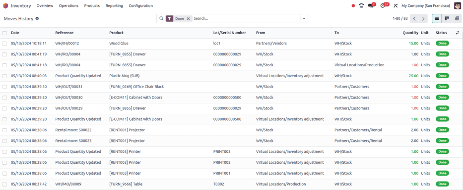

# Moves history dashboard

The *Moves History* report in Odoo *Inventory* provides a detailed record of product movements
(containing past and current locations), lot numbers, and reasons for movement. Reports can be
generated for any time frame, making this report essential for analyzing stock levels, monitoring
inventory turnover, and identifying any discrepancies in inventory.

#### NOTE
The reporting feature is only accessible to users with [admin access](../../../../general/users/access_rights.md).

To access the stock report, go to Inventory app ‣ Reporting ‣ Moves History.

## Navigate the moves history report

In the report, the columns represent:

- Date: calendar date and time of the stock move.
- Reference: description of the reason for the stock move or quantity change, such as a
  receipt number (e.g. `WH/IN/00012`).
- Product: name of the product involved in the move.
- Lot/Serial Number: specifies the lot or serial number of the tracked product being
  moved.
- From: source location of the moved product.
- To: destination location of the moved product.
- Quantity: number of products moved.
- Unit: unit of measure of the products moved.
- Status: indicates the move status, which can be Done,
  Available (ready for action), or Partially Available (insufficient
  quantities to complete the operation).

### Search options

Use the following search options to customize the Moves History report to display
relevant information

Bộ lọc

The Filters section allows users to search among pre-made and custom filters to
find specific stock records.

- To Do: show stock move records that are in progress. This includes lines with a
  Status column value of Available or Partially Available.
- Done: completed stock moves, with a Status of Done.
- Incoming: displays move records from vendor locations.
- Outgoing: displays move records to customer locations, including customer
  returns.
- Internal: displays move records from one internal location to another.
- Manufacturing: shows records where products were produced from the virtual,
  production [location](../inventory_management/use_locations.md).
- Date: select this drop-down menu to access various date filter options and view
  stock moves from a specific month, quarter, or year.
- Last 30 Days: show records that occurred in the last thirty days.
- Last 3 Months: show records from the last three months.

Nhóm theo

The Group By section allows users to add pre-made and custom groupings to the
search.

- Product: group records by product.
- Status: group records by the three status types: Done,
  Available, and Partially Available.
- Date: group records by Year, Quarter, Month,
  Week, or Day.
- Transfers: group records by operation number, e.g. `WH/OUT/00012`,
  `WH/MO/00211`.
- Location: group records by source location (the From column in this
  report).
- Category: group records by product category. To configure these, go to
  Inventory app ‣ Configuration ‣ Products: Product Categories.
- Batch Transfer: group records by [batch](../../shipping_receiving/picking_methods/batch.md).

Yêu thích

To save the current applied filters and groups, so the same information can be easily accessed
after closing this page, click Save current search.

Optionally, tick the Default filter checkbox to make this current view the default
filter when opening the Moves History report. Or tick the Shared
checkbox to make the search option available to other users.

Lastly, click the Save button.

#### SEE ALSO
[Tìm kiếm, lọc, và nhóm bản ghi](../../../../essentials/search.md)
