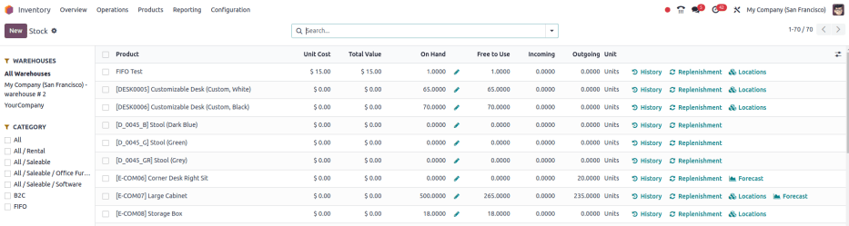

# Stock report

Use the stock report in Odoo _Inventory_ for a detailed list of all stored products, including those\
reserved, purchased and in transit, as well as those delivered to customers.

#### NOTE

The reporting feature is only accessible to users with [admin access](../../../../general/users/access_rights.md).

To access the stock report, go to Inventory app ‣ Reporting ‣ Stock.

## Navigate the stock report

On the stock report, the left sidebar includes several groupings to narrow down what is being shown.\
The default groupings are Warehouses, which filters products by specific warehouses,\
and Category, which shows products within a selected product category.

#### NOTE

The Warehouse grouping is only available when there are multiple warehouses in the\
database. Refer to the [Kho hàng](../inventory_management/warehouses.md) documentation for more details.

In the report itself, the columns represent:

* Product: name of the product.
* Unit Cost: average inventory valuation per unit, adjusted based on the cost to\
  purchase and/or manufacture the product.
*   Total Value: Total inventory valuation of the product, calculated by multiplying unit\
    cost by on-hand quantity.

    **SEE ALSO**

    * [Compute average cost inventory valuation per unit](../../../../finance/accounting/get_started/avg_price_valuation.md#inventory-avg-cost-formula)
    * [Inventory valuation methods](../../product_management/inventory_valuation/inventory_valuation_config.md)
* On Hand: current quantity of products. Click the (pencil) icon to [modify the on-hand quantity](../inventory_management/count_products.md).
* Free to Use: on-hand quantity that are **not** reserved for delivery or manufacturing\
  orders, and are available to sell or use.
* Incoming: items expected to arrive at the warehouse. Number of products is based on\
  quantities in confirmed purchase orders.
* Outgoing: items expected to leave the warehouse or be consumed in manufacturing\
  orders. Number of products is based on quantities in confirmed sales or manufacturing orders.

Click the buttons to the right of each row item to access additional information:

* History: access the stock move history of the product, displaying information about\
  the quantity and description of why the product was moved from one location to another.
* Replenishment: access the [reordering rules](../replenishment/reordering_rules.md) page for the product to create or manage methods of procuring\
  the product.
* Locations: break down of on-hand quantity at multiple storage locations. Only\
  available when the product is stored in multiple locations.
* Forecast: access the forecasted report to view on-hand, incoming, and outgoing\
  quantities. Report also contains links to confirmed purchase, sales, or manufacturing orders. Only\
  available when there are confirmed sales, purchase, or manufacturing orders for the product.

### Search options

Bộ lọc

The Filters section allows users to search among pre-made and custom filters to\
find specific stock records.

* Published: display products published on the website. Only available with th&#x65;_&#x57;ebsite_ app installed.
* Available in POS: display products available through the _Point of Sale_ app.
* Available in Self: display products available in self order through the _Point_\
  _of Sale_ app. Appears in the search because the Available in Self Order checkbox\
  was ticked in the Point of Sale section of a product form's Sales\
  tab. The option is only available when the Available in POS checkbox is ticked.
* Not available in Self: display products available in _PoS_, but not available in\
  self order.

#### SEE ALSO

[Configure PoS products](https://youtu.be/REbA3TBhFa4)

* Can be Sold: display products that can be sold to customers. Appears in the\
  search because the Can be Sold checkbox is ticked on the product form.
* Can be Purchased: display products that can be bought from vendors. Appears in\
  the search because the Can be Purchased checkbox is ticked on the product form.
* Can be Recurring: show subscription products, indicated by ticking the\
  Recurring checkbox on the product form. Only available with the _Subscription_\
  app activated.
* Can be Rented: show products that can be loaned to customers for a certain time.\
  Appears in the search because the Can be Rented checkbox was ticked on the\
  product form. Only available with the _Rental_ app installed.
* Can be Subcontracted: display products that can be produced by a[third-party manufacturer](../../../manufacturing/subcontracting/subcontracting_basic.md). Available only with th&#x65;_&#x4D;anufacturing_ app installed.
* Can be Expensed: show items that can be expensed. Only available with th&#x65;_&#x45;xpenses_ app installed.

#### SEE ALSO

[Loại sản phẩm](../../product_management/configure/type.md)

Nhóm theo

The Group By section allows users to add pre-made and custom groupings to the\
search results.

* Product Type: group items by [product type](../../product_management/configure/type.md).
* Product Category: group items by product category. To configure these, go to\
  Inventory app ‣ Configuration ‣ Products: Product Categories.
* POS Product Category: group items by [point of sale product categories](../../../../sales/point_of_sale/configuration.md).

Yêu thích

To save the current applied filters and groupbys, so the same information can be easily\
accessed after closing this page, click Save current search.

Optionally, tick the Default filter checkbox to make this current view the default\
filter when opening the stock report. Or tick the Shared checkbox to make the\
search option available to other users.

Lastly, click the Save button.

#### SEE ALSO

[Tìm kiếm, lọc, và nhóm bản ghi](../../../../essentials/search.md)
