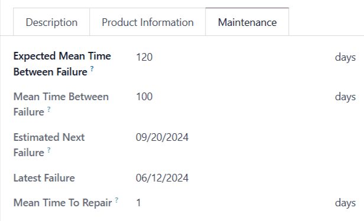

# Add new equipment

Trong Odoo, *thiết bị* đề cập đến mọi thứ được sử dụng trong các hoạt động hàng ngày, bao gồm cả sản xuất sản phẩm. Thiết bị có thể có nghĩa là một bộ phận máy móc trên dây chuyền sản xuất, một công cụ được sử dụng ở các vị trí khác nhau hoặc một máy tính trong văn phòng. Thiết bị được đăng ký trong Odoo có thể thuộc sở hữu của công ty sử dụng cơ sở dữ liệu Odoo hoặc của bên thứ ba, chẳng hạn như nhà cung cấp trong trường hợp cho thuê thiết bị.

Using Odoo *Maintenance*, it is possible to track individual pieces of equipment, along with
information about their maintenance requirements. To add a new piece of equipment, navigate to the
Maintenance module, select Equipments ‣ Machines & Tools ‣ Create,
and configure the equipment as follows:

- Equipment Name: the product name of the piece of equipment
- Equipment Category: the category that the equipment belongs to; for example,
  computers, machinery, tools, etc.; new categories can be created by navigating to
  Configuration ‣ Equipment Categories and clicking Create
- Company: the company that owns the equipment; again, this can be the company that uses
  the Odoo database, or a third-party company
- Used By: specify if the equipment is used by a specific employee, department, or both;
  select Other to specify both an employee and a department
- Maintenance Team: the team responsible for servicing the equipment; new teams can be
  created by navigating to Configuration ‣ Maintenance Teams and
  selecting Create; the members of each team can also be assigned from this page
- Technician: the person responsible for servicing the equipment; this can be used to
  assign a specific individual in the event that no maintenance team is assigned or when a specific
  member of the assigned team should always be responsible for the equipment; any person added to
  Odoo as a user can be assigned as a technician
- Used in location: the location where the equipment is used; this is a simple text
  field that can be used to specify locations that are not work centers, like an office, for
  example
- Work Center: if the equipment is used at a work center, specify it here; equipment can
  also be assigned to a work center by navigating to Maintenance ‣ Equipments ‣
  Work Centers, selecting a work center or creating a new one using the Create button,
  and clicking the Equipment tab on the work center form

## Include additional product information

The Product Information tab at the bottom of the page can be used to provide further
details about the piece of equipment:

- Vendor: the vendor that the equipment was purchased from
- Vendor Reference: the reference code assigned to the vendor
- Model: the specific model of the piece of equipment
- Serial Number: the unique serial number of the equipment
- Effective Date: the date that the equipment became available for use; this is used to
  calculate the 
- Cost: the amount the equipment was purchased for
- Warranty Expiration Date: the date on which the equipment's warranty will expire

## Add maintenance details

The Maintenance tab at the bottom of the page provides information about the failure
frequency of the piece of equipment:

- Expected Mean Time Between Failure: the average number of days the equipment is
  expected to operate between failures. This number can be configured manually.
- Mean Time Between Failure: the average number of days the equipment operates between
  failures. This number is calculated automatically based on previous failures, and cannot
  be configured manually.
- Estimated Next Failure: the estimated date the equipment may experience its next
  failure.
  This date is calculated automatically based on the data in the Mean Time Between
  Failure and Latest Failure fields, and cannot be configured manually.
- Latest Failure: the most recent date on which the equipment failed. This date is based
  on the creation date of the equipment's most recent maintenance request, and cannot be configured
  manually.
- Mean Time To Repair: the average number of days needed to repair the equipment. This
  number is calculated automatically based on the duration of previous maintenance requests, and
  cannot be configured manually.

