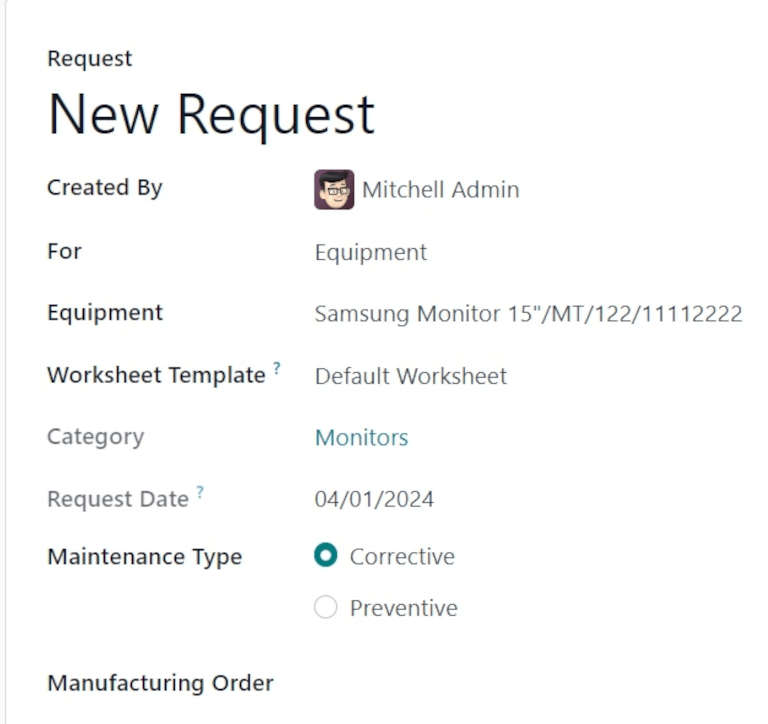
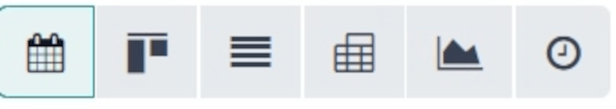
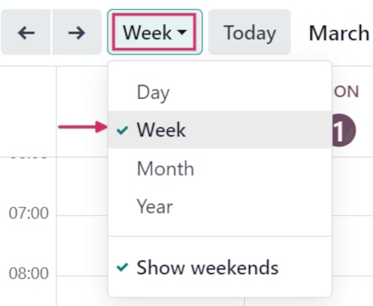

# Maintenance calendar

Avoiding equipment breakdowns, and blocks in warehouse work centers, requires constant equipment
maintenance. Timely corrective maintenance for machines and tools that break unexpectedly, as well
as preventive maintenance to ensure that such issues are avoided, are key to keeping warehouse
operations running smoothly.

In Odoo *Maintenance*, users can access the *Maintenance Calendar* to create, schedule, and edit
both corrective and preventive maintenance requests, to stay on top of equipment and work centers.

## Create maintenance request

Maintenance requests can be created directly from the *Maintenance Calendar*. To access the
calendar, navigate to Maintenance app ‣ Maintenance ‣ Maintenance Calendar.

To create a new request, click anywhere on the calendar. Doing so opens a New Event
pop-up window. In the Name: field, assign a title to the new request.

Clicking Create on the pop-up window saves the new request with no additional details.
If the request's creation should be canceled, click Cancel.

To add more details and schedule the request for a specific date and time, click Edit.

Clicking Edit opens a blank maintenance request form, where various details about the
request can be filled out.

### Edit maintenance request

In the Request field, assign a title to the new request. In the Created By
field, from the drop-down menu, select which user the request was created by. By default, this field
populates with the user actually creating the request.

In the For field, from the drop-down menu, select if this request is being created for a
piece of Equipment, or a Work Center.

#### NOTE
If Work Center is selected in the For field's drop-down menu, two
additional fields appear on the form: Work Center and Block Workcenter.

In the Work Center field, select which work center in the warehouse this maintenance
request applies to.

If the Block Workcenter option's checkbox is ticked, it is not possible to plan work
orders, or other maintenance requests, in this work center during the time that this request is
being performed.

If Equipment is selected in the For field, which it is by default, select
which machine or tool requires maintenance from the Equipment field. Once a specific
piece of equipment is selected, a greyed-out Category field appears, listing the
*Equipment Category* to which the equipment belongs.

In the Worksheet Template field, if necessary, click the drop-down menu to select a
worksheet template. These templates are custom templates that can be filled out by the employee
performing the maintenance.

Under the Category field, the Request Date field displays the date requested
for the maintenance to happen.

The Maintenance Type field provides two selectable radio button options:
Corrective and Preventive.

Corrective maintenance is for requests that arise for immediate needs, such as broken
equipment, while Preventive maintenance is for planned requests, to avoid breakdowns in
the future.

If this request is tied to a specific , select that  from the Manufacturing
Order field.

From the drop-down menu for the Team field, select the desired maintenance team who will
perform the maintenance. In the Responsible field, select the technician responsible for
the request.

In the Scheduled Date field, click the date to open a calendar popover. From this
popover, select the planned date of the maintenance, and click Apply to save the date.

In the Duration field, enter the the amount of hours (in a `00:00` format) that the
maintenance is planned to take.

In the Priority field, choose a priority between one and three ⭐⭐⭐ (stars).
This indicates the importance of the maintenance request.

If working in a multi-company environment, from the drop-down menu in the Company field,
select the company to which this maintenance request belongs.

At the bottom of the form, there are two tabs: Notes and Instructions.

In the Notes tab, type out any internal notes for the team or technician assigned to the
request, if necessary.

In the Instructions tab, if necessary, select one of the three radio button options to
provide maintenance instructions to the assigned team or technician. The available methods for
providing instructions are via PDF, Google Slide, or Text.

## Calendar elements

The *Maintenance Calendar* provides various views, search functions, and filters to help keep track
of the progress of ongoing and planned maintenance requests.

The following sections describe elements found across various views of the calendar.

### Filters and Favorites

To access the maintenance calendar, navigate to Maintenance app ‣ Maintenance ‣
Maintenance Calendar.

To add and remove filters for sorting data on the *Maintenance Calendar*, click the 🔻
(triangle pointed down) icon, to the right of the search bar at the top of the page.

The left-hand side of the resulting drop-down menu lists all the different Filters users
can select. By default, To Do and Active are selected, so all open requests
are displayed.

The right-hand side of the drop-down menu lists the Favorites, or any searches that have
been saved as a favorite to be revisited at a later date.

To save a new Favorite search, select the desired Filters. Then, click
Save current search. In the field directly below Save current search, assign
a name to the search.

Under the assigned name, there are two options, to save the current search either as the
Default filter, or as a Shared filter.

Selecting Default filter sets this filter as the default when opening this calendar
view.

Selecting the Shared filter makes this filter available to other users.

Once ready, click Save. When clicked, the new Favorite filter appears in the
Favorites column, and a ⭐ (gold star) icon appears with the filter's name in
the search bar.

### Lượt xem

The Maintenance Calendar is available in six different views: Calendar
(default), Kanban, List, Pivot, Graph, and
Activity.

#### Chế độ xem lịch

Calendar is the default view displayed when the Maintenance Calendar is
opened. There are a number of options in this view type for sorting and grouping information about
maintenance requests.

Ở góc trên bên trái trang có menu thả xuống mặc định hiển thị Tuần. Khi nhấp vào menu này sẽ hiển thị các khoảng thời gian khác nhau để xem lịch: Ngày, Tháng và Năm. Tùy chọn Hiển thị cuối tuần cũng được chọn mặc định. Nếu bỏ chọn, cuối tuần sẽ không hiển thị trên lịch.

To the left of this menu, there is a ⬅️ (left arrow) icon and a ➡️ (right
arrow) icon. Clicking these arrows moves the calendar backward or forward in time, respectively.

To the right of the drop-down menu set to Week, by default, is a Today
button. Clicking this button resets the calendar to view today's date, no matter which point in time
is being viewed before clicking it.

At the far-right side of the page is a sidebar column, containing a minimized calendar set to
today's date, and a Technician list, displaying all the *Technicians* with requests
currently open. Click the (panel) icon at the top of this sidebar to open or close the
sidebar.

#### NOTE
The Technician list only displays if technicians are assigned to open requests, and
individual technicians are only listed, if they are listed as Responsible on at least
**one** maintenance request form.

#### Chế độ xem kanban

With the Kanban view, all open maintenance requests are displayed in Kanban-style
columns, in their respective stages of the maintenance process.

Each maintenance request appears on its own task card, and each task card can be dragged-and-dropped
to a different stage of the Kanban pipeline.

Each column has a name (i.e. In Progress). Hovering at the top of a column reveals a
⚙️ (gear) icon. Clicking the ⚙️ (gear) icon reveals a list of options for
that column: Fold, Edit, Automations, and Delete.

Clicking Fold folds the column to hide its contents.

Clicking Edit opens an Edit: (stage name) pop-up window, with the
corresponding stage name, wherein the column's details can be edited. The following are the column
options that can be edited:

- Name: the name of the stage in the Kanban pipeline.
- Folded in Maintenance Pipe: when checked, this stage's column is folded by default in
  the Kanban view type.
- Yêu cầu đã được xác nhận: Khi ô này không được đánh dấu và loại yêu cầu bảo trì là 'Khu vực sản xuất', thì không có đợt ngừng hoạt động nào được tạo trên khu vực sản xuất tương ứng khi tạo yêu cầu bảo trì. Nếu ô này  *được* đánh dấu, thì khu vực sản xuất sẽ tự động bị chặn trong khoảng thời gian đã chọn, vào ngày nhất định hoặc ngay khi có thể, với điều kiện lúc đó khu vực sản xuất không hoạt động.
- Sequence: the order in the maintenance process, in which this stage appears.
- Request Done: if ticked, this box indicates this stage is the final step of the
  maintenance process. Requests moved to this stage are closed.

Once ready, click Save & Close. If no changes have been made, click Discard,
or click the X icon to close the pop-up window.

#### Xem danh sách

With the List view selected, all open maintenance requests are displayed in a list, with
information about each request listed in its respective row.

The columns of information displayed in this view type are the following:

- Subjects: the name assigned to the maintenance request.
- Employee: the employee who originally created the maintenance request.
- Technician: the technician responsible for the maintenance request.
- Category: the category the equipment being repaired belongs to.
- Stage: the stage of the maintenance process the request is currently in.
- Company: if in a multi-company environment, the company in the database the request is
  assigned to.

#### Chế độ xem pivot

With the Pivot view selected, maintenance requests are displayed in a pivot table, and
can be customized to show different data metrics.

To add more data to the pivot table, click the Measures button to reveal a drop-down
menu. By default, Count is selected. Additional options to add to the table are
Additional Leaves to Plan Ahead, Duration, and Repeat Every.

To the right of the Measures button is the Insert in Spreadsheet button.
Clicking this button opens a pop-up window titled Select a spreadsheet to insert your
pivot..

Cửa sổ bật lên này có hai tab: Bảng tính và Trang chủ. Nhấp vào một trong các tab này và chọn bảng tính hoặc trang chủ trong cơ sở dữ liệu để thêm bảng pivot vào. Khi sẵn sàng, nhấp Xác nhận. Nếu không muốn thêm bảng này vào bảng tính hoặc trang chủ, nhấp Hủy hoặc nhấp biểu tượng X để đóng cửa sổ bật lên.

To the right of the Insert in Spreadsheet button are three buttons:

- Flip axis: the x and y axis of the pivot data table flip.
- Expand all: all the available rows and columns of the pivot data table expand fully.
- Download xlsx: the pivot data table is downloaded as an .xlsx file.

#### Chế độ xem biểu đồ

With the graph view selected, the following options appear between the search bar and visual
representation of the data. These graph-specific options are located to the right of the
Measures and Insert in Spreadsheet buttons.

There are three different types of graphs available to users to view the data:

- Bar Chart: the data is displayed in a bar chart.
- Line Chart: the data is displayed in a line chart.
- Pie Chart: the data is displayed in a pie chart.

When viewing the data as a Bar Chart graph, the data can be formatted in the following
ways:

- Stacked: the data is stacked on the graph.
- Descending: the data is displayed in descending order.
- Ascending: the data is displayed in ascending order.

When viewing the data as a Line Chart graph, the data can be formatted in the following
ways:

- Stacked: the data is stacked on the graph.
- Cumulative: the data is increasingly accumulated.
- Descending: the data is displayed in descending order.
- Ascending: the data is displayed in ascending order.

When viewing the data as a Pie Chart graph, all relevant data is displayed by default,
and no additional formatting options are available.

#### Xem hoạt động

With the Activity view selected, all open maintenance requests are listed in their own
row, with the ability to schedule activities related to those requests.

Maintenance requests are listed in the Maintenance Request column as activities.
Clicking a request opens a Maintenance Request popover that indicates the status of the
request, and the responsible technician. To schedule an activity directly from the popover, click
➕ Schedule an activity. This opens a Schedule Activity pop-up window.

From the pop-up window, choose the Activity Type, provide a Summary,
schedule a Due Date, and choose the responsible user in the Assigned to
field.

Type any additional notes for the new activity in the blank space under the greyed-out
Log a note... field. When clicked, this changes to Type "/" for commands.

Once ready, click Schedule to schedule the activity. Alternatively, click
Schedule & Mark as Done to close the activity, click Done & Schedule Next to
close the activity and open a new one, or click Cancel to cancel the activity.

With the Activity view selected, each activity type available when scheduling an
activity is listed as its own column. These columns are Email, Call,
Meeting, Maintenance Request, To-Do, Upload
Document, Request Signature, and Grant Approval.

To schedule an activity with that specific activity type, click into any blank box on the
corresponding row for the desired maintenance request, and click the ➕ (plus) icon. This
opens an Odoo pop-up window, wherein the activity can be scheduled.

#### SEE ALSO
- [Maintenance requests](maintenance_requests.md)
- [Add new equipment](add_new_equipment.md)
