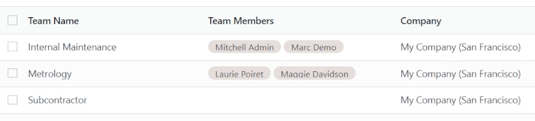
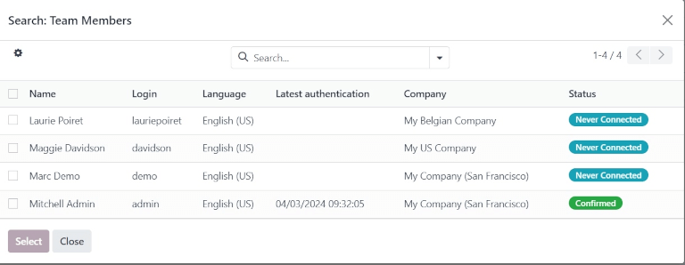
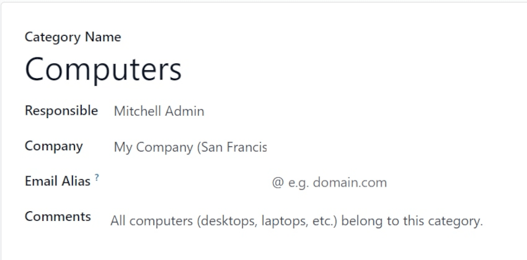
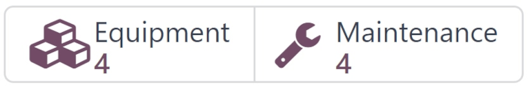
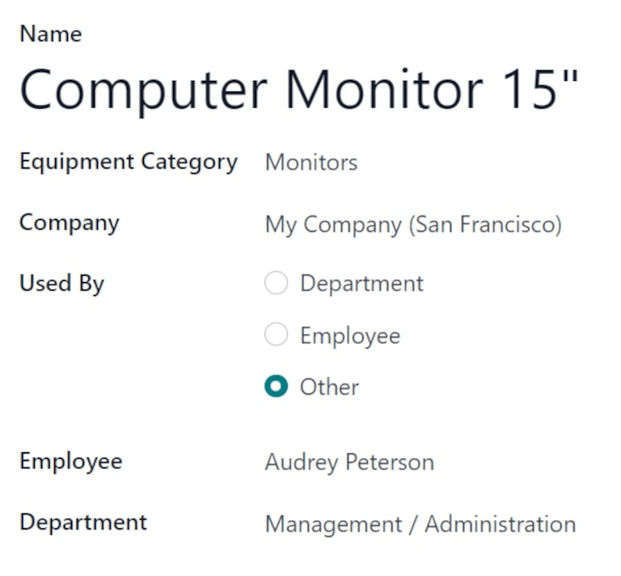
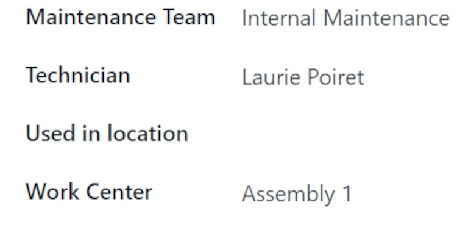
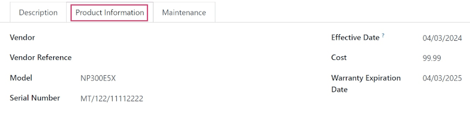
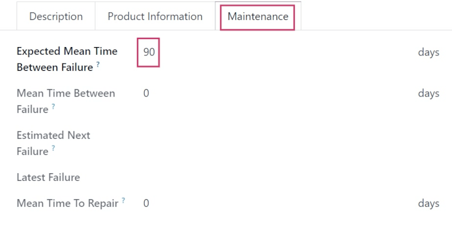
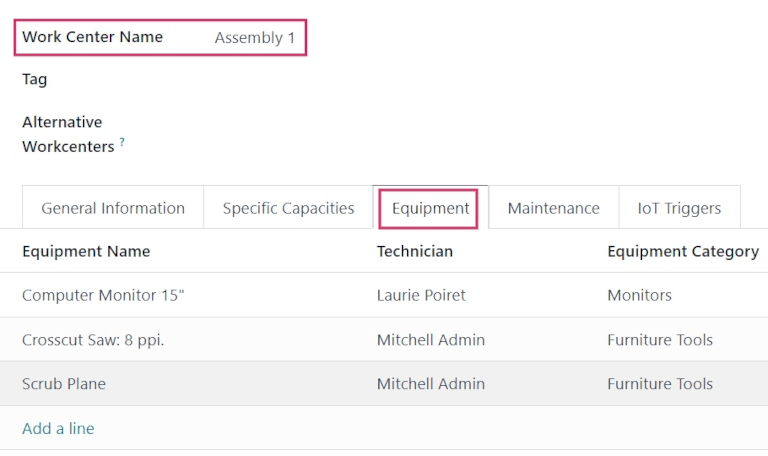

# Maintenance setup

Odoo *Maintenance* helps companies schedule corrective and preventive maintenance on equipment used
in their warehouse. This helps companies avoid equipment breakdowns, blocks in warehouse work
centers, and emergency repair costs.

## Maintenance teams

When creating maintenance requests, a *maintenance team* can be assigned to the request as the team
responsible for handling the request.

To view existing maintenance teams, navigate to Maintenance app ‣ Configuration
‣ Maintenance Teams.

From the resulting Teams page, a list of all existing teams (if any) is displayed, with
the Team Name, Team Members, and Company listed in the columns,
by default.

To add a new team, click New. This adds a blank line at the bottom of the list of teams.
In the blank field that appears below the Team Name column, assign a name to the new
maintenance team.

In the Team Members column, click the field to reveal a drop-down menu with existing
users in the database. Choose which users should be members of the new maintenance team.

Click Search More... to open a Search: Team Members pop-up window to search
for users **not** shown on the initial drop-down menu.

In the Company column, if in a multi-company environment, click the drop-down menu to
select the company in the database to which this new maintenance team belongs.

Khi sẵn sàng, hãy nhấp vào Lưu để lưu thay đổi.

## Thiết bị

In Odoo *Maintenance*, *equipment* refers to machines and tools used internally in warehouse work
centers. Equipment can include technology such as computers or tablets, power tools, machines used
for manufacturing, and more.

### Equipment categories

Each piece of equipment belongs to an *equipment category*. Before adding new equipment, make sure
that a fitting equipment category is created.

To create a new equipment category, navigate to Maintenance app ‣ Configuration
‣ Equipment Categories, and click New. Doing so opens a blank equipment category
form.

On the blank form, assign a name in the Category Name field.

In the Responsible field, assign a user to be responsible for the equipment in this
category, if necessary. By default, the user who creates the category is selected as
Responsible, by default.

If in a multi-company environment, click the drop-down menu in the Company field, and
select the company in the database to whom the equipment in this category belongs.

In the Email Alias field, assign an email alias to this category, if necessary.

In the Comments field, type any comments or notes for internal users to reference in
relation to this category, if necessary.

#### NOTE
Once a new equipment category is created, all equipment belonging to that category, as well as
any past or currently open maintenance requests, are available from the equipment category form.

Navigate to Maintenance app ‣ Configuration ‣ Equipment Categories, and
select a category to view. Locate the Equipment and Maintenance smart
buttons at the top of the form.

Click the Equipment smart button to view all equipment belonging to this category.
Click the Maintenance smart button to view any past, or currently open, maintenance
requests.

### Machines & tools

To add new equipment, navigate to Maintenance app ‣ Equipment ‣ Machines &
Tools, and click New. This opens a blank equipment form.

In the Name field, assign a name for the new equipment. In the Equipment
Category field, click the drop-down menu and select which category this new equipment should belong
to.

If in a multi-company environment, click the drop-down menu in the Company field, and
select the company in the database to whom the new equipment belongs.

In the Used By field, select from one of three radio button options:
Department, Employee, or Other.

If Department is selected, a Department field appears below the
Used By field. Click the drop-down menu and select the department that uses this
equipment.

If Employee is selected, an Employee field appears below the Used
By field. Click the drop-down menu, and select the employee who uses this equipment.

If the Other option is selected, both the Department and
Employee fields appear below the Used By field. Click the drop-down menus
for the respective fields, and choose which department and employee uses this equipment.

In the Maintenance Team field, select the team responsible for this equipment. In the
Technician field, select the team member/user responsible for this equipment.

In the Used in location field, enter the location wherein this equipment will be used,
if not in an internal work center (e.g. in an office).

In the Work Center field, click the drop-down menu, and select which work center this
equipment will be used in.

In the blank space under the Description tab at the bottom of the form, add any relevant
information describing the equipment for users to reference.

#### Product Information tab

To add any relevant information while creating a new piece of equipment, from the equipment form,
click the Product Information tab.

In the Vendor field, add the vendor from which the equipment was purchased. In the
Vendor Reference field, add the product reference number obtained from the vendor, if
applicable.

In the Model field, specify which model this equipment is, if applicable. If the
equipment is serialized, add a serial number in the Serial Number field.

In the Effective Date field, click the date to reveal a calendar popover, and select a
date. This date indicates when this equipment was first put in use, and will be used to compute the
Mean Time Between Failure (MTBF) in the equipment's Maintenance tab.

In the Cost field, specify how much the equipment cost to acquire, if applicable.

If the equipment is covered under a warranty, specify the Warranty Expiration Date by
selecting a date from the calendar popover in that field.

#### Maintenance tab

Various maintenance metrics are available for each piece of equipment, and are automatically
computed, based on corrective maintenance, and planned preventive maintenance.

To view the maintenance metrics for a specific piece of equipment, from the equipment form, click
the Maintenance tab.

Doing so reveals the following fields:

- Expected Mean Time Between Failure: the amount of time (in days) before the next
  failure is expected. This is the **only** field not greyed-out, and the **only** field users can
  edit.
- Mean Time Between Failure: the amount of time (in days) between reported failures.
  This value is computed based on completed corrective maintenances.
- Estimated Next Failure: the date on which the next failure is expected. This date is
  computed as the Latest Failure Date + .
- Latest Failure: The date of the latest failure. The value in this field updates once a
  failure is reported for this equipment.
- Mean Time To Repair: the amount of time (in days) it takes to repair this equipment
  upon failure. This value updates once a maintenance request is completed for this equipment.

## Work centers

To view the work centers where equipment is being used, and how the equipment is being used in them,
navigate to Maintenance app ‣ Equipment ‣ Work Centers, and click into a work
center.

From the resulting work center form, click the Equipment tab to view all machines and
tools being used in that specific work center.

Each piece of equipment is listed with certain relevant information: the Equipment Name,
the responsible Technician, the Equipment Category it belongs to, and a few
important maintenance metrics: its , , and Est. Next Failure date.

#### SEE ALSO
[Add new equipment](applications/inventory_and_mrp/maintenance/add_new_equipment.md)
