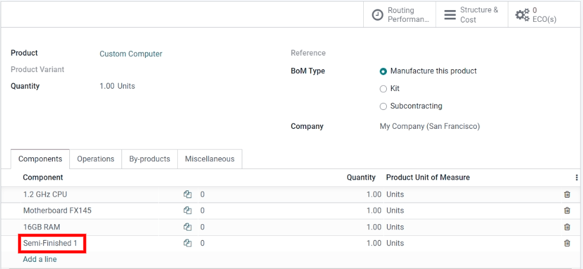

# Quản lý bán thành phẩm

*Sản phẩm bán thành phẩm*, còn được gọi là *tiểu cụm lắp ráp*, là sản phẩm sản xuất được sử dụng làm thành phần trong danh mục vật tư (BoM) của sản phẩm khác. Sản phẩm bán thành phẩm được sử dụng để đơn giản hóa  phức tạp hoặc để phản ánh chính xác hơn quy trình sản xuất. Một  có chứa các sản phẩm bán thành phẩm được gọi là *BoM nhiều cấp*, trong đó có thể phân biệt giữa *sản phẩm chính cấp cao nhất* và các tiểu cụm lắp ráp của nó.

## Cấu hình bán thành phẩm

Để thiết lập  nhiều cấp, bạn phải cấu hình sản phẩm cấp cao nhất và sản phẩm bán thành phẩm. Do đó, bước đầu tiên là tạo các sản phẩm bán thành phẩm và  của chúng.

#### SEE ALSO
[Danh mục vật tư](../basic_setup/bill_configuration.md)

## Tạo danh mục vật tư (BoM) cấp cao nhất

Sau khi các sản phẩm bán thành phẩm được cấu hình đầy đủ, hãy điều hướng đến Sản xuất ‣ Sản phẩm ‣ Sản phẩm. Sau đó, Tạo sản phẩm cấp cao nhất. Cấu hình thông số kỹ thuật của sản phẩm theo ý muốn và đảm bảo Lưu.

Sau khi cấu hình xong sản phẩm cấp cao nhất, hãy nhấp vào nút thông minh Danh mục vật tư trên biểu mẫu sản phẩm, sau đó nhấp vào Tạo để tạo  cho sản phẩm cấp cao nhất. Tiếp theo, chỉ cần thêm các sản phẩm bán thành phẩm vào  này, cùng với những thành phần cần thiết khác.

## Quản lý kế hoạch sản xuất

Có một số phương pháp để quản lý tự động hóa lệnh sản xuất cho các sản phẩm có `BoM (Danh mục vật tư)` nhiều cấp.

#### NOTE
Các sản phẩm bán thành phẩm được sử dụng khi quản lý những sản phẩm sản xuất có BoM nhiều cấp. Nếu BoM được tạo ra chỉ để tổ chức thành phần hoặc gộp sản phẩm có thể bán được, thì sử dụng [Kit](kit_shipping.md) sẽ hợp lý hơn.

Để tự động kích hoạt lệnh sản xuất cho các sản phẩm bán thành phẩm sau khi xác nhận lệnh sản xuất cho sản phẩm chính, có hai tùy chọn:

- **Tùy chọn 1 (được đề xuất):** Tạo *Quy tắc tái đặt hàng* cho các sản phẩm bán thành phẩm và đặt cả số lượng tồn kho tối thiểu và tối đa mong muốn thành `0`.

#### SEE ALSO
[Configure reordering rules](../../purchase/products/reordering.md)

- **Tùy chọn 2:** Kích hoạt các tuyến Bổ sung theo đơn đặt hàng (MTO) và Sản xuất trong tab Tồn kho của biểu mẫu sản phẩm bán thành phẩm.

Tùy chọn 1 linh hoạt hơn Tùy chọn 2 và do đó được khuyên dùng. Các quy tắc tái đặt hàng không liên kết trực tiếp nhu cầu với việc bổ sung hàng, và do đó cho phép không dự trữ trước hàng tồn kho và chuyển chúng sang các lệnh sản xuất khác, nếu cần. Tuyến Bổ sung theo đơn đặt hàng (MTO) tạo ra một liên kết duy nhất giữa các sản phẩm bán thành phẩm và sản phẩm cấp cao nhất, dự trữ riêng số lượng tồn kho cho lệnh sản xuất cấp cao nhất đã xác nhận.

Dù bạn chọn tuỳ chọn nào, các sản phẩm bán thành phẩm phải được sản xuất hoàn chỉnh trước khi có thể bắt đầu sản xuất sản phẩm cấp cao nhất.

