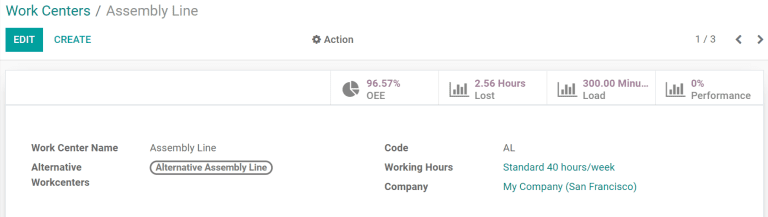
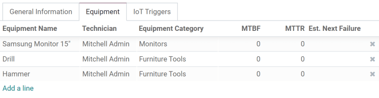

# Quản lý công đoạn sử dụng khu vực sản xuất

Odoo Sản xuất cho phép thực hiện công đoạn tại các khu vực sản xuất cụ thể. Khi lệnh sản xuất được tạo cho một sản phẩm, thì mọi công đoạn được liệt kê trong tab Hoạt động của danh mục vật tư (BoM) cũng sẽ được tự động tạo và được chỉ định cho khu vực sản xuất đã xác định. Bạn có thể quản lý công đoạn trong phân hệ Sản xuất bằng cách chọn Hoạt động ‣ Công đoạn.

Để sử dụng khu vực sản xuất, trước tiên phải bật tính năng Công đoạn. Để làm như vậy, hãy vào phân hệ Sản xuất, chọn Cấu hình ‣ Cài đặt và kích hoạt hộp kiểm bên cạnh Công đoạn. Sau đó, có thể tạo và quản lý khu vực sản xuất bằng cách chọn Cấu hình ‣ Khu vực sản xuất.

## Tạo một khu vực sản xuất

Trong phân hệ Sản xuất, chọn Cấu hình ‣ Khu vực sản xuất ‣ Tạo. Sau đó, bạn có thể điền biểu mẫu khu vực sản xuất như sau:

- Tên khu vực sản xuất: đặt tên ngắn gọn cho khu vực sản xuất để mô tả loại hoạt động sản xuất tại đó
- Khu vực sản xuất dự trù: chỉ định một khu vực sản xuất dự trù để thực hiện hoạt động nếu khu vực sản xuất chính không khả dụng
- Mã: gán cho khu vực sản xuất một mã tham chiếu
- Giờ làm việc: xác định số giờ mà khu vực sản xuất có thể được sử dụng mỗi tuần
- Công ty: chọn công ty mà khu vực sản xuất thuộc về

### Thiết lập tiêu chuẩn về năng suất của khu vực sản xuất

Tab Thông tin chung trên biểu mẫu khu vực sản xuất cho phép chỉ định mục tiêu năng suất cho một khu vực sản xuất:

- Hiệu suất thời gian: được sử dụng để tính toán thời lượng dự kiến ​​hoàn thành một công đoạn tại khu vực sản xuất. Ví dụ, nếu thông thường một công đoạn kéo dài trong một giờ, nhưng khi hiệu suất được đặt thành 200%, thì công đoạn này sẽ được hoàn thành trong 30 phút
- Công suất: số lượng sản phẩm có thể được xử lý tại khu vực sản xuất cùng một lúc
- Mục tiêu OEE: mục tiêu về hiệu suất sản xuất tại khu vực sản xuất
- Thời gian trước khi sản xuất: thời gian thiết lập cần thiết trước khi công việc có thể bắt đầu
- Thời gian sau khi sản xuất: thời gian phân tích hoặc dọn dẹp cần thiết sau khi công việc hoàn tất
- Chi phí theo giờ: chi phí vận hành khu vực sản xuất trong một giờ
- Tài khoản phân tích: tài khoản dùng để ghi lại chi phí của khu vực sản xuất

### Chỉ định thiết bị cho một khu vực sản xuất

Sử dụng tab Thiết bị, có thể gán các thiết bị cụ thể cho một khu vực sản xuất. Thông tin sau sẽ được hiển thị cho từng thiết bị được thêm vào:

- Tên thiết bị: tên của thiết bị
- Kỹ thuật viên: kỹ thuật viên chịu trách nhiệm vận hành thiết bị
- Danh mục thiết bị: danh mục mà thiết bị thuộc về
- MTBF: thời gian trung bình giữa các lần hỏng hóc; thời gian trung bình mà thiết bị sẽ hoạt động trước khi hỏng hóc
- MTTR: thời gian trung bình để phục hồi; thời gian trung bình để thiết bị hoạt động trở lại hoàn toàn
- Lần hỏng kế tiếp dự kiến: ước tính thời điểm tiếp theo xảy ra trục trặc thiết bị

#### NOTE
MTBF, MTTR và Lần hỏng kế tiếp dự kiến đều được tính toán tự động dựa trên dữ liệu lỗi trước đó, nếu có.

### Tích hợp với thiết bị IoT

Tab Bộ kích hoạt IoT cho phép tích hợp các thiết bị  với một khu vực sản xuất:

- Thiết bị: xác định thiết bị IoT sẽ được kích hoạt
- Khoá: khóa bảo mật cho thiết bị
- Tác vụ: tác vụ của thiết bị IoT được kích hoạt

## Trường hợp vận dụng: cấu hình một khu vực sản xuất thay thế

Khi một khu vực sản xuất đạt đến mức công suất quy định, thì bạn sẽ không thể xử lý thêm công đoạn mới nào tại đây. Thay vì chờ để sử dụng khu vực sản xuất này, bạn có thể chỉ định một khu vực sản xuất thay thế để thực hiện các công đoạn khác.

Bắt đầu bằng cách tạo một khu vực sản xuất mới. Cấu hình tab Thiết bị với tất cả thiết bị giống như khu vực sản xuất chính. Điều này sẽ đảm bảo rằng các nhiệm vụ giống nhau có thể được thực hiện tại cả hai khu vực sản xuất. Đi đến khu vực sản xuất chính và chọn khu vực sản xuất mới này trong trường lựa chọn Khu vực sản xuất dự trù.

Bây giờ, hãy tạo một lệnh sản xuất mới sử dụng khu vực sản xuất chính để xử lý một trong các hoạt động của lệnh sản xuất này. Khu vực sản xuất chính sẽ tự động được chọn cho hoạt động trong tab Công đoạn. Sau khi xác nhận lệnh sản xuất, hãy nhấp vào nút Kế hoạch xuất hiện ở góc trên bên trái của biểu mẫu.

Nếu khu vực sản xuất chính đã quá tải, thì khu vực sản xuất cho hoạt động này sẽ tự động được chuyển sang khu vực sản xuất dự trù.

## Giám sát hiệu suất của khu vực sản xuất

Bạn có thể xem hiệu suất của mỗi khu vực sản xuất bằng cách chọn Cấu hình ‣ Khu vực sản xuất và nhấp vào một khu vực sản xuất. Những số liệu cho thấy hiệu suất của khu vực sản xuất sẽ hiển thị ở góc trên bên phải của biểu mẫu:

- OEE: hiệu suất thiết bị tổng thể, tỷ lệ phần trăm thời gian mà khu vực sản xuất đạt năng suất tối đa
- Hao hụt: lượng thời gian bị hao hụt do ngừng công việc
- Độ tải: lượng thời gian cần thiết để hoàn thành khối lượng công việc hiện tại
- Hiệu suất: thời lượng thực tế của thời gian sản xuất, được hiển thị dưới dạng phần trăm thời lượng dự kiến
