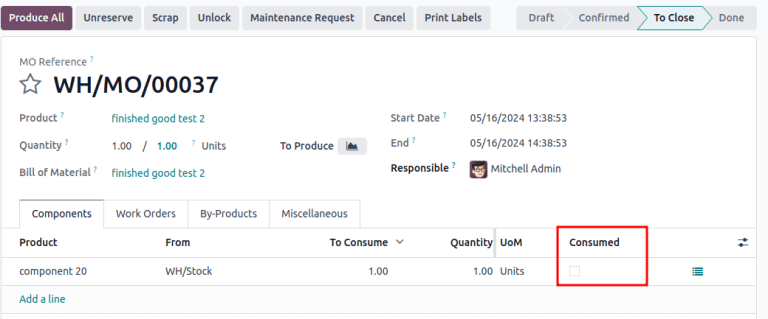

# Danh mục vật tư

A *bill of materials* (or *BoM* for short) documents specific components, along with their
respective quantities, that are needed to produce or repair a product. In Odoo,  serve as
blueprints for manufactured goods and kits, and often include production operations and step-by-step
guidelines, as well.

## Thiết lập BoM

Để tạo , hãy vào Ứng dụng Sản xuất ‣ Sản phẩm ‣ Danh mục vật tư và nhấp vào Mới.

Tiếp theo, đặt Loại BoM thành Sản xuất sản phẩm này.

Sau đó, chỉ định [thành phần bắt buộc](#manufacturing-basic-setup-setup-components) và nếu cần, hãy xác định bất kỳ [hoạt động sản xuất](#manufacturing-basic-setup-setup-operations) nào.

#### SEE ALSO
- [Bộ kit](applications/inventory_and_mrp/manufacturing/advanced_configuration/kit_shipping.md)
- [Basic subcontracting](applications/inventory_and_mrp/manufacturing/subcontracting/subcontracting_basic.md)

### Thành phần

Trong tab Thành phần của , hãy chỉ định các thành phần được sử dụng để sản xuất sản phẩm bằng cách nhấp vào Thêm một dòng. Từ menu Thành phần thả xuống, hãy chọn từ các sản phẩm hiện có hoặc tạo sản phẩm mới bằng cách nhập tên và chọn tùy chọn Tạo " " để nhanh chóng thêm mục sản phẩm hoặc tùy chọn Tạo và chỉnh sửa... để thêm thành phần và tiếp tục đến biểu mẫu cấu hình của thành phần đó.

Tùy chọn, truy cập các trường bổ sung bằng cách nhấp vào biểu tượng <i class="oi oi-settings-adjust"></i> (điều chỉnh cài đặt) ở phía bên phải của tab Thành phần. Đánh dấu vào hộp kiểm cho các tính năng sau để bật những cột này:

- Áp dụng cho các biến thể: chỉ rõ [biến thể sản phẩm](applications/inventory_and_mrp/manufacturing/advanced_configuration/product_variants.md) mà mỗi thành phần được sử dụng. Khi trường này để trống, thành phần sẽ được sử dụng trong tất cả các biến thể sản phẩm.

- Đã sử dụng trong Hoạt động: chỉ định hoạt động sử dụng thành phần. Hữu ích để xác định [sẵn sàng sản xuất](#manufacturing-basic-setup-manufacturing-readiness).
- Tiêu thụ thủ công: tích vào hộp kiểm để buộc người vận hành tích vào hộp kiểm Tiêu thụ trên lệnh sản xuất (MO).
  

  Nếu không tích vào hộp kiểm đó, thì thông báo lỗi Cảnh báo lượng sử dụng sẽ được kích hoạt để yêu cầu nhập số lượng thành phần đã sử dụng theo cách thủ công. Nếu không, quy trình sản xuất không thể hoàn tất.
  

### Hoạt động

Thêm một *hoạt động* vào  để chỉ định hướng dẫn sản xuất và ghi lại thời gian dành cho hoạt động. Để sử dụng tính năng này, trước tiên hãy bật tính năng *Công đoạn* bằng cách vào Ứng dụng Sản xuất ‣ Cấu hình ‣ Cài đặt. Trong phần Hoạt động, hãy đánh dấu vào hộp kiểm Công đoạn để bật tính năng này.

#### SEE ALSO
[Hạng mục phụ thuộc của công đoạn](applications/inventory_and_mrp/manufacturing/advanced_configuration/work_order_dependencies.md)

Tiếp theo, đi đến  bằng cách vào Ứng dụng Sản xuất ‣ Sản phẩm ‣ Danh mục vật tư và chọn  mong muốn. Để thêm một hoạt động mới, hãy vào tab Hoạt động và nhấp vào Thêm một dòng.

Khi thực hiện thao tác này, cửa sổ bật lên Tạo hoạt động sẽ mở ra, tại đó các trường của hoạt động sẽ được cấu hình:

- Hoạt động: tên của hoạt động.
- Khu vực sản xuất: chọn các vị trí hiện có để thực hiện hoạt động hoặc tạo một khu vực sản xuất mới bằng cách nhập tên và chọn tùy chọn Tạo " ".
- Áp dụng cho các biến thể: chỉ rõ liệu có phải hoạt động này chỉ khả dụng cho một số biến thể sản phẩm nhất định hay không. Nếu hoạt động áp dụng cho tất cả biến thể sản phẩm, hãy để trống trường này.

  #### SEE ALSO
  [Cấu hình BoM cho các biến thể sản phẩm](applications/inventory_and_mrp/manufacturing/advanced_configuration/product_variants.md)
- Tính toán thời lượng: chọn cách theo dõi thời gian dành cho hoạt động. Chọn Tính theo thời gian đã theo dõi để sử dụng trình theo dõi thời gian của hoạt động hoặc Đặt thời lượng theo cách thủ công nếu người vận hành có thể tự ghi lại và sửa đổi thời gian.

  Việc chọn tùy chọn Tính theo thời gian đã theo dõi sẽ kích hoạt tùy chọn Dựa trên \_\_ công đoạn trước đó, tùy chọn này sẽ tự động ước tính thời gian hoàn thành hoạt động hiện tại dựa vào vài hoạt động trước đó. Mặt khác, khi chọn Đặt thời lượng theo cách thủ công sẽ kích hoạt trường Thời lượng mặc định.
- Thời lượng mặc định: lượng thời gian ước tính để hoàn thành hoạt động; được sử dụng để [lập kế hoạch lệnh sản xuất](https://www.youtube.com/watch?v=TK55jIq00pc) và xác định [tình trạng khả dụng của khu vực sản xuất](https://www.youtube.com/watch?v=3YwFlD97Bio).
- Công ty: xác định công ty có .

Nêu chi tiết hoạt động trong tab Bảng công tác. Chọn PDF để đính kèm tệp hoặc Google Slide với quyền truy cập *công khai* để chia sẻ liên kết. Chọn Văn bản để nhập hướng dẫn vào trường văn bản Mô tả.

Cuối cùng, nhấp vào Lưu & đóng để đóng cửa sổ bật lên. Để thêm nhiều hoạt động hơn, nhấp vào Lưu & mới và lặp lại các bước tương tự ở trên để cấu hình một hoạt động khác.

#### NOTE
Mỗi hoạt động là duy nhất vì nó luôn được liên kết riêng với một .

#### Hướng dẫn

#### IMPORTANT
Để thêm hướng dẫn chi tiết vào hoạt động, bạn phải cài đặt ứng dụng *Chất lượng*.

Thêm hướng dẫn cụ thể vào một hoạt động hiện có bằng cách nhấp vào biểu tượng <i class="fa fa-list-ul"></i> (danh sách) của hoạt động đó trong cột Hướng dẫn. Số trong cột Hướng dẫn hiển thị số hướng dẫn chi tiết hiện có cho hoạt động đó.

Trên trang chủ Bước, nhấp vào Mới để mở biểu mẫu điểm kiểm soát chất lượng trống mà bạn có thể tạo bước sản xuất mới từ đó. Tại đây, hãy đặt Tiêu đề cho hướng dẫn cụ thể và đặt Loại thành Hướng dẫn. Trong tab Hướng dẫn của biểu mẫu, hãy viết chỉ dẫn cho từng bước trong hoạt động sản xuất.

#### NOTE
Tại đây, bạn có thể tùy chỉnh thêm trên biểu mẫu này, ngoài các hướng dẫn thông thường, để bao gồm cả các loại điểm kiểm soát chất lượng cụ thể với những điều kiện cụ thể (hoặc phức tạp). Để biết thêm chi tiết về điểm kiểm soát chất lượng, hãy tham khảo tài liệu [Kiểm tra theo hướng dẫn](applications/inventory_and_mrp/quality/quality_check_types/instructions_check.md).

### Thông tin khác

Tab Thông tin khác chứa nhiều cấu hình  hơn để tùy chỉnh hoạt động mua sắm, tính toán chi phí và xác định cách sử dụng các thành phần.

- Trạng thái sẵn sàng sản xuất: việc chọn Khi các thành phần dùng cho hoạt động đầu tiên có sẵn sẽ hiển thị Trạng thái thành phần là Không có **màu xanh lá cây**, khi chỉ có sẵn các thành phần được sử dụng trong hoạt động đầu tiên. Điều này cho biết rằng mặc dù chưa có đủ tất cả thành phần, nhưng ít nhất người vận hành có thể bắt đầu với hoạt động đầu tiên này. Chọn Khi có đủ tất cả thành phần sẽ hiển thị trạng thái thành phần là Không có **màu đỏ** trừ khi tất cả thành phần đều có sẵn.
  
- Phiên bản: hiển thị phiên bản  hiện tại, có thể nhìn thấy khi cài đặt ứng dụng Odoo *PLM* để quản lý các thay đổi .
- Lượng sử dụng linh hoạt: xác định xem các thành phần được sử dụng có thể chênh lệch với số lượng đã xác định trên  hay không. Chọn Đã bị chặn nếu người vận hành **phải** tuân thủ nghiêm ngặt số lượng trên . Nếu không, hãy chọn Được phép hoặc Được phép kèm cảnh báo.
- Tuyến: chọn loại hoạt động sản xuất của kho hàng ưa thích cho các sản phẩm được sản xuất tại nhiều kho hàng. Nếu để trống, loại hoạt động `Sản xuất` của kho hàng này sẽ được sử dụng theo mặc định.
- Phân phối phân tích: chọn [mô hình phân phối phân tích](applications/finance/accounting/reporting/analytic_accounting.md) tạo sẵn từ danh sách để tự động ghi lại chi phí sản xuất sản phẩm trong sổ nhật ký đã chọn.
- Thời gian sản xuất: xác định số ngày cần thiết để hoàn thành  kể từ ngày xác nhận.
- Ngày để chuẩn bị Lệnh sản xuất: số ngày cần thiết để bổ sung thành phần hoặc sản xuất các cụm lắp ráp của sản phẩm.

#### SEE ALSO
- [Phân phối phân tích](applications/finance/accounting/reporting/analytic_accounting.md)
- [Thời gian hoàn thành](applications/inventory_and_mrp/inventory/warehouses_storage/replenishment/lead_times.md)

## Thêm phụ phẩm vào BoM

*Phụ phẩm* là sản phẩm còn lại được tạo ra trong quá trình sản xuất ngoài sản phẩm chính của . Không giống như sản phẩm chính, có thể có nhiều hơn một phụ phẩm trên .

Để thêm phụ phẩm vào , trước tiên hãy bật tính năng *Phụ phẩm* trong Ứng dụng Sản xuất ‣ Cấu hình ‣ Cài đặt. Trong phần Hoạt động, hãy đánh dấu vào hộp kiểm Phụ phẩm để bật tính năng này.

Sau khi bật tính năng này, hãy thêm phụ phẩm vào  bằng cách nhấp vào tab Phụ phẩm. Nhấp vào Thêm một dòng và điền vào Phụ phẩm, Số lượng và Đơn vị tính. Theo tuỳ chọn, chỉ định Đã sản xuất trong hoạt động cho phụ phẩm.
