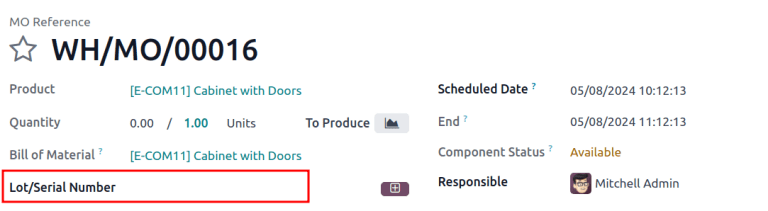
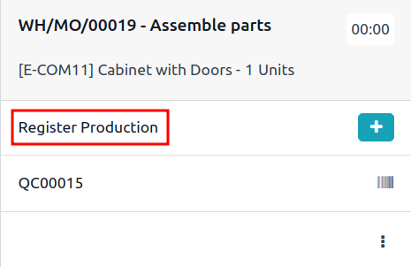

# Cấu hình sản phẩm sản xuất

Để sản xuất một sản phẩm trong Odoo *Sản xuất*, sản phẩm phải được cấu hình đúng cách. Việc này bao gồm kích hoạt tuyến *Sản xuất* và cấu hình danh mục vật tư (BoM) cho sản phẩm. Sau khi hoàn tất các bước này, sản phẩm có thể được chọn khi tạo lệnh sản xuất mới.

## Kích hoạt tuyến sản xuất

Tuyến Sản xuất được kích hoạt cho từng sản phẩm trên trang sản phẩm riêng của sản phẩm đó. Để thực hiện, hãy bắt đầu bằng cách đi đến Sản xuất ‣ Sản phẩm ‣ Sản phẩm. Sau đó, chọn một sản phẩm hiện có hoặc tạo một sản phẩm mới bằng cách nhấp vào Mới.

Trên trang sản phẩm, chọn tab Tồn kho, sau đó bật hộp kiểm Sản xuất trong phần Tuyến. Điều này cho Odoo biết sản phẩm có thể được sản xuất.

### Theo dõi số lô/sê-ri

Việc chỉ định lô hoặc số sê-ri cho các sản phẩm mới sản xuất là tùy chọn. Để tùy chọn [chỉ định lô hoặc số sê-ri](../../inventory/product_management/product_tracking/create_sn.md) cho các sản phẩm mới sản xuất, đi đến phần Truy xuất nguồn gốc trong tab Tồn kho. Trong trường Theo dõi, hãy chọn Theo số sê-ri duy nhất hoặc Theo lô.

Thao tác này sẽ kích hoạt trường *Số lô/sê-ri* trên lệnh sản xuất hoặc hướng dẫn *Ghi nhận sản xuất* trên thẻ công đoạn trong ứng dụng *Xưởng*.

## Cấu hình danh mục vật tư (BoM)

Tiếp theo, phải cấu hình  cho sản phẩm để Odoo biết cách sản xuất sản phẩm đó.  là danh mục các thành phần và hoạt động cần thiết để sản xuất một sản phẩm.

Để tạo  cho một sản phẩm cụ thể, hãy đi đến Sản xuất ‣ Sản phẩm ‣ Sản phẩm, sau đó chọn sản phẩm. Trên trang sản phẩm, nhấp vào nút Danh mục vật tư ở đầu trang, sau đó chọn Mới để cấu hình  mới.

Trên , sản phẩm được tự động điền vào trường Sản phẩm. Trong trường Số lượng, hãy xác định số lượng đơn vị mà BoM sản xuất.

Thêm một thành phần vào  bằng cách chọn tab Thành phần và nhấp vào Thêm một dòng. Chọn một thành phần từ menu Thành phần thả xuống, sau đó nhập số lượng vào trường Số lượng. Tiếp tục thêm thành phần trên các dòng mới cho đến khi tất cả thành phần được thêm vào.

Tiếp theo, chọn tab Hoạt động. Nhấp vào Thêm một dòng và cửa sổ bật lên Tạo hoạt động sẽ xuất hiện. Trong trường Hoạt động, đặt tên cho hoạt động đang được thêm vào (VD: Lắp ráp, cắt,...). Chọn khu vực sản xuất, nơi hoạt động sẽ được thực hiện, từ menu thả xuống Khu vực sản xuất. Cuối cùng, nhấp vào Lưu & đóng để hoàn tất việc thêm hoạt động hoặc Lưu & mới để thêm hoạt động khác.

#### IMPORTANT
Tab Hoạt động chỉ xuất hiện nếu cài đặt Công đoạn được bật. Để thực hiện, hãy đi đến Sản xuất ‣ Cấu hình ‣ Cài đặt, sau đó bật hộp kiểm Công đoạn.

