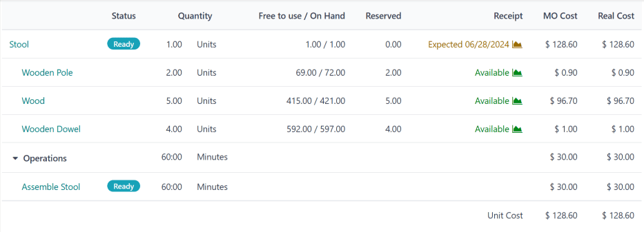

# Chi phí lệnh sản xuất

Khả năng tính toán chính xác chi phí sản xuất một sản phẩm là rất quan trọng khi xác định lợi nhuận của sản phẩm. Ứng dụng Odoo *Sản xuất* đơn giản hóa phép tính này bằng cách tự động tính toán chi phí để hoàn thành mỗi lệnh sản xuất (MO), cũng như chi phí sản xuất trung bình của một sản phẩm, dựa trên tất cả  đã hoàn thành.

#### IMPORTANT
Ứng dụng Sản xuất của Odoo phân biệt giữa *chi phí lệnh sản xuất* và *chi phí thực tế* của .

Chi phí  là chi phí  *ước tính* để hoàn thành một , dựa vào cấu hình danh mục vật tư (BoM) của sản phẩm. Trong đó bao gồm chi phí và số lượng thành phần, cũng như chi phí hoàn thành các hoạt động cần thiết.

Chi phí thực tế thể hiện số tiền *thực tế* cần để hoàn thành . Một số yếu tố có thể khiến chi phí thực tế chênh lệch với chi phí . Ví dụ, một hoạt động có thể mất nhiều thời gian hơn để hoàn thành so với ước tính, có thể cần nhiều thành phần hơn so với số lượng được chỉ định trong  hoặc giá thành phần có thể thay đổi trong quá trình sản xuất.

## Cấu hình chi phí

Odoo tính toán chi phí  dựa trên cấu hình của  được sử dụng để sản xuất một sản phẩm. Phép tính này bao gồm chi phí và số lượng thành phần cũng như các hoạt động được liệt kê trên , cộng với chi phí vận hành của khu vực sản xuất được dùng để xử lý những hoạt động đó.

### Chi phí thành phần

Chi phí thành phần được tính toán tự động dựa trên giá mua trung bình của nó từ tất cả đơn mua hàng (PO). Để xem chi phí của một thành phần, hãy đi đến Ứng dụng Tồn kho --> Sản phẩm --> Sản phẩm và chọn một thành phần. Chi phí được hiển thị trong trường Chi phí của tab Thông tin chung, trên biểu mẫu sản phẩm của thành phần đó.

Có thể thiết lập chi phí của một thành phần theo cách thủ công bằng cách nhấp vào trường Chi phí trên biểu mẫu sản phẩm của thành phần và nhập giá trị. Tuy nhiên, mọi 

```
|PO|
```

 để mua thành phần đó trong tương lai sẽ ghi đè giá trị đã nhập thủ công và đặt lại trường Chi phí về giá trị tự động.

### Chi phí khu vực sản xuất

Để thiết lập chi phí vận hành cho một khu vực sản xuất cụ thể, hãy đi đến Ứng dụng Sản xuất ‣ Cấu hình ‣ Khu vực sản xuất và chọn một khu vực sản xuất.

To set the operating cost for the work center, as a whole, enter a value in the per
workcenter field, located beside the Cost per hour section on the work center's
General Information tab. This operating cost is used regardless of how many employees
are working at the work center at any given time.

To set the operating cost for the work center based on the number of employees working there at a
given time, enter a value in the per employee field, located beside the Cost
per hour section on the work center's General Information tab. For example, if `25.00`
is entered in the per employee field, it costs $25.00 per hour for *each* employee
working at the work center.

Note that, if values are entered in both the per workcenter *and* per
employee fields, the value in the per workcenter field takes precedence, and the value
in the per employee field is ignored.

#### IMPORTANT
It is also possible to set a per hour cost for specific employees, by navigating to the
Employees app, selecting an employee, clicking the HR Settings tab
on their employee form, and entering a value in the Hourly Cost field.

Just like the *per workcenter* field on a work center form, the Hourly Cost field on
an employee's form overrides the *per employee* field on a work center form.

However, the *per workcenter* field takes precedence over both the *per employee* field on the
workcenter form *and* the Hourly Cost field on the employee form.

### cost

Việc cấu hình  để Odoo có thể tính toán chính xác chi phí của  sử dụng BoM đó được thực hiện trong hai bước. Đầu tiên **phải** thêm thành phần và xác định số lượng thành phần cần thiết. Thứ hai, **phải** thêm hoạt động và khu vực sản xuất dùng để thực hiện hoạt động đó.

Bắt đầu bằng cách đi đến Ứng dụng Sản xuất ‣ Sản phẩm ‣ Danh mục vật tư. Chọn một  hoặc tạo một BoM mới bằng cách nhấp vào Mới.

Trong tab Thành phần của biểu mẫu , hãy thêm từng thành phần bằng cách nhấp vào Thêm một dòng, chọn thành phần từ menu thả xuống trong cột Thành phần và nhập số lượng vào cột Số lượng.

Trong tab Hoạt động, thêm một hoạt động bằng cách nhấp vào Thêm một dòng để mở cửa sổ bật lên Tạo hoạt động. Nhập tiêu đề cho hoạt động trong trường Hoạt động.

Chọn Khu vực sản xuất nơi sẽ dùng để thực hiện hoạt động. Sau đó, thêm Thời lượng mặc định, là khoảng thời gian ước tính để hoàn thành hoạt động này.

Theo mặc định, trường Tính toán thời lượng được đặt thành Đặt thời lượng theo cách thủ công, nghĩa là số được nhập vào trường Thời lượng mặc định luôn được sử dụng làm thời lượng dự kiến ​​của hoạt động.

Việc chọn Tính theo thời gian đã theo dõi cho phép Odoo tự động tính toán thời lượng mặc định dựa trên một số công đoạn nhất định, được chọn trong trường Dựa trên. Trước khi có công đoạn để tính toán thời lượng này, giá trị trong trường Thời lượng mặc định sẽ được sử dụng thay thế.

Chi phí vận hành khu vực sản xuất theo giờ và thời lượng hoạt động được sử dụng để tính toán chi phí hoạt động.

Cuối cùng, nhấp vào Lưu & đóng để thêm hoạt động vào , và đóng cửa sổ bật lên Tạo hoạt động. Hoặc, nhấp vào Lưu & mới để thêm hoạt động vào , và mở cửa sổ bật lên Tạo hoạt động trống để thêm hoạt động khác.

#### SEE ALSO
Để có cái nhìn tổng quan đầy đủ về cấu hình , hãy tham khảo tài liệu về [danh mục vật tư](bill_configuration.md).

## Tổng quan

Mỗi  đều có một trang *tổng quan*, liệt kê nhiều thông tin về  đó, bao gồm chi phí cho  và chi phí thực tế. Để xem tổng quan về một , hãy đi đến Ứng dụng Sản xuất ‣ Hoạt động ‣ Lệnh sản xuất, và chọn một . Sau đó, nhấp vào nút <i class="fa fa-bars"></i> Tổng quan ở đầu .

Cả chi phí  và chi phí thực tế đều tính chi phí và số lượng thành phần, cũng như chi phí hoàn thành mỗi công đoạn. Trang tổng quan này liệt kê một hàng cho mỗi giá trị đó và tổng của chúng được liệt kê ở cuối các cột Chi phí MO và Chi phí thực tế.

Trước khi bắt đầu xử lý , các cột Chi phí MO và Chi phí thực tế hiển thị cùng một mức chi phí. Đây là chi phí  *ước tính* để hoàn thành .

Tuy nhiên, khi tiến hành sản xuất, giá trị trong cột Chi phí thực tế có thể bắt đầu khác với giá trị trong cột Chi phí MO. Điều này xảy ra nếu số lượng thành phần được sử dụng khác với số lượng liệt kê trên , hoặc nếu thời lượng xử lý công đoạn khác với dự kiến.

Sau khi  được hoàn thành bằng cách nhấp vào Sản xuất tất cả, các giá trị trong cột Chi phí MO sẽ cập nhật cho khớp với giá trị hiển thị trong cột Chi phí thực tế.



## Chi phí sản xuất trung bình

Ngoài chi phí của từng  cho một sản phẩm, Odoo cũng theo dõi chi phí trung bình để sản xuất sản phẩm, gồm chi phí của mỗi  đã hoàn thành. Để xem thông tin này, hãy đi đến Ứng dụng Tồn kho ‣ Sản phẩm ‣ Sản phẩm và chọn một sản phẩm.

Chi phí sản xuất của sản phẩm được hiển thị theo đơn vị tính trong trường Chi phí, nằm trong tab Thông tin chung. Giá trị này tiếp tục cập nhật khi chi phí của  bổ sung được tính vào chi phí trung bình.

Bên phải trường Chi phí là nút Tính giá từ BoM, chỉ xuất hiện trên những sản phẩm có ít nhất một . Nhấp vào nút này để đặt lại chi phí của sản phẩm thành chi phí dự kiến, chỉ tính các thành phần và hoạt động được liệt kê trên .

#### IMPORTANT
Xin lưu ý rằng việc nhấp vào Tính giá từ BoM không có nghĩa là chi phí sẽ được thiết lập vĩnh viễn. Chi phí sẽ tiếp tục cập nhật dựa trên giá trung bình của  và chi phí thực tế của bất kỳ  nào trong tương lai.
