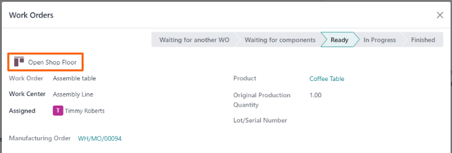

# Sản xuất một bước

Odoo *Sản xuất* cho phép người dùng sản xuất sản phẩm trong một, hai hoặc ba bước. Khi sử dụng sản xuất một bước, Odoo tạo lệnh sản xuất (MO), nhưng không tạo lệnh chuyển hàng để chuyển thành phần ra khỏi kho hoặc thành phẩm vào kho. Số lượng hàng tồn kho vẫn được cập nhật dựa trên số lượng thành phần đã sử dụng và sản phẩm đã sản xuất, song việc chuyển chúng vào và ra khỏi kho không được theo dõi.

#### IMPORTANT
Sản phẩm phải được cấu hình chính xác trước khi có thể được sản xuất trong Odoo. Để biết chi tiết về cách thực hiện, hãy tham khảo tài liệu về cách [cấu hình sản phẩm để sản xuất](applications/inventory_and_mrp/manufacturing/basic_setup/configure_manufacturing_product.md#manufacturing-management-configure-manufacturing-product).

## Tạo lệnh sản xuất

Để sản xuất một sản phẩm trong Odoo *Sản xuất*, hãy bắt đầu bằng cách đi đến Sản xuất ‣ Hoạt động ‣ Lệnh sản xuất, sau đó nhấp vào Mới để tạo  mới.

Trên  mới, hãy chọn sản phẩm cần sản xuất từ ​​menu thả xuống Sản phẩm. Danh mục vật tư (BoM) liên quan sẽ tự động được điền vào trường Danh mục vật tư.

Nếu có trên một  được cấu hình cho một sản phẩm, thì bạn có thể chọn  cụ thể trong trường Danh mục vật tư và trường Sản phẩm sẽ được tự động điền bằng thông tin về sản phẩm liên quan.

Sau khi đã chọn , các tab Thành phần và Công đoạn sẽ tự động được điền bằng những thành phần và hoạt động đã xác định trên . Nếu cần thêm thành phần hoặc hoạt động cho  đang tạo, hãy thêm chúng vào các tab Thành phần và Công đoạn bằng cách nhấp vào Thêm một dòng.

Cuối cùng, nhấp vào Xác nhận để xác nhận .

## Xử lý lệnh sản xuất

 được xử lý bằng cách hoàn thành tất cả công đoạn được liệt kê trong tab Công đoạn của lệnh sản xuất đó. Bạn có thể thực hiện trên chính  hoặc từ chế độ xem máy tính bảng của công đoạn.

### Quy trình cơ bản

Để hoàn thành công đoạn từ chính , hãy bắt đầu bằng cách đi đến Sản xuất ‣ Hoạt động ‣ Lệnh sản xuất, sau đó chọn một .

Trên trang , chọn tab Công đoạn. Khi bắt đầu thực hiện công đoạn đầu tiên mà bạn cần hoàn thành, hãy nhấp vào nút Bắt đầu cho công đoạn này. Sau đó, Odoo *Sản xuất* khởi động một đồng hồ tính giờ để theo dõi thời gian cần để hoàn thành công đoạn.

Khi hoàn thành, hãy nhấp vào nút Hoàn tất cho công đoạn đó. Lặp lại quy trình tương tự cho mỗi công đoạn được liệt kê trên tab Công đoạn.

Sau khi hoàn thành tất cả công đoạn, hãy nhấp vào Sản xuất tất cả ở đầu màn hình để đánh dấu  là Hoàn tất và ghi nhận (các) sản phẩm đã sản xuất vào hàng tồn kho.

### Quy trình Xưởng

Để hoàn thành các công đoạn của một  bằng cách sử dụng phân hệ *Xưởng*, hãy bắt đầu từ việc đi đến Sản xuất ‣ Hoạt động ‣ Lệnh sản xuất, sau đó chọn một .

Trên , nhấp vào tab Công đoạn, sau đó chọn nút ↗️ (hình vuông có mũi tên trỏ lên) trên dòng công đoạn đầu tiên cần xử lý. Sau đó, cửa sổ bật lên Công đoạn sẽ mở ra và chứa thông tin chi tiết cũng như tùy chọn xử lý công đoạn.

Trên cửa sổ bật lên, chọn nút Mở Xưởng ở góc trên bên trái của cửa sổ để mở phân hệ *Xưởng*.

Khi truy cập trực tiếp từ một công đoạn cụ thể trong , *Xưởng* mặc định là trang dành cho khu vực sản xuất nơi được cấu hình để thực hiện công đoạn. Trang này hiển thị một thẻ dành cho công đoạn và thẻ đó hiển thị số , sản phẩm và số lượng đơn vị cần sản xuất cũng như các bước cần thiết để hoàn thành công đoạn.

Công đoạn được xử lý bằng cách hoàn thành từng bước đã liệt kê trên thẻ của công đoạn đó. Bạn có thể thực hiện việc này bằng cách nhấp vào một bước và làm theo hướng dẫn hiển thị trên cửa sổ bật lên. Khi hoàn thành bước này, hãy nhấp vào Tiếp theo để chuyển sang bước kế tiếp, nếu cần.

Ngoài ra, bạn có thể hoàn thành các bước thực hiện công đoạn bằng cách nhấp vào hộp kiểm ở bên phải dòng của bước đó trên thẻ công đoạn. Khi sử dụng phương pháp này, bước sẽ tự động được đánh dấu là đã hoàn thành mà không có cửa sổ bật lên nào xuất hiện.

Bước cuối cùng trên thẻ công đoạn có tiêu đề là *Ghi nhận sản xuất*. Bước này được sử dụng để ghi nhận số lượng đơn vị sản phẩm đã sản xuất. Nếu số lượng đã sản xuất trong thực tế bằng với số lượng trong , thì hãy nhấp vào nút # đơn vị ở bên phải dòng để tự động ghi nhận con số đó làm số lượng đã sản xuất.

Nếu phải nhập một số khác, hãy nhấp vào bước Ghi nhận sản xuất để mở cửa sổ bật lên. Nhập số lượng đơn vị đã sản xuất trong thực tế vào trường Đơn vị, sau đó nhấp vào Xác thực để ghi nhận con số đó.

#### NOTE
Bước *Ghi nhận sản xuất* xuất hiện trên mọi thẻ công đoạn. Phải hoàn tất bước này cho công đoạn đầu tiên mà bạn xử lý. Sau đó, bước này sẽ xuất hiện là đã hoàn thành trên mỗi công đoạn còn lại trong .

Sau khi hoàn thành tất cả các bước trong công đoạn, thì một nút sẽ xuất hiện ở footer của thẻ công đoạn. Nếu bạn cần hoàn tất công đoạn khác trước khi có thể đóng , nút đó sẽ có tiêu đề là Đánh dấu là hoàn tất. Nếu không cần hoàn thành thêm công đoạn nào, nút đó sẽ có tiêu đề là Đóng sản xuất.

Việc nhấp vào Đánh dấu là hoàn tất sẽ khiến thẻ công đoạn mờ dần. Khi thẻ biến mất hoàn toàn, thì trạng thái của công đoạn được đánh dấu là  *Đã hoàn thành* trên , và công đoạn tiếp theo sẽ xuất hiện trong phân hệ *Xưởng*, trên trang của khu vực sản xuất nơi được cấu hình để thực hiện công đoạn đó. Mọi công đoạn bổ sung đều có thể được xử lý bằng cách sử dụng các hướng dẫn đã nêu trong phần này.

Việc nhấp vào Đóng sản xuất sẽ khiến thẻ công đoạn mờ dần. Khi thẻ biến mất,  được đánh dấu là *Hoàn tất* và các đơn vị sản phẩm đã sản xuất được nhập vào tồn kho.

Sau khi nhấp vào Đánh dấu là hoàn tất hoặc Đóng sản xuất, thì nút Hoàn tác sẽ xuất hiện. Nhấp vào nút Hoàn tác trước khi thẻ công đoạn mờ dần để duy trì trạng thái mở của công đoạn.
