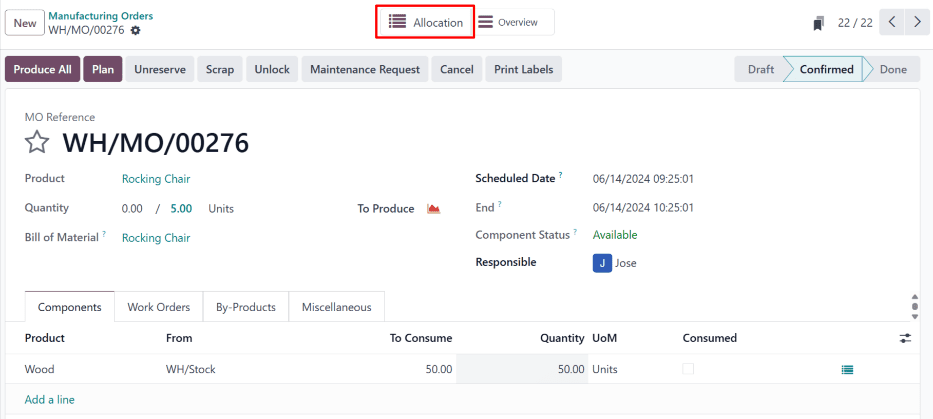

# Allocation reports

When fulfilling sales orders (SOs), or sourcing components for manufacturing orders (MOs), it is
sometimes necessary to prioritize one  or  over another. In situations where there is
insufficient stock on-hand to fulfill every  or , ensuring that products and components are
reserved for priority orders is essential.

In Odoo *Manufacturing*, allocation reports are used on  to assign products to specific sales
orders , or components to specific . This ensures the products or components are available
for those orders, and are not used by mistake.

## Cấu hình

To use allocation reports, the *Allocation Report for Manufacturing Orders* feature **must** be
enabled. To do so, navigate to Manufacturing app ‣ Configuration ‣ Settings,
and tick the checkbox next to Allocation Report for Manufacturing Orders. Then, click
Save.

For products that are sold, it is also necessary to configure them so they can be included in .
To do so, begin by navigating to Inventory ‣ Products ‣ Products, and select a
product. Under the Product Name field on the product form, make sure that the
Can Be Sold checkbox is ticked.

## Allocate products

To allocate products or components from an  to an , or to a different , begin by
navigating to Manufacturing app ‣ Operations ‣ Manufacturing Orders. Click
New to create a new .

On the  form, select a product in the Product field, and specify the quantity to be
produced in the Quantity field. Finally, click Confirm to confirm the .

The rest of the allocation workflow depends on the current on-hand quantity of the product being
manufactured, and whether or not there are any  or  which require the product, but have
not already been allocated units.

If there **are** existing  and  that require the product, **and** there are too few units
of the product on-hand to fulfill those orders, then an <i class="fa fa-list"></i> Allocation smart
button appears at the top of the page as soon as the  is confirmed.

If there **are** existing  and  that require the product, **and** there are enough units
of the product on-hand to fulfill those orders, then the <i class="fa fa-list"></i> Allocation
smart button only appears at the top of the page once the  has been marked as done, by clicking
Produce All.

#### NOTE
If there **are not** any existing  and  that require the product, the <i class="fa fa-list"></i>
Allocation smart button does not appear, even when the  has been marked as done.

Click the <i class="fa fa-list"></i> Allocation smart button to open the MRP Reception
Report for the . This report lists open delivery orders or , depending on the type of
product produced in the original .

### Allocate to delivery order

If the  contains a finished product, the report lists any open delivery orders for which
quantities of the product have yet to be reserved.

Click the Assign All button to the right of a specific order to assign products for each
quantity required to fulfill that order.

Alternatively, click Assign next to a specific quantity to only assign products to that
quantity, and not any others in the order.

### Allocate to MO

If the  contains a component, the report lists any open  for which quantities of the
component have yet to be reserved.

Click the Assign All or Assign button to the right of a specific  to
assign components to that .

### Unassign products

After assigning products to a quantity within a delivery order, or components to an ,
the Assign button turns into an Unassign button. Click Unassign
to unreserve the assigned products from that quantity, making them available for other quantities.

### Print labels

After clicking Assign All or Assign, the Print Labels or
Print Label button to the right of either button becomes selectable. Selecting either
button generates and downloads a PDF document with one label for each product that was assigned.
These labels are used to designate each product as being reserved for that specific order.

