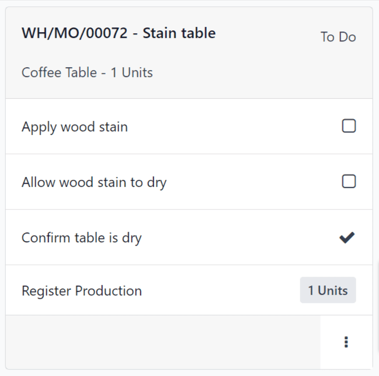

# Shop Floor overview

The _Shop Floor_ module is a companion module to the _Manufacturing_ app. _Shop Floor_ provides a\
visual interface for processing manufacturing orders (MOs) and work orders. It also allows\
manufacturing employees to track the amount of time spent working on manufacturing and work orders.

The _Shop Floor_ module is installed alongside the _Manufacturing_ app. It cannot be installed by\
itself. To install the _Manufacturing_ app, navigate to Apps, search for`manufacturing` in the Search... bar, and then click Install on the\
Manufacturing app card.

#### IMPORTANT

The _Shop Floor_ module replaces the tablet view functionality of the _Manufacturing_ app, and is\
only available in Odoo versions 16.4 and later.

To check the version number of an Odoo database, navigate to Settings and scroll\
down to the About section at the bottom of the page. The version number is displayed\
there.

To switch to a newer version of Odoo, see the documentation on [upgrading a database](../../../../administration/upgrade.md).

## Điều hướng

_Shop Floor_ is broken down into three main views, which can be selected from the navigation bar at\
the top of the module:

* The All page serves as the main dashboard for the module, and displays information\
  cards for .
* Each work center also has a dedicated page, which shows information cards for work orders assigned\
  to that work center. Work center pages can be toggled on or off by clicking the +\
  (plus) button in the navigation bar, selecting or deselecting them on the pop-up window that\
  appears, and then clicking Confirm.
* The My page shows information cards for all work orders assigned to the employee whose\
  profile is currently active in the operator panel on the left side of the module. Other than only\
  showing work orders assigned to the active employee, this page functions the same as the pages for\
  each work center.

Bên trái của phân hệ là bảng điều khiển người vận hành, hiển thị tất cả các nhân viên hiện đang đăng nhập vào _Xưởng_, và cho phép nhân viên mới đăng nhập. Bảng điều khiển người vận hành luôn có sẵn trong phân hệ, bất kể đang chọn chế độ xem nào. Nó có thể được bật/tắt bằng cách nhấp vào nút thanh bên ở cuối bên trái của thanh điều hướng.

### All page

By default, the All page shows an information card for every that is _ready to_\
_start_. An is considered ready to start once it has been confirmed, and all required components\
are available.

To view every confirmed regardless of readiness, click the x button on the\
Ready to Start filter to remove it from the Search... bar.

#### MO information card

An information card on the All page shows all of the relevant details of the\
associated , and also provides employees with options for processing the .

Phần tiêu đề của thẻ hiển thị số , sản phẩm và số lượng đơn vị đang được sản xuất, cùng trạng thái của . Nếu công việc chưa bắt đầu trên , trạng thái hiển thị là Đã xác nhận. Khi công việc bắt đầu, trạng thái sẽ cập nhật thành Đang thực hiện. Nếu tất cả lệnh sản xuất cho đã hoàn thành và sẵn sàng để đóng, trạng thái sẽ cập nhật thành Cần đóng.

Phần nội dung chính của thẻ hiển thị một dòng cho từng công đoạn đã hoàn thành (nếu có), tiếp theo là công đoạn hiện tại cần hoàn thành. Các công đoạn đã hoàn thành được đánh dấu bằng dấu tích màu xanh lá cây ở bên phải tiêu đề của công đoạn. Công đoạn hiện tại được hiển thị bằng một nút, cho phép mở trang của khu vực sản xuất xử lý công đoạn đó.

Below the current work order is a line titled Register Production, which is used to\
record the number of product units produced. To manually enter the number of units produced, click\
on the Register Production line, enter a value in the Units field of the\
resulting pop-up window, then click Validate.

Alternatively, click the # Units button on the right side of the line, which\
automatically records the number of units the was created for as the number of units produced.\
For example, if an is created for 10 units of a dining table, clicking the 10 units\
button records that 10 units were produced.

Phần chân của thẻ hiển thị nút Đóng sản xuất. Nút này được dùng để đóng sau khi quá trình sản xuất đã hoàn tất. Tuy nhiên, nếu có bất kỳ kiểm tra chất lượng nào được yêu cầu cho toàn bộ (không phải các công đoạn thành phần), thì nút Kiểm tra chất lượng sẽ xuất hiện thay thế. Việc nhấp vào Kiểm tra chất lượng sẽ mở một cửa sổ bật lên, từ đó có thể thực hiện các kiểm tra chất lượng cần thiết.

After clicking Close Production, the card begins to fade away, and an\
Undo button appears on the footer. Clicking Undo causes the to remain\
open. Once the card disappears completely, the work order is closed.

On the right side of the footer is an ⋮ (options) button, which opens a pop-up window\
with additional options for the :

* Scrap is used to send components to a scrap location when they are found to be\
  defective.
* Add Work Order is used to add an additional work order to the .
* Add Component is used to add an additional component to the .
* Open Backend MO opens the in the Manufacturing app.

### Work center pages

By default, the page for each work center shows an information card for every work order assigned to\
it that is _ready to start_. A work order is considered ready to start once the it is a part of\
is ready to start, and any preceding work orders have been completed.

To view every confirmed work order assigned to a work center regardless of readiness, click the\
x button on the Ready to Start filter to remove it from the\
Search... bar.

#### Work order information card

A work order information card on a work center's page shows all of the relevant details of the\
associated work order, and also provides employees with options for processing the work order.

Header của thẻ công đoạn hiển thị số tham chiếu của chứa công đoạn đó, sản phẩm và số lượng đơn vị đang được sản xuất và trạng thái của công đoạn. Nếu công đoạn chưa bắt đầu, trạng thái sẽ hiển thị là Cần làm. Khi đã bắt đầu, trạng thái sẽ cập nhật để hiển thị đồng hồ tính giờ cho biết tổng thời gian công đoạn đã được thực hiện.

Thân chính của thẻ công đoạn hiển thị một dòng cho mỗi bước cần thiết để hoàn thành công đoạn. Các bước công đoạn có thể được hoàn thành bằng cách nhấp vào dòng, sau đó làm theo hướng dẫn trong cửa sổ bật lên xuất hiện. Ngoài ra, việc nhấp vào hộp kiểm ở phía bên phải của mỗi dòng sẽ tự động đánh dấu bước đó là đã hoàn thành.

Below the final step of the work order is a line titled Register Production, which\
functions the same as the Register Production line on an card. Registering the\
number of units produced using the Register Production line on a work order card also\
completes the step for the associated card.

Nếu công đoạn đang xử lý là công đoạn cuối cùng cho , nút Đóng sản xuất sẽ xuất hiện ở footer của thẻ công đoạn. Việc nhấp vào Đóng sản xuất sẽ đóng cả công đoạn và , trừ khi yêu cầu kiểm tra chất lượng. Trong trường hợp này, cần hoàn thành kiểm tra chất lượng từ thẻ trước khi có thể đóng .

Alternatively, if the requires the completion of additional work orders, a Mark as\
Done button appears instead. Clicking Mark as Done marks the current work order as\
completed, and causes the next work order to appear on the page for the work center it is assigned\
to.

After clicking Close Production or Mark as Done, the work order card begins\
to fade away, and an Undo button appears on the footer. Clicking Undo causes\
the work order to remain open. Once the work order card disappears completely, the work order is\
marked as Finished on the .

On the right side of the footer is an ⋮ (options) button, which opens a pop-up window\
with additional options for the work order:

* Scrap is used to send components to a scrap location when they are found to be\
  defective.
* Add Component is used to add an additional component to the .
* Move to work center is used to transfer the work order to a different work center.
* Suggest a Worksheet improvement allows the user to propose a change to the work\
  order's instructions or steps.
* Create a Quality Alert opens a quality alert form that can be filled out to alert a\
  quality team about a potential issue.

### Operator panel

The operator panel is used to manage the employees that are signed in to the _Shop Floor_ module.\
The panel shows the name and profile picture of every employee that is currently signed in across\
all instances of the database.

To interact with _Shop Floor_ as a specific employee, click the employee's name to activate their\
profile. Profiles that are not active appear with their names and profile pictures greyed-out.

When an employee is selected in the operator panel, they can begin working on a work order by\
clicking the work order's heading. If an employee is working on one or more work orders, the work\
order title(s) appear under their name, along with a timer showing how long they've been working on\
each order.

To add a new employee to the operator panel, click the + Add Operator button at the\
bottom of the panel. Then, select an employee from the Select Employee pop-up window.

To remove an employee from the operator panel, simply click the x button next to their\
name in the panel.

## MO/WO prioritization

The **Shop Floor** module uses the _scheduled date_ entered on to prioritize the and\
work orders that appear on the module's dashboard and work center pages. and work orders\
scheduled sooner are more highly prioritized, and appear before orders which are scheduled further\
out.

To specify the scheduled date on an , begin by navigating to Manufacturing app\
‣ Operations ‣ Manufacturing Orders, and click New to create a new .

Click on the Scheduled Date field to open a calendar popover window. By default, the\
Scheduled Date field, and its corresponding pop-up window, show the current date and\
time.

Use the calendar to select the date on which processing should begin for the . In the two fields\
at the bottom of the popover window, enter the hour and minute at which processing should begin,\
using the 24-hour clock format.

Finally, click Apply at the bottom of the popover window to set the date and time for\
the Scheduled Date field. Then, click the Confirm button at the top of the\
to confirm it.

Once the is confirmed, it appears in the **Shop Floor** module, as long is it has the\
Ready status, which means all components are available.

On the Odoo dashboard, click on the Shop Floor module to open it. The\
All MO # page of the dashboard displays _Ready_ , organized in order of their\
scheduled dates.

At the top of the module, select a work center to see the work orders assigned to it. The page for\
each work center organizes work orders, based on the scheduled dates of their corresponding .
