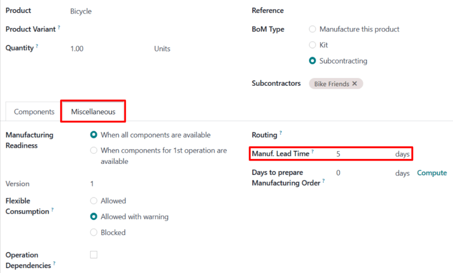

# Dropship subcontracting lead times

In Odoo, lead times are used to predict how long it takes to complete a certain action. For example,
a *delivery lead time* can be set for a purchased product, which specifies the number of days it
usually takes for the product's vendor to deliver the product to the purchasing company.

For subcontracted products specifically, delivery lead times can be configured to take into account
the amount of time required for the subcontractor to manufacture a product. Doing so allows the
contracting company to better predict the delivery dates of subcontracted products.

Certain subcontracted products require the contracting company to supply the subcontractor with
manufacturing components. In this case, a *manufacturing lead time* can be used, in addition to the
delivery lead time, to generate the date on which the subcontractor must receive the required
components, in order to manufacture the product and deliver it on time.

In cases where components are dropshipped to the subcontractor, an additional delivery lead time
can be set for each component. This should be set to the amount of time it takes the vendor to
deliver components to the subcontractor.

Once a delivery lead time has been set on a component, dropship orders for the component display the
date by which the order must be confirmed, so that it can be dropshipped to the subcontractor by the
date on which manufacturing must begin.

#### IMPORTANT
Like all lead times in Odoo, lead times for subcontracted products are only an estimate, and are
based on how long actions are *expected* to take.

Unforeseen circumstances can impact the completion of these actions, which means that lead times
should not be viewed as guarantees.

## Cấu hình

When using the [Dropship Subcontractor on Order](subcontracting_dropship.md) route, a company is
responsible for purchasing the necessary components from a vendor, and having them dropshipped
directly to the subcontractor.

This means that, in addition to the amount of time it takes the subcontractor to manufacture and
deliver the product, it is also necessary to consider how long it takes the component vendor to
dropship the components to the subcontractor.

By assigning a product's subcontractor a *delivery lead time*, specifying a *manufacturing lead
time* on the product's BoM, and assigning the vendor of the components an additional *delivery lead
time*, *Dropship Subcontractor* orders for the product's components display the deadline for
confirming a dropship order to send the components to the subcontractor.

### Product delivery lead time

To set a delivery lead time for a product's subcontractor, navigate to Inventory app -->
Products --> Products, and select a subcontracted product.

Then, select the Purchase tab on the product's page. If the subcontractor has not
already been added as a vendor, do so now by clicking Add a line, and selecting the
subcontractor in the Vendor column.

Once the subcontractor has been added, enter the number of days it takes them to manufacture and
deliver the product, in the Delivery Lead Time column.

### Product manufacturing lead time

Next, navigate to the product's  by clicking the Bill of Materials smart button at
the top of the product's page. Then, select a BoM from the list.

On the , select the Miscellaneous tab. In the Manuf. Lead Time field,
enter the same number of days that was entered in the Delivery Lead Time field of the
's product.

Mặc dù không phải đơn vị gia công sẽ sử dụng tất cả những ngày này để sản xuất, song việc thiết lập cùng số ngày trong mỗi trường sẽ báo cho Odoo biết rằng đơn vị gia công phải nhận các linh kiện và bắt đầu sản xuất trước thời gian hoàn thành giao sản phẩm. Điều này giúp đơn vị gia công có đủ thời gian để cả sản xuất và giao sản phẩm.

### Component delivery lead time

From the product's BoM, navigate to each component by clicking on the component in the
Components tab, and then clicking the <i class="oi oi-arrow-right"></i> (right arrow)
button to the right of the component.

On the product page for each component, select the Purchase tab. If the vendor has not
already been added, do so now by clicking Add a line, and selecting the subcontractor in
the Vendor column.

Once the vendor has been added, enter the number of days it takes them to dropship the product to
the subcontractor, in the Delivery Lead Time column.

## Dropship subcontracting workflow

Create a request for quotation (RfQ) for the product by navigating to Purchase app
‣ Orders ‣ Requests for Quotation, and clicking New.

Specify the subcontractor in Vendor field. Then, add the product in the
Products tab by clicking Add a product, selecting the product in the
Product column, and specifying a quantity in the Quantity column.

In the Expected Arrival field, enter a date that provides enough time for the component
vendor to dropship the components, and the subcontractor to manufacture and deliver the product.

#### IMPORTANT
When a product is added to an , the Expected Arrival field auto-populates with a
date that is today's date plus the delivery lead time of the product. However, this does not
consider the time it takes to dropship the components to the subcontractor.

When purchasing a product subcontracted using the *Dropship Subcontractor on Order* route, it is
necessary to adjust this date to take into account the extra time needed for the components to be
delivered to the subcontractor.

Since production does not begin until they receive the components, leaving the date as is results
in the finished product arriving *after* the date listed on the .

Next, click Confirm Order to turn the  into a . Doing so creates a second 
to purchase the components from the dropshipper, and have them sent to the subcontractor.

Navigate to Purchase app ‣ Orders ‣ Requests for Quotation, and select the
 that lists the dropshipper in the Vendor column.

On the , the Expected Arrival field lists the date on which the subcontractor must
receive the components, in order to deliver the finished product by the *Expected Arrival* date
listed on the subcontractor .

The Order Deadline field lists the latest date on which the  can be confirmed, in
order for the dropshipper to deliver the components to the subcontractor by the Expected
Arrival date.

Click Confirm Order to turn the  into a , and confirm the purchase of the
components from the dropshipper. Doing so causes a Dropship smart button to appear at
the top of the page.

Click the Dropship smart button to open the dropship order. This order can also be
accessed from the Resupply smart button that now appears on the subcontractor .

After the dropshipper has delivered the components to the subcontractor, click the
Validate button at the top of the dropship order to confirm that the subcontractor has
received the components.

Once the subcontractor receives the components, they begin manufacturing the component, before
delivering it to the contracting company.
