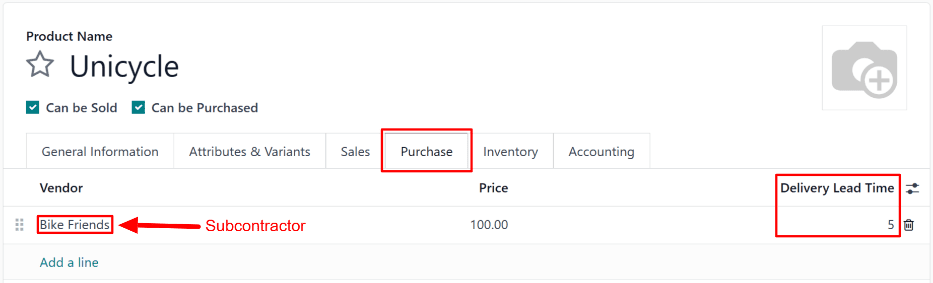
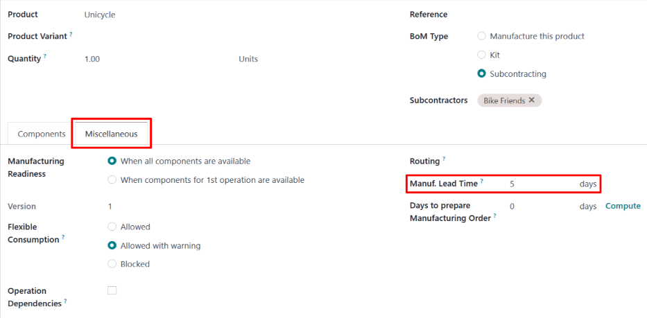

# Resupply subcontracting lead times

In Odoo, lead times are used to predict how long it takes to complete a certain action. For example,
a *delivery lead time* can be set for a purchased product, which specifies the number of days it
usually takes for the product's vendor to deliver the product to the purchasing company.

For subcontracted products specifically, delivery lead times can be configured to take into account
the amount of time required for the subcontractor to manufacture a product. Doing so allows the
contracting company to better predict the delivery dates of subcontracted products.

Certain subcontracted products require the contracting company to supply the subcontractor with
manufacturing components. In this case, a *manufacturing lead time* can be used, in addition to the
delivery lead time, to generate the date on which the subcontractor must receive the required
components, in order to manufacture the product and deliver it on time.

#### IMPORTANT
Like all lead times in Odoo, lead times for subcontracted products are only an estimate, and are
based on how long actions are *expected* to take.

Unforeseen circumstances can impact the completion of these actions, which means that lead times
should **not** be viewed as guarantees.

## Cấu hình

When using the [Resupply Subcontractor on Order](applications/inventory_and_mrp/manufacturing/subcontracting/subcontracting_resupply.md) route, a company is
responsible for supplying the subcontractor with the necessary components. As a result, the
subcontractor cannot begin manufacturing until the components have been received.

This means that, in addition to the amount of time it takes the subcontractor to manufacture and
deliver the product, the date they receive the components must also be considered.

By assigning a product's subcontractor a delivery lead time, and specifying a manufacturing lead
time on the product's bill of materials (BoM), *Resupply Subcontractor* orders for the product's
components display the deadline by which the subcontractor must receive the components.

### Product delivery lead time

To set a delivery lead time for a product's subcontractor, navigate to Inventory app
‣ Products ‣ Products, and select a subcontracted product.

Then, select the Purchase tab on the product's page. If the subcontractor has not
already been added as a vendor, do so now by clicking Add a line, and selecting the
subcontractor in the Vendor field.

Once the subcontractor has been added, enter the number of days it takes them to manufacture and
deliver the product, in the Delivery Lead Time column.

### Product manufacturing lead time

Next, navigate to the product's  by clicking the Bill of Materials smart button at
the top of the product's page. Then, select a  from the list.

On the , select the Miscellaneous tab. In the Manuf. Lead Time field,
enter the same number of days that was entered in the Delivery Lead Time field of the
's product.

Mặc dù không phải đơn vị gia công sẽ sử dụng tất cả những ngày này để sản xuất, song việc thiết lập cùng số ngày trong mỗi trường sẽ báo cho Odoo biết rằng đơn vị gia công phải nhận các linh kiện và bắt đầu sản xuất trước thời gian hoàn thành giao sản phẩm. Điều này giúp đơn vị gia công có đủ thời gian để cả sản xuất và giao sản phẩm.

### Resupply subcontracting workflow

Create a request for quotation (RfQ) for the product by navigating to Purchase app
‣ Orders ‣ Requests for Quotation, and clicking New.

Specify the subcontractor in Vendor field. Then, add the product in the
Products tab by clicking Add a product, selecting the product in the
Product column, and specifying a quantity in the Quantity column.

In the Expected Arrival field, enter a date that provides enough time for the
subcontractor to receive the components, manufacture the product, and deliver it back to the
subcontracting company.

#### IMPORTANT
When a product is added to an , the Expected Arrival field auto-populates with a
date that is today's date plus the delivery lead time of the product. However, this does **not**
consider the time it takes to ship the components to the subcontractor.

When purchasing a product subcontracted using the Resupply Subcontractor on Order route, it is
necessary to adjust this date to take into account the extra time needed for the components to be
shipped to the subcontractor.

Since production does not begin until they receive the components, leaving the date as is results
in the finished product arriving *after* the date listed on the .

Next, click Confirm Order to turn the  into a . Doing so causes a
Resupply smart button to appear at the top of the page.

Click the Resupply smart button to open the resupply subcontractor order, which is the
order created to send components to the subcontractor.

The Deadline field on the resupply subcontractor order shows the deadline for the
subcontractor to receive the components, in order for them to have enough time to manufacture and
deliver the finished product by the Expected Arrival date.

The Scheduled Date field should display the latest date on which components can be
shipped, while still arriving to the subcontractor by the Deadline. However, by default,
the date displayed is the same as the date in the Deadline field, and must be updated to
take into account the time required for shipping.

Click on the Scheduled Date field to open a calendar popover from which a date can be
selected. Select a date that allows for the components to be delivered by the Deadline
on the resupply subcontractor order.

After the components are shipped, click the Validate button at the top of the order to
confirm they have been sent to the subcontractor.

Once the subcontractor receives the components, they begin manufacturing the component, before
delivering it to the contracting company.
