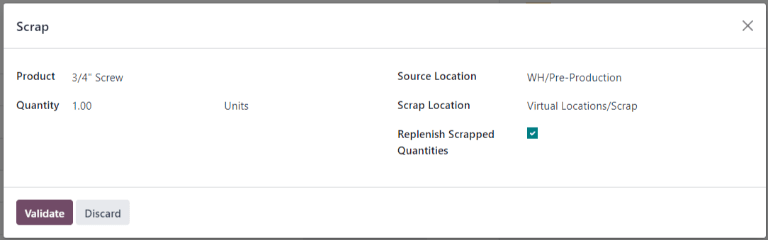

# Phế phẩm trong quá trình sản xuất

Trong quá trình sản xuất, có thể phát sinh nhu cầu loại bỏ các thành phần sản xuất hoặc thành phẩm. Điều này có thể cần thiết nếu một thành phần hoặc sản phẩm bị hư hỏng hoặc không sử dụng được vì bất kỳ lý do nào khác.

Theo mặc định, việc loại bỏ một thành phần hoặc thành phẩm sẽ loại chúng khỏi kho vật lý và đưa đến một vị trí ảo có tên là *Vị trí ảo/Phế phẩm*. Một vị trí ảo **không** phải là một không gian vật lý, mà là một tính năng trong Odoo được sử dụng để theo dõi các mặt hàng không còn trong kho vật lý.

#### SEE ALSO
Để biết thêm thông tin, hãy tham khảo tài liệu về các loại [vị trí](applications/inventory_and_mrp/inventory/warehouses_storage/inventory_management.md) khác nhau.

Có thể loại bỏ các thành phần từ cả ứng dụng *Sản xuất* và phân hệ *Xưởng* trước khi lệnh sản xuất (MO) liên quan được đóng lại. Chỉ có thể loại bỏ thành phẩm từ ứng dụng *Sản xuất* và chỉ sau khi đóng  liên quan.

## Cửa sổ Loại bỏ bật lên

Việc loại bỏ các thành phần và thành phẩm được thực hiện thông qua cửa sổ bật lên Loại bỏ. Có thể truy cập cửa sổ bật lên này trong  từ backend hoặc phân hệ *Xưởng*.

### Loại bỏ thành phần trong quá trình sản xuất

Để loại bỏ một thành phần khỏi , hãy bắt đầu bằng cách đ đến Sản xuất ‣ Hoạt động ‣ Lệnh sản xuất, sau đó chọn một . Ở đầu , nhấp vào nút Loại bỏ để mở cửa sổ bật lên Loại bỏ.

### Loại bỏ thành phẩm trong quá trình sản xuất

Để loại bỏ một thành phẩm khỏi , hãy bắt đầu bằng cách đi đến Sản xuất ‣ Hoạt động ‣ Lệnh sản xuất. Chọn một  đang mở, sau đó nhấp vào nút Sản xuất tất cả để đóng lệnh sản xuất đó.

Để chọn  đã đóng, hãy đi đến Sản xuất ‣ Hoạt động ‣ Lệnh sản xuất, xóa bộ lọc Việc cần làm khỏi thanh Tìm kiếm..., sau đó chọn  mong muốn.

Sau khi đóng, hãy nhấp vào nút Loại bỏ ở đầu  để mở cửa sổ Loại bỏ bật lên.

### Loại bỏ thành phần từ Xưởng

Để loại bỏ một thành phần khỏi phân hệ *Xưởng*, hãy bắt đầu bằng cách đi đến Xưởng. Sau đó, nhấp vào nút ⋮ (ba dấu chấm dọc) trên thẻ  hoặc chọn một khu vực sản xuất từ phần trên cùng và nhấp vào nút ⋮ (ba dấu chấm dọc) trên thẻ công đoạn.

Cả hai phương pháp đều mở cửa sổ bật lên Bạn muốn làm gì?. Nhấp vào nút Loại bỏ trên cửa sổ để mở cửa sổ Loại bỏ bật lên.

## Cửa sổ Loại bỏ bật lên

Sau khi mở cửa sổ bật lên này bằng một trong các phương pháp [đã nêu](#manufacturing-management-scrap-window), hãy chọn thành phần hoặc thành phẩm cần loại bỏ từ menu thả xuống Sản phẩm.

Trong trường Số lượng, nhập số lượng cần loại bỏ.

Theo mặc định, trường Vị trí nguồn được đặt thành vị trí tiền sản xuất của kho hàng, trong khi trường Vị trí phế phẩm được đặt thành vị trí Vị trí ảo/Phế phẩm. Nếu cần thay đổi vị trí nguồn hoặc vị trí phế phẩm, hãy chọn một vị trí khác từ menu thả xuống tương ứng.

Bật hộp kiểm Bổ sung số lượng bị loại bỏ nếu cần tạo phiếu xuất kho để thay thế (các) thành phần đã loại bỏ sau khi xác nhận lệnh loại bỏ. Tùy chọn này chỉ nên được bật cho các kho hàng có quy trình sản xuất [hai bước](applications/inventory_and_mrp/manufacturing/basic_setup/two_step_manufacturing.md) hoặc [ba bước](applications/inventory_and_mrp/manufacturing/basic_setup/three_step_manufacturing.md), vì trong quy trình sản xuất [một bước](applications/inventory_and_mrp/manufacturing/basic_setup/one_step_manufacturing.md) không cần lấy thành phần.

Nhấp vào nút Loại bỏ để loại bỏ thành phần đã chọn. Sau khi một hoặc nhiều lệnh loại bỏ được tạo, nút thông minh Loại bỏ sẽ xuất hiện ở đầu màn hình. Nhấp vào nút đó để xem danh sách tất cả các lệnh loại bỏ liên quan đến .

Nếu phiếu xuất kho được tạo tự động để bổ sung các thành phần bị loại bỏ, bạn có thể truy cập phiếu này bằng cách mở ứng dụng Tồn kho, nhấp vào nút # cần xử lý trên thẻ Lấy thành phần và chọn phiếu.
