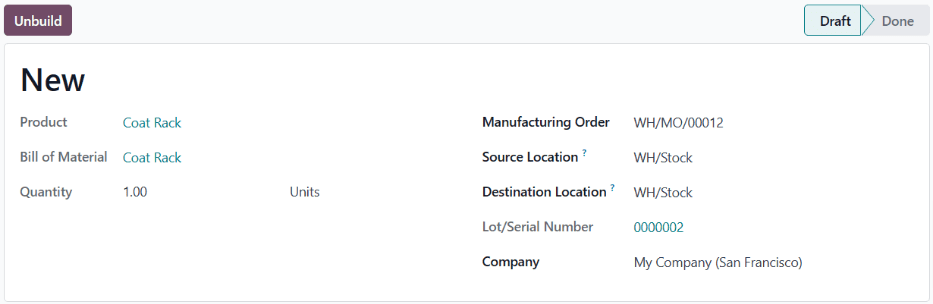

# Unbuild orders

In some cases, it is necessary to dismantle manufactured products into their individual components.
This may be required if too many units of a product were built, or if the components of one product
must be reclaimed to use in the manufacturing of another.

In Odoo *Manufacturing*, products can be dismantled, and their components returned to inventory,
using *unbuild orders*. By using unbuild orders to accomplish this task, inventory counts for the
finished product and its components remain accurate, based on the quantity of products dismantled,
and the quantity of components reclaimed.

## Create unbuild order

A new unbuild order can be created by navigating to Manufacturing app ‣ Operations
‣ Unbuild Orders, and clicking New.

Begin filling out the new unbuild order by selecting a Product to unbuild. After doing
so, the Bill of Material field auto-populates with the corresponding bill of materials
(BoM). If a different  should be used, click on the Bill of Material field, and
select it from the drop-down menu.

Alternatively, a specific  can be selected in the Bill of Material field before
selecting a product, which causes the corresponding product to auto-populate in the
Product field.

Next, specify the Quantity of the product that is being unbuilt.

If the product being unbuilt was originally manufactured in a specific manufacturing order (MO),
select it in the Manufacturing Order field.

In the Source Location field, select the location where the product being unbuilt is
currently stored.

In the Destination Location field, select the location where the reclaimed components
are stored after the unbuild order is completed.

If the *Lots & Serial Numbers* feature is enabled in the settings of the *Inventory* app, a
Lot/Serial Number field appears on the unbuild order, which can be used to specify the
lot(s) or serial number(s) of the product being unbuilt, if any are assigned.

If the Odoo database has been configured with multiple companies, a Company field
appears on the unbuild order, which can be used to specify the company that owns the product being
unbuilt.

Finally, once the product has been unbuilt, click the Unbuild button at the top of the
order to confirm that it has been completed.

#### WARNING
While it is possible to create unbuild orders for products that have zero (or fewer) units
on-hand, this is not advised, since it can lead to inventory inconsistencies.

If an unbuild order is created for a product with zero (or fewer) units on-hand, a pop-up window
appears, warning the user that there is an insufficient quantity to unbuild.

To ignore the warning, and proceed with the unbuild order, click Confirm at the
bottom of the pop-up window. To return to the unconfirmed unbuild order, click
Discard, instead.

After completing an unbuild order, inventory counts automatically update, based on the quantity of
products unbuilt, and the quantity of components reclaimed.

## Scrap unusable components

In some cases, components may be unusable after the unbuilding process is completed. To ensure that
inventory counts accurately reflect the quantity of usable components on-hand, any component that
can no longer be used should be removed from inventory using a [scrap order](../../inventory/warehouses_storage/inventory_management/scrap_inventory.md).
