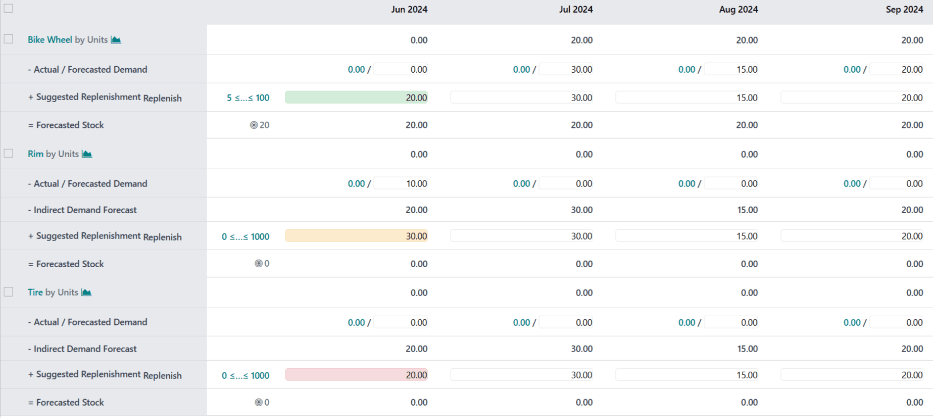
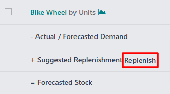
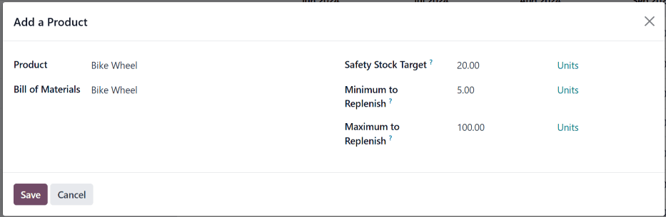

# Kế hoạch sản xuất tổng thể

Trong ứng dụng *Sản xuất* của Odoo, *kế hoạch sản xuất tổng thể* (MPS) được sử dụng để lập kế hoạch thủ công cho các lệnh hàng sản xuất (MO) và đơn mua hàng (PO), dựa trên số lượng sản phẩm và thành phần được dự báo.

Bằng cách xem xét tác động của  và  đã xác nhận, cùng với dự báo nhu cầu được điều chỉnh thủ công,  có thể được sử dụng để quản lý việc bổ sung sản phẩm trong dài hạn. Điều này đảm bảo các sản phẩm và thành phần cần thiết luôn có hàng.

Vì  cho phép can thiệp thủ công, nên tính năng này hữu ích trong bổ sung sản phẩm khi nhu cầu từ các đơn bán hàng hiện tại (SO) **không** phản ánh chính xác nhu cầu trong tương lai.

#### IMPORTANT
Điều quan trọng cần nhớ là  là một công cụ **THỦ CÔNG**. Việc thêm một sản phẩm vào  không khiến sản phẩm đó được sản xuất hay mua tự động.  chỉ gợi ý số lượng sản phẩm cần được bổ sung, nhưng yêu cầu người dùng nhập dữ liệu để tạo  hoặc  được sử dụng để bổ sung sản phẩm đó.

Do đó, **KHÔNG** nên sử dụng  cùng với các quy tắc tái đặt hàng cho cùng một sản phẩm. Vì quy tắc tái đặt hàng là một quy trình tự động, nên chúng xung đột với phương pháp bổ sung hàng thủ công của . Việc sử dụng cả hai cùng lúc có thể dẫn đến dự báo không chính xác và tạo ra các lệnh bổ sung hàng không cần thiết.

## Bật và cấu hình

Để sử dụng tính năng , hãy đi đến Ứng dụng Sản xuất ‣ Cấu hình ‣ Cài đặt và đánh dấu vào hộp kiểm Kế hoạch sản xuất tổng thể trong phần Kế hoạch. Cuối cùng, nhấp vào Lưu.

Sau khi bật tính năng Kế hoạch sản xuất tổng thể, hai trường mới sẽ xuất hiện bên dưới tính năng này trên trang Cài đặt: Khoảng thời gian và Số cột.

Trường Khoảng thời gian được sử dụng để chọn khoảng thời gian diễn ra quá trình lập kế hoạch và có ba tùy chọn: Hàng tháng, Hàng tuần và Hàng ngày. Ví dụ, nếu chọn Hàng tháng,  sẽ lập kế hoạch cho các yêu cầu sản xuất sản phẩm và thành phần theo tháng.

Trường Số cột được sử dụng để xác định số lượng đơn vị Khoảng thời gian đã chọn được hiển thị trên trang . Ví dụ, nếu trường Khoảng thời gian được đặt thành Hàng tháng và `12` được nhập vào trường Số cột, thì  sẽ hiển thị số cột ứng với 12 tháng tiếp theo, bắt đầu từ tháng hiện tại.

Nếu giá trị của trường Khoảng thời gian hoặc Số cột bị thay đổi, hãy nhấp vào Lưu một lần nữa để lưu các thay đổi.

## Trang chủ

Để mở , hãy đi đến Ứng dụng Sản xuất ‣ Kế hoạch ‣ Kế hoạch sản xuất tổng thể. Chế độ xem  xuất hiện như sau:

Cột màu xám ở bên trái màn hình hiển thị một phần dành cho mọi sản phẩm được thêm vào , mỗi phần sản phẩm được chia thành các hàng nhỏ hơn. Thông tin hiển thị trong các hàng phụ thuộc vào bộ lọc được chọn trong menu thả xuống của thanh Tìm kiếm... ở đầu trang. Những mục mặc định xuất hiện trong các hàng này là:

- [Sản phẩm] theo [đơn vị] <i class="fa fa-area-chart"></i>: số lượng hàng tồn kho được dự báo vào đầu mỗi khoảng thời gian. [Sản phẩm] và <i class="fa fa-area-chart"></i> là các nút có thể chọn để mở trang sản phẩm hoặc báo cáo dự báo cho sản phẩm.
- - Nhu cầu được dự báo: dự báo nhu cầu, được nhập thủ công. Trường này thể hiện ước tính nhu cầu cho sản phẩm trong từng khoảng thời gian.
- - Dự báo nhu cầu gián tiếp: mặc dù đây là mục mặc định, nhưng nó **chỉ** xuất hiện đối với các sản phẩm là thành phần của sản phẩm khác. Nó cho biết nhu cầu thành phần từ các MO hiện có.
- + Bổ sung hàng được đề xuất: số lượng sản phẩm được đề xuất bổ sung thông qua  hoặc . Bên phải tiêu đề mục là nút Bổ sung hàng, được sử dụng để bổ sung sản phẩm thủ công, dựa trên số lượng được đề xuất bổ sung.
  
- = Tồn kho được dự báo: số lượng sản phẩm được dự báo sẽ có trong kho vào cuối mỗi khoảng thời gian, giả sử số lượng bổ sung hàng đề xuất đã được đáp ứng.

Các mục mặc định này tạo thành một phương trình:

$$
\text{Nhu cầu được dự báo} + \text{Bổ sung hàng được đề xuất} = \text{Tồn kho được dự báo}
$$

Nếu là thành phần, Dự báo nhu cầu gián tiếp cũng được tính đến.

Có thể chỉnh sửa các trường - Nhu cầu được dự báo và + Bổ sung hàng được đề xuất tại bất kỳ khoảng thời gian nào ở bên phải cột sản phẩm. Việc này sẽ thay đổi phương trình và cập nhật giá trị hiển thị trong trường Tồn kho được dự báo.

Việc thay đổi giá trị trong trường + Bổ sung hàng được đề xuất cũng làm xuất hiện nút <i class="fa fa-times"></i> (cài đặt lại) ở bên trái trường. Nhấp vào nút <i class="fa fa-times"></i> (cài đặt lại) để đặt lại giá trị của trường về giá trị được tính toán bởi .

#### IMPORTANT
Trong khi  chỉ có thể được sử dụng với các mục mặc định được bật, bạn nên bật cả mục Nhu cầu thực tế. Thực hiện bằng cách nhấp vào <i class="fa fa-caret-down"></i> (mũi tên xuống) ở bên phải thanh Tìm kiếm... và bật tùy chọn Nhu cầu thực tế dưới header của Hàng.

Khi bật tùy chọn Nhu cầu thực tế, mục - Nhu cầu được dự báo sẽ thay đổi thành mục - Nhu cầu thực tế/được dự báo. Ngoài nhu cầu được dự báo được nhập thủ công, mục này cũng hiển thị nhu cầu đã xác nhận cho sản phẩm, dựa trên  đã xác nhận.

Mỗi cột bên phải cột sản phẩm liệt kê một đơn vị khoảng thời gian được chọn trong trường *Khoảng thời gian* trên trang *Cài đặt* của ứng dụng *Sản xuất* (VD: tháng). Số lượng cột khoảng thời gian tương ứng với giá trị được nhập vào trường *Số cột*.

Cột khoảng thời gian đầu tiên biểu thị khoảng thời gian hiện tại. Ví dụ, nếu  được cấu hình để sử dụng tháng, cột đầu tiên sẽ hiển thị dữ liệu cho tháng hiện tại. Trên cột đầu tiên này, trường + Bổ sung hàng được đề xuất sẽ xuất hiện với một trong năm màu sau:

- Xanh lục: phải tạo đơn bổ sung hàng để duy trì lượng hàng tồn kho ở mức Mục tiêu tồn kho an toàn.
- Xám: đã tạo đơn bổ sung hàng để duy trì lượng hàng tồn kho ở mức Mục tiêu tồn kho an toàn.
- Vàng: đơn bổ sung hàng đã được tạo, nhưng số lượng hàng trong đơn bổ sung đó không đủ để duy trì lượng hàng tồn kho ở mức Mục tiêu tồn kho an toàn.
- Đỏ: đơn bổ sung hàng đã được tạo, nhưng số lượng hàng trong đơn bổ sung đó khiến lượng hàng tồn kho vượt mức Mục tiêu hàng tồn kho an toàn.

Trường + Bổ sung hàng được đề xuất sẽ hiển thị màu trắng nếu không có đơn bổ sung hàng nào được tạo và không cần thiết phải tạo đơn bổ sung hàng vào thời điểm hiện tại.

## Thêm sản phẩm

Để sử dụng  để quản lý việc bổ sung sản phẩm, hãy đi đến Ứng dụng Sản xuất ‣ Kế hoạch ‣ Kế hoạch sản xuất tổng thể. Ở đầu trang , nhấp vào Thêm sản phẩm để mở cửa sổ bật lên Thêm sản phẩm.

#### IMPORTANT
Sản phẩm **phải** được cấu hình chính xác để có thể bổ sung thông qua .

Nếu là sản phẩm được sản xuất, tuyến *Sản xuất* phải được chọn trong phần *Tuyến* của tab *Tồn kho* trên biểu mẫu sản phẩm.

Nếu là sản phẩm được mua, tuyến *Mua* phải được chọn trong phần *Tuyến* của tab *Tồn kho*, trên biểu mẫu sản phẩm. Ngoài ra, nhà cung cấp và giá bán sản phẩm cũng phải được chỉ định trên tab *Mua hàng*.

Trên cửa sổ bật lên, chọn sản phẩm cần thêm trong menu thả xuống Sản phẩm. Nếu sản phẩm được bổ sung thông qua sản xuất, hãy chọn  của sản phẩm trong trường Danh mục vật tư.

#### NOTE
Việc chọn BoM khi thêm sản phẩm vào  cũng sẽ thêm mọi thành phần được liệt kê trên BoM. Nếu không cần quản lý việc bổ sung thành phần thông qua , chỉ cần để trống trường Danh mục vật tư.

Nếu cơ sở dữ liệu được cấu hình với nhiều kho hàng, trường Kho hàng sản xuất sẽ xuất hiện trên cửa sổ bật lên Thêm sản phẩm. Sử dụng trường này để chỉ định kho hàng mà sản phẩm được bổ sung vào.

Trong trường Mục tiêu tồn kho an toàn, hãy xác định số lượng sản phẩm tối thiểu luôn được duy trì sẵn cho các đơn hàng. Ví dụ, nếu luôn phải có sẵn 20 đơn vị sản phẩm để thực hiện đơn hàng, hãy nhập `20` vào trường Mục tiêu tồn kho an toàn.

Trong trường Số lượng bổ sung tối thiểu, hãy nhập số lượng sản phẩm tối thiểu cho các đơn bổ sung hàng được tạo. Ví dụ, nếu nhập `5` vào trường này, các đơn bổ sung hàng cho sản phẩm bao gồm tối thiểu năm đơn vị.

Trong trường Số lượng bổ sung tối đa, hãy nhập số lượng sản phẩm tối đa cho các đơn bổ sung hàng được tạo. Ví dụ, nếu nhập `100` vào trường này, các đơn bổ sung hàng cho sản phẩm bao gồm tối thiểu 100 đơn vị.

Cuối cùng, nhấp vào Lưu để thêm sản phẩm vào . Giờ đây, sản phẩm sẽ xuất hiện trên trang  mỗi khi mở ra. Nếu một  được chọn trong trường Danh mục vật tư của cửa sổ bật lên Thêm sản phẩm, thì mọi thành phần được liệt kê trên  này cũng sẽ xuất hiện trên trang.

### Sửa sản phẩm

Sau khi thêm sản phẩm vào , có thể cần phải thay đổi các giá trị bổ sung đã nhập vào cửa sổ bật lên Thêm sản phẩm. Để thực hiện, hãy nhấp vào nút # ≤…≤ # ở ngay bên phải nút Bổ sung hàng, trên hàng + Bổ sung hàng được đề xuất, bên dưới tên sản phẩm.

#### NOTE
Số đầu tiên và số thứ hai hiển thị trên nút # ≤…≤ # tương ứng với các giá trị được nhập vào trường Số lượng bổ sung tối thiểu và Số lượng bổ sung tối đa khi thêm sản phẩm vào .

Ví dụ, nếu nhập `5` vào trường Số lượng bổ sung tối thiểu và nhập `100` vào trường Số lượng bổ sung tối đa, thì nút sẽ hiển thị là 5 ≤…≤ 100.

Việc nhấp vào nút # ≤…≤ # sẽ mở cửa sổ bật lên Chỉnh sửa lịch trình sản xuất. Cửa sổ này giống với cửa sổ bật lên Thêm sản phẩm, ngoại trừ các trường Sản phẩm và Danh mục vật tư không thể chỉnh sửa được.

Trên cửa sổ bật lên Chỉnh sửa lịch trình sản xuất, nhập giá trị mong muốn vào các trường Mục tiêu tồn kho an toàn, Số lượng bổ sung tối thiểu và Số lượng bổ sung tối đa. Sau đó, nhấp vào Lưu để lưu các thay đổi.

### Xoá sản phẩm

Để xóa một sản phẩm khỏi , hãy đánh dấu vào hộp kiểm bên trái tên của sản phẩm đó. Sau đó, nhấp vào nút <i class="fa fa-cog"></i> Tác vụ ở đầu màn hình và chọn Xoá từ menu kết quả thả xuống. Cuối cùng, nhấp vào Ok trên cửa sổ Xác nhận bật lên.

Việc xóa sản phẩm khỏi  sẽ xóa sản phẩm đó và tất cả dữ liệu của nó. Nếu sản phẩm được thêm lại, giá trị bổ sung hàng của sản phẩm đó phải được cấu hình lại.

## Bổ sung hàng

Sản phẩm trong  có thể được bổ sung theo một trong ba cách sau:

- Nhấp vào nút Bổ sung hàng ở đầu màn hình để tạo đơn bổ sung hàng cho mọi sản phẩm có số lượng dưới Mục tiêu tồn kho an toàn trong tháng hiện tại.
- Nhấp vào nút Bổ sung hàng ở bên phải hàng + Bổ sung hàng được đề xuất của một sản phẩm cụ thể để tạo đơn bổ sung hàng cho sản phẩm đó.
- Đánh dấu vào hộp kiểm bên trái tên sản phẩm của một hoặc nhiều sản phẩm. Sau đó, nhấp vào nút <i class="fa fa-cog"></i> Tác vụ ở đầu màn hình và chọn Bổ sung hàng từ menu kết quả thả xuống. Việc này sẽ tạo ra đơn bổ sung hàng cho mỗi sản phẩm đã chọn.

Loại đơn bổ sung hàng được tạo tương ứng với tuyến đã chọn trên tab *Tồn kho* của biểu mẫu sản phẩm:

- Nếu đã chọn tuyến *Mua*, một  được tạo ra để bổ sung sản phẩm.  có thể được chọn bằng cách đi đến ứng dụng Mua hàng. Bất kỳ  nào được tạo ra bởi  đều liệt kê MPS trong trường Chứng từ gốc của nó.
- Nếu đã chọn tuyến *Sản xuất*, một  được tạo ra để bổ sung sản phẩm.  có thể được chọn bằng cách đi đến Ứng dụng Sản xuất ‣ Hoạt động ‣ Lệnh sản xuất. Bất kỳ  nào được tạo ra bởi  đều liệt kê MPS trong trường Chứng từ gốc của nó.
