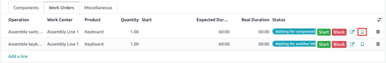
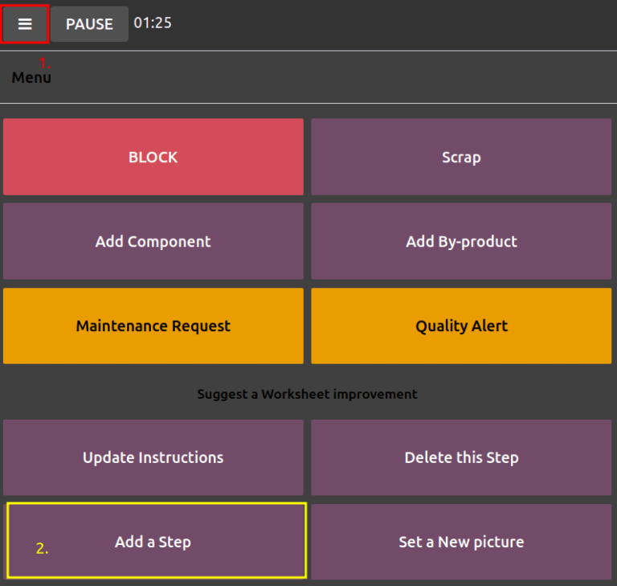
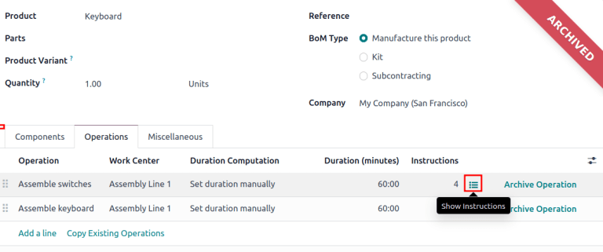

# Engineering change orders

Utilize *engineering change orders* (*ECOs*) to track, implement, and revert change versions made to
products, and [bills of materials](../../manufacturing/basic_setup/bill_configuration.md).

Engineering change orders can be created:

1. [directly in the ECO type](#plm-eco-create-eco).
2. by an operator in the [tablet view](#plm-eco-tablet-view) of an operation.
3. automatically from feedback submitted to the [ECO type's email alias](eco_type.md#plm-eco-eco-type).

## Tạo ECO

To create a new , begin by navigating to the *PLM* app. Then, select the  type card that
will be used to track the progress of the change. On the Engineering Change Orders page,
click the New button in the top-left corner.

#### NOTE
Learn how to create new [ECO types](eco_type.md#plm-eco-eco-type) to categorize and organize change
orders. Doing so ensures employees only view the  related to their responsibilities,
whether it involves new product introductions, targeted product line updates, or regulatory
compliance fulfillment.

On the  form, fill in the following fields accordingly:

- Description is a brief summary of the improvement.
- Type: specifies the  type project for organizing the .
- Apply on determines if the  changes the Bill of Materials or the
  Product Only.
- Product indicates the product being improved.
- Bill of Materials specifies the changed . It auto-populates if the product in
  Product field has an existing . If multiple  exist, select the intended
  radio options from the drop-down menu.
- Company field is used in multi-company databases. Specify if the change applies to
  products in a specific company, or leave blank if the change applies to all companies.
- Responsible represents the assignee in charge of this . (Optional)
- Effective specifies when the  becomes live. Choosing As soon as
  possible means the  applies to the production  as soon as an authorized user
  [applies the changes](#plm-eco-apply-changes).

  On the other hand, choosing At Date, and setting a specific date, leaves a date that
  makes it easier to track the version history of the , and the specific date , used for
  production.
- Tags are assigned to  for prioritization and organization. Create a new tag by
  typing the name in the field and selecting Create from the drop-down menu. (Optional)

After filling out the  form, click the Start Revision button to begin implementing
the changes.

By pressing Start Revision, three actions occur:

1. The Documents smart button appears, storing relevant files of the .
2. A copy of the production  is stored in the newly-appeared Revision smart button
   of the . The next available version number (e.g., `V2`, `V3`, ...) is also assigned to keep
   track of all  versions.
3. The stages of the  Type are displayed in the top-right corner of the .

#### NOTE
The Revision smart button is available **only** when the Bill of
Materials radio button is selected in the Apply on field, and the Start
Revision button has been pressed.

## Change components

To modify the components in a , click the Revision smart button on an  to
access the new version of the . Odoo distinguishes the non-production version of the  from
the current version, by flagging the test  with a large Archived tag.

On the new , in the Components tab, proceed to modify the components list, by
changing the Quantity of existing components, adding new components using the
Add a line button, and removing components with the 🗑️ (trash) icon.

### Compare changes

Once the changes are complete, navigate back to the , by clicking `ECO00X` in the breadcrumbs
located in the top-left corner. On the  form, a new BoM Changes tab displays the
differences between the current  and the new version.

Blue text indicates new components added to the revised  that are not in the production .
Black text represents updates shared by both , while red text indicates components removed in
the revised .

Changes and tests are encapsulated in the revised , and do **not** affect the  currently
used in production. That is, until the [changes are applied](#plm-eco-apply-changes).

## Change operations

To modify the operations in a , click the Revision smart button on an  to
access the archived, new version of the .

In the new  version, switch to the Operations tab to view and edit 
operations. To make changes, select each operation, which opens the corresponding Open:
Operations pop-up window.

#### NOTE
The Operations tab is *not* available by default. To enable it, navigate to
Manufacturing app ‣ Configuration ‣ Settings, and check the Work
Orders box.

Make changes to any of the fields in the Open: Operations pop-up window, then click
Save once completed.

Create new operations by clicking the Add a line button, and remove new operations by
clicking the Archive Operation button.

### Compare changes

Once the changes are complete, navigate back to the , by clicking `ECO00X` in the breadcrumbs
located in the top-left corner.

On the  form, a new Operation Changes tab displays the differences between the
current production  and the new version.

Blue text indicates new operations added to the revised  that do not yet exist in the
production . Black text represents updates shared by both , while red text indicates
operations removed in the revised .

Modifications to the  in an  will **not** affect the  used in production. That is,
until the [changes are applied](#plm-eco-apply-changes).

In the Operation Changes tab, each row of details, beneath the columns in the table,
reflect the following information:

- Operation: Name of the operation that was modified.
- Step: specifies the quality control point, visible when the operation includes
  detailed instructions.

#### NOTE
To check for instructions, click the operation line item in the Operations tab of a
. Then, in the Open: Operations pop-up window, look for the
Instructions smart button displayed at the top.

- Step Type details the type of quality control for further instructions in the
  operation.
- Type corresponds with the colored text to specify how the revised  differs from
  the production . Operation change types can be Add, Remove, or
  Update.
- Work Center specifies the work center at which the operation is performed.
- Manual Duration Change refers to the change in the Default Duration field
  in the Open: Operations pop-up window, which specifies the expected time for
  completing the operation.

## Áp dụng thay đổi

After verifying the changes, move the  to a [verification stage](eco_type.md#plm-eco-stage-config),
which are stages that require approval before the revised changes can be applied to the production
.

Once the approvers accept the changes, the Apply Changes button becomes available. Click
this button, and the  is automatically moved to a closing stage. The changes are applied, which
archives the original production , and the revised  becomes the new production .

### Verify changes

To ensure the changes are live, from the  where the Apply Changes button was just
pressed, return to the revised  by clicking the Revision smart button.

On the revised , the large red Archived flag is removed.

To further verify the changes, check the production  by going to Manufacturing
app ‣ Products ‣ Products and select the product.

Then, on the product form, click the Bill of Materials smart button, and select the
 from the list. In the Miscellaneous tab of the , the Version
field is updated to match the version number shown on the Revision smart button of the
latest .

## Create ECO from tablet view

Operators can directly suggest clearer operation instructions, while performing manufacturing orders
(MOs) in the *Manufacturing* app.

To create  in this manner, begin by navigating to Manufacturing app ‣
Operations ‣ Manufacturing Orders. Then, select the desired  and
switch to the Work Orders tab. Then, click the 📱 (mobile phone) icon for
the desired work order to open the *tablet view* of the operation.

#### IMPORTANT
The 📱 (mobile phone) icon is **only** available for  with a Confirmed or In Progress status.

Next, add an instructional step, by clicking the ☰ (three horizontal lines) icon in the
tablet view of an operation. Doing so opens the Menu of action items for a . Then, click the Add a step button.

Clicking the button reveals an Add a step pop-up window, where the proposed changes are
submitted.

In the Title field, enter a short step description. Next, in the Instruction
text field, type the instructions of the step in greater detail. Optionally, add an image to the
Document field. Once completed, finish by clicking the Propose Change
button.

Based on the inputs from the Add a Step pop-up window, an  is created with the
following information:

1. Description is the name of the operation, followed by the  number for reference.
2. The  Type is automatically assigned to `BOM Changes`.
3. Product and Bill of Materials fields are automatically populated, based
   on the  used in the .
4. Responsible is the operator who submitted the feedback.

### Xem ECO

To review the proposed changes, navigate to the PLM app ‣ Overview. In the `BOM
Updates`  type card, the X Engineering Changes button represents the amount of
operational changes created from the tablet view.

Click on the X Engineering Changes button to open the kanban view of the  type. To
view the suggestion, select an  in the `New` stage.

On the , view a summary of the proposed changes in the Operation Changes tab. Click
the Revision smart button to navigate to the revised  and look into the proposed
changes in greater detail.

On the revised , switch to the Operations tab, and select the ☰ (three
horizontal lines) icon. Doing so opens a list of Steps to perform the operation, with
the newest instruction titled `New Step Suggestion:`, followed by the user-entered title. Click the
line item to view the suggested changes.

On the [quality control point](../../quality/quality_management/quality_control_points.md#quality-quality-management-quality-control-points) form, ensure
the following form fields are accurately filled out to give detailed instructions for operators:

- Title: rename to give a concise description of the new instruction.
- Control per: using the drop-down menu, determine whether this instruction applies
  broadly for the Product, specifically for this Operation *only*, or a
  particular Quantity of the product.
- Type: categorizes the control point type. From the drop-down menu, select
  Instructions to detail an instruction for the worker. To receive input from the
  workers, select the Take a Picture, Register Consumed Materials,
  Print Label, or other [quality check options](../../quality/quality_management/quality_control_points.md#quality-quality-management-quality-control-points).

#### SEE ALSO
[Configure quality control points](../../quality/quality_management/quality_control_points.md#quality-quality-management-quality-control-points)

Once the quality control point is configured, return to the Steps list using the
breadcrumbs. Finally, drag the last quality control line item to its intended order of instructions.
