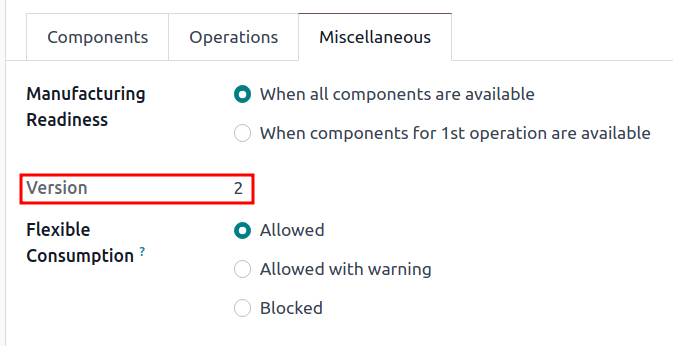

# Kiểm soát phiên bản

Use Odoo's *Product Lifecycle Management (PLM)* to manage previous versions of bills of materials
(BoMs). Store former assembly instructions, component details, and past product design files while
keeping the past details out of the production .

Easily revert to previous  versions, when needed. Additionally, use *PLM* to trace which 
version was active on specific dates for recalls or customer complaints.

Every  version is stored in an *engineering change order* (ECO) for organized testing and
improvements without disrupting normal manufacturing operations.

#### SEE ALSO
[Engineering change order](engineering_change_orders.md#plm-eco)

## Current BoM version

To see the current version of the  used in production, go to PLM app ‣ Master
Data ‣ Bill of Materials, and select the desired  from the list. Then, switch to the
Miscellaneous tab, where the currently live Version of the  is
displayed.

#### NOTE
 can also be accessed from Manufacturing app ‣ Products ‣ Bill of
Materials.

## Lịch sử phiên bản

To manage all former, current, and future versions of a , begin by navigating to
Manufacturing app ‣ Products ‣ Bills of Materials and click the desired .

From the  page, click the ECO smart button, and switch to list view by selecting
the ≣ (four horizontal lines) icon on the top right corner.

#### NOTE
The ECO smart button is visible on the  **only** if the *PLM* app is installed.

In the list of  for the product, navigate to the search bar at the top, and click the
▼ (down arrow) icon on the right to access a drop-down menu of Filters.

Next, filter by Done  to view: the revision history of the , the
Responsible user who applied the change, and the Effective Date of the
.

Click each  to view the past components, operations, and design files associated with the
.

#### NOTE
If the Effective Date field is empty, the Effective date of the  is
automatically set to As soon as possible and no dates are recorded in the revision
history of the .

## Design files

Attach computer-aided design (CAD) files, PDFs, images, or other design material to the 
itself.

To do so, navigate to PLM app ‣ Master Data ‣ Bill of Materials, and select the
desired . On the , navigate to the *chatter*, and click the 📎 (paperclip)
icon.

The files associated with the  are displayed in the Files section. To add more
design files, select the Attach files button.

### Manage design files in an ECO

Add, modify, and remove files in an . Once the  is approved and applied, the new files are
automatically linked to the production . Archived files are removed from the , but are
still accessible in the .

To manage the design files in the , begin by navigating to PLM app ‣ Changes
and choose the desired . Next, open the Attachments page by clicking the
Documents smart button.

Hover over each attachment to reveal the ︙ (three vertical dots) icon. From there,
choose whether to Edit, Remove, or Download the file. Any
changes made to these files are contained within the , and will only apply to the production
 once the [changes are applied](engineering_change_orders.md#plm-eco-apply-changes).

#### NOTE
Archived files are **not** permanently deleted — they can still be accessed in the previous
, or as an archived file in the latest , where the archival occurred.

## Apply rebase

Odoo simplifies merge conflict resolution for concurrent  on the same product.

Conflicts can occur when the production  is updated while other  are modifying the
previous version. Differences between the new and previous production  are displayed in the
Previous Eco Bom Changes tab, visible only in this scenario.

To resolve conflicts and retain  changes, click the Apply Rebase button.
