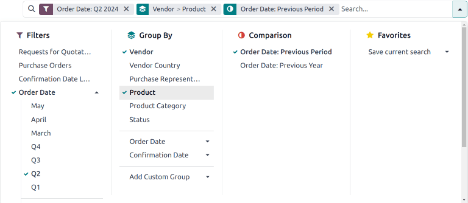
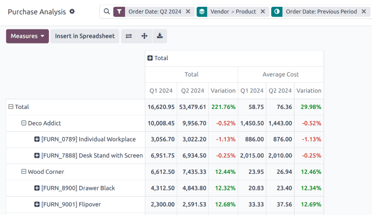

# Vendor costs report

With the *Purchase* application, users can track the fluctuation of vendor costs over time. This
allows users to identify the most expensive vendors, and track seasonal changes.

## Create vendor costs reports

Để tạo báo cáo chi phí nhà cung cấp, trước tiên hãy đi đến Ứng dụng Mua hàng ‣ Báo cáo ‣ Mua hàng để mở trang chủ Phân tích mua hàng. Theo mặc định, trang chủ này hiển thị biểu đồ đường tổng quan về Tổng trước thuế của đơn mua hàng (PO) với Ngày xác nhận trong tháng hiện tại hoặc của yêu cầu báo giá (RFQ) với trạng thái *Nháp*,  *Đã gửi* hoặc  *Đã hủy*.

### Add filters and groups

On the top-right, click the <i class="oi oi-view-pivot"></i> (pivot) icon to switch to pivot view.

Remove any default filters from the Search... bar. Then, click the <i class="fa fa-caret-down"></i> (down) icon to open the
drop-down menu that contains the Filters, Group By, and
Favorites columns.

#### NOTE
Unless otherwise specified, the report displays data from both  and . This can be
changed by selecting either Requests for Quotation or Purchase Orders
under the Filters column.

Under the Filters column, select a date range to use for comparison. The report can be
filtered by either Order Date or Confirmation Date. Choose one from the
list, and click the <i class="fa fa-caret-down"></i> (down) icon to specify the date range, either by month, quarter, or year.

Next, under the Group by column, select Vendor. Then, select
Product, which is also located in the Group By column.

#### NOTE
Selecting Product is **not** required for this report. However, it is recommended, as
it provides additional insight into the performance of individual vendors. Additional selections
can be made under the Group by heading as well, including Product
Category, Status, and Purchase Representative.

To ensure the report is generated correctly, make sure that Vendor is the **first**
selection made under the Group By column.

Next, make a selection under the Comparison heading. These options are only available
after the date range is selected under the Filters column, and vary based on that range.
Previous Period adds a comparison to the previous period, such as the last month or
quarter. Previous Year compares the same time period from the previous year.

#### NOTE
While multiple time-based filters can be added at once, only one comparison can be selected at a
time.

### Add measures

After selecting the Filters, Group by, and Comparison settings,
click out of the drop-down menu.

Theo mặc định, báo cáo sẽ hiển thị các chỉ số sau: Đơn hàng, Tổng, Tổng trước thuế và Số lượng. Nhấp vào Chỉ số ở góc trên bên trái để mở danh sách thả xuống các chỉ số khả dụng. Nhấp Chi phí trung bình để thêm vào báo cáo. Bạn có thể chọn thêm bất kỳ chỉ số nào khác để bổ sung vào báo cáo, hoặc nhấp vào các chỉ số đã chọn để loại bỏ chúng nếu cần.

## Xem kết quả

After all of the [filters and measures have been selected](#purchase-vender-cost-report-filters), the report generates in the pivot view. Click
Insert in Spreadsheet to add the pivot view into an editable spreadsheet format within
the *Documents* app.

#### IMPORTANT
The Insert in Spreadsheet option is only available if the *Documents Spreadsheet*
module is installed.

#### NOTE
The vendor costs report is also available in *graph* view. Click the <i class="fa fa-area-chart"></i>
(area chart) icon to change to graph view. Click the corresponding icon at the top of
the report to switch to a <i class="fa fa-bar-chart"></i> (bar chart), <i class="fa fa-line-chart"></i>
(line chart), or <i class="fa fa-pie-chart"></i> (pie chart).

#### SEE ALSO
To save this report as a *favorite*, see [Yêu thích](../../../essentials/search.md#search-favorites).
