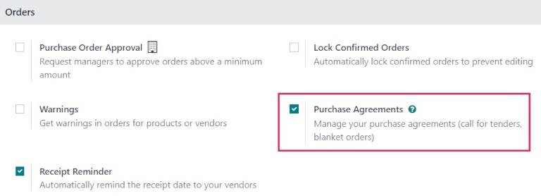
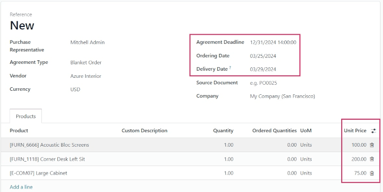
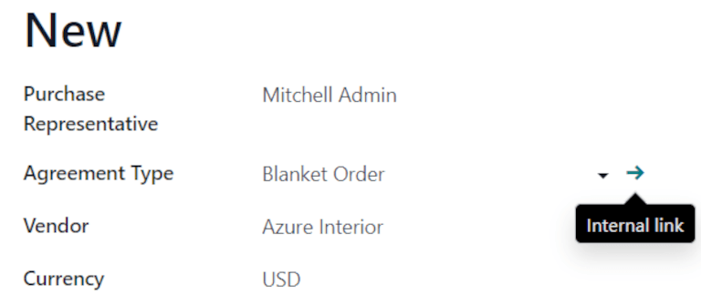
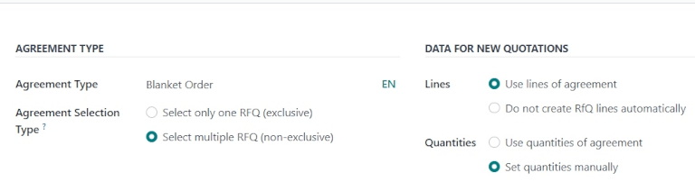
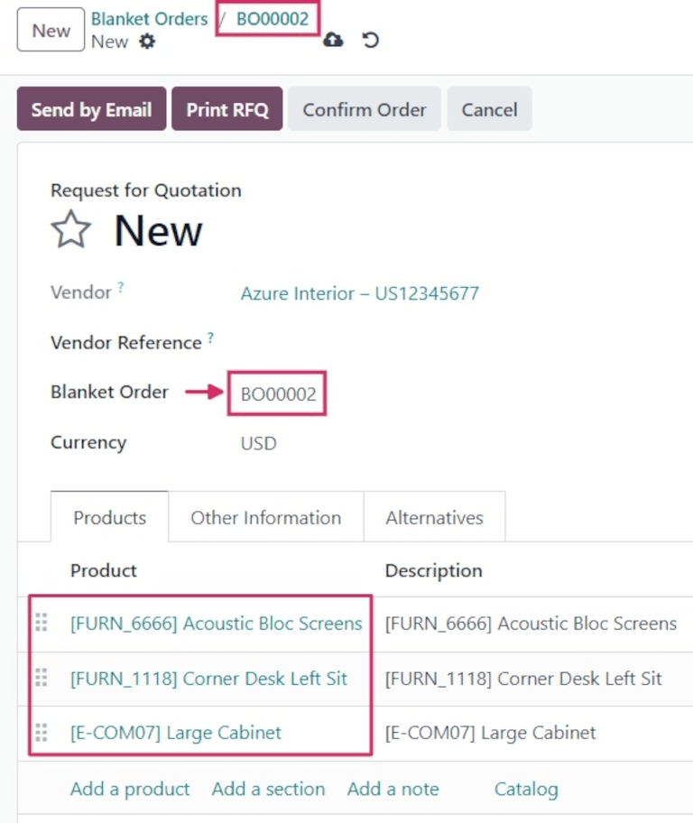
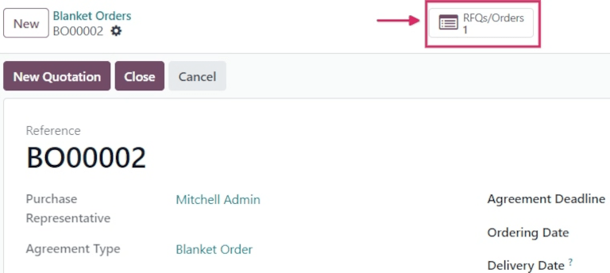
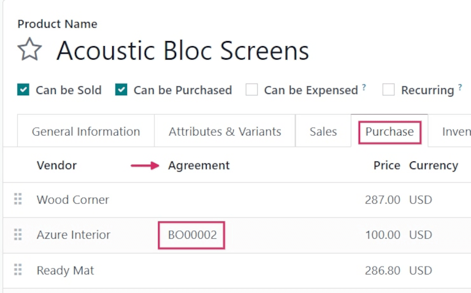

# Blanket orders

Blanket orders are long-term purchase agreements between a company and a vendor to deliver products
on a recurring basis with predetermined pricing.

Blanket orders are helpful when products are consistently purchased from the same vendor, but in
different quantities, and at different times.

By simplifying the ordering process, blanket orders not only save time, they also save money, since
they can be advantageous when negotiating bulk pricing with vendors.

## Create a new blanket order

To create blanket orders, enable the *Purchase Agreements* feature from the *Purchase* app settings.
Navigate to Purchase app ‣ Configuration ‣ Settings, and under the
Orders section, click the checkbox for Purchase Agreements. Then click
Save to implement the changes.

#### NOTE
In addition to creating blanket orders, the *Purchase Agreements* setting also allows users to
create alternative requests for quotation (RfQs).

To create a blanket order, go to Purchase app ‣ Orders ‣ Blanket Orders, and
click New. This opens a new blanket order form.

Configure the following fields in the new blanket order form to establish predetermined rules for
the recurring long-term agreement:

- Purchase Representative: the user assigned to this specific blanket order. By default,
  this is the user who created the agreement; the user can be changed directly from the drop-down
  menu next to this field.
- Agreement Type: the type of purchase agreement this blanket order is classified as. In
  Odoo, blanket orders are the only official purchase agreement.
- Vendor: the supplier to whom this agreement is tied, either once or on a recurring
  basis. The vendor can be selected directly from the drop-down menu next to this field.
- Currency: the agreed-upon currency to be used for this exchange. If multiple
  currencies have been activated in the database, the currency can be changed from the drop-down
  menu next to this field.
- Agreement Deadline: the date that this purchase agreement will be set to expire on. If
  this blanket order should not expire, leave this field blank.
- Ordering Date: the date that this blanket order should be placed on if a new quotation
  is created directly from the blanket order form. If a new quotation is created, this value
  automatically populates the *Order Deadline* field on the .
- Delivery Date: the expected delivery date that the products included in an  are
  expected, if created directly from a blanket order form. If a new quotation is created, this value
  automatically populates the *Expected Arrival* field on the .
- Source Document: the source purchase order (PO) that this blanket order is tied to. If
  this blanket order should not be tied to any existing , leave this field blank.
- Company: the company assigned to this specific blanket order. By default, this is the
  company that the user creating the blanket order is listed under. If the database is not a
  multi-company database, this field **cannot** be changed, and defaults to the only company listed
  in the database.

Once all relevant fields have been filled out, click Add a line to add products under
the Product column. Then, in the Quantity column, change the quantity of
each product, and set a price in the Unit Price column.

#### IMPORTANT
When adding products to a new blanket order, the pre-existing prices of products are not
automatically added to the product lines. Instead, the prices **must** be manually assigned, by
changing the value in the Unit Price column to an agreed-upon price with the listed
vendor. Otherwise, the price will remain `0`.

To view and change the default purchase agreement settings for blanket orders directly from the
blanket order form, click the ➡️ (right arrow) icon that becomes visible when hovering
over the Agreement Type field, where Blanket Order is listed. This navigates
to the blanket order settings.

From here, the settings for blanket orders can be edited. Under the Agreement Type
section, the name of the Agreement Type can be changed, and the Agreement
Selection Type can be changed, as well. There are two options that can be activated for the type of
selection:

- Select only one RfQ (exclusive): when a purchase order is confirmed, the remaining
  purchase orders are canceled.
- Select multiple RfQ (non-exclusive): when a purchase order is confirmed, remaining
  purchase orders are **not** canceled. Instead, multiple purchase orders are allowed.

Under the Data For New Quotations section, the Lines and
Quantities fields can be edited. Doing so sets how new quotations should be populated
when using this purchase agreement.

There are two options that can be activated for Lines:

- Use lines of agreement: when creating a new quotation, the product lines pre-populate
  with the same products listed on the blanket order, if said blanket order is chosen for the new
  quotation.
- Do not create RfQ lines automatically: when creating a new quotation, **and**
  selecting an existing blanket order, the settings carry over to the new quotation, but the product
  lines do **not** populate.

And, there are two options that can be activated for Quantities:

- Use quantities of agreement: when creating a new quotation, the product quantities
  listed on the blanket order pre-populate on the product lines, if said blanket order is chosen for
  the new quotation.
- Set quantities manually: when creating a new quotation, **and** selecting an existing
  blanket order, the product lines pre-populate, but all quantities are set to `0`. The quantities
  **must** be manually set by the user.

Once any desired changes have been made, click New (via the breadcrumbs, at the top of
the page) to navigate back to the blanket order form. Then, click Confirm to save this
new purchase agreement.

Once confirmed, the blanket order's stage (in the upper-right corner) changes from Draft
to Ongoing, meaning this agreement can be selected and used when creating new .

## Create a new  from the blanket order

After confirming a blanket order, new quotations can be created directly from the blanket order
form.  using this form are pre-populated with information based on the rules set in the form.
Additionally, new quotations are automatically linked to this blanket order form, via the
RFQs/Orders smart button at the top-right of the form.

To create a new quotation from the blanket order form, click the New Quotation button.
This opens a new , that is pre-populated with the correct information, depending on the
settings configured on the blanket order form.

From the new  form, click Send by Email to compose and send an email to the listed
vendor. Click Print RFQ to generate a printable PDF of the quotation; or, once ready,
click Confirm Order to confirm the .

Sau khi  đã được xác nhận, nhấp quay trở lại mẫu đơn hàng bao phủ (thông qua thanh breadcrumbs ở đầu trang). Từ biểu mẫu hợp đồng khung, giờ đây sẽ có một  được liệt kê trong nút thông minh RFQ/Đơn hàng ở góc trên bên phải của biểu mẫu. Nhấp vào nút thông minh RFQ/Đơn hàng để xem  vừa được tạo.

## Bổ sung hàng

Once a blanket order is confirmed, a new vendor line is added under the Purchase tab of
the products included in the order.

This makes blanket orders useful with [automated replenishment](../products/reordering.md), because information about the Vendor,
Price, and the Agreement are referenced on the vendor line. This information
dictates when, where, and at what price the product should be replenished.

#### SEE ALSO
[Call for tenders](calls_for_tenders.md)
