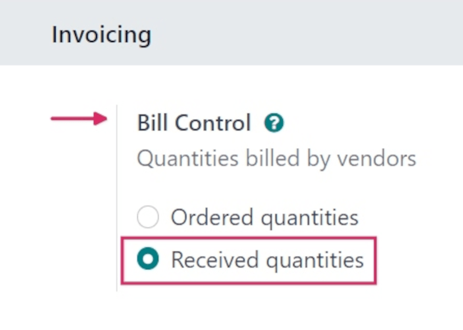
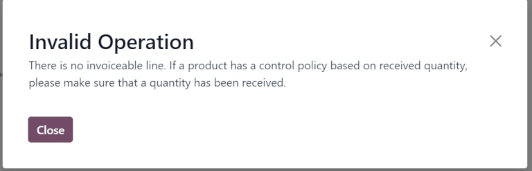
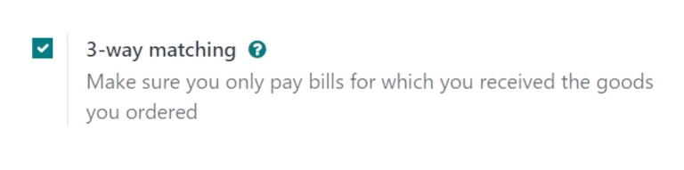
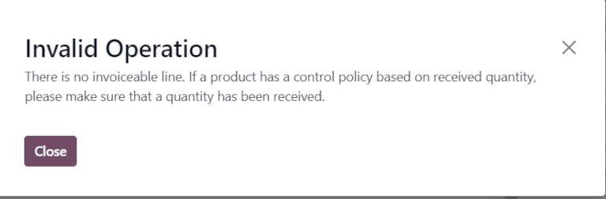
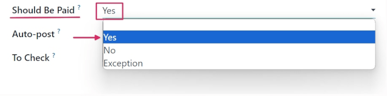
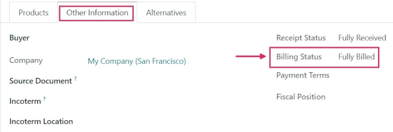

# Bill control policies

In Odoo's *Purchase* app, the *bill control* policy determines the quantities billed by vendors on
every purchase order (PO), for either ordered or received quantities.

The policy selected in the *Purchase* app settings acts as the default value, and is applied to any
new product created.

## Cấu hình

To configure the *bill control* policy, navigate to Purchase app ‣ Configuration
‣ Settings, and scroll down to the Invoicing section. Under Bill Control,
select either Ordered quantities or Received quantities. Then, click
Save.

- Ordered quantities: creates a vendor bill as soon as a  is confirmed. The products
  and quantities in the  are used to generate a draft bill.
- Received quantities: a bill is created only *after* part of the total order has been
  received. The products and quantities received are used to generate a draft bill. An error message
  appears if creation of a vendor bill is attempted without receiving anything.
  

#### NOTE
If a specific product should use a different control policy than selected in the *Purchase* app
settings, the Bill Control policy for that product can be changed from its product
form.

To do that, navigate to Purchase app ‣ Products ‣ Products, and select a
product. From the product form, click the Purchase tab. Under the Vendor
Bills section, modify the selection in the Control Policy field.

## Đối chiếu 3 bước

The *3-way matching* feature ensures vendor bills are only paid once some (or all) of the products
included in the  have been received.

To activate *3-way matching*, navigate to Purchase app ‣ Configuration ‣
Settings, and scroll down to the Invoicing section. Then, tick the checkbox for
3-way matching to enable the feature, and click Save.

#### IMPORTANT
The 3-way matching feature **only** works with the Bill Control policy
set to Received quantities.

### Pay vendor bills with 3-way matching

When *3-way matching* is enabled, vendor bills display a Should Be Paid field under the
Other Info tab. When a new vendor bill is created, the field is set to Yes,
since a bill **cannot** be created until at least some of the products included in a  have been
received.

Để tạo hóa đơn mua hàng từ , hãy đi đến Ứng dụng Mua hàng ‣ Đơn hàng ‣ Đơn mua hàng. Từ trang Đơn mua hàng, chọn  mong muốn từ danh sách. Sau đó, nhấp Tạo hóa đơn. Thao tác này sẽ mở biểu mẫu Hóa đơn mua hàng mới ở trạng thái Nháp. Nhấp vào tab Thông tin khác và tìm trường Nên thanh toán.

#### IMPORTANT
The  selected from the list **must not** be billed yet, or an Invalid Operation
pop-up window appears. This occurs for  with a Received quantities policy, and a
Fully Billed Billing Status.

Click the drop-down menu next to Should Be Paid to view the available options:
Yes, No, and Exception.

#### NOTE
If the total quantity of products from a  has not been received, Odoo only includes the
products that *have* been received in the draft vendor bill.

Draft vendor bills can be edited to increase the billed quantity, change the price of the products
in the bill, and add additional products to the bill.

If the draft bill's information is changed, the Should Be Paid field status is set to
Exception. This means that Odoo notices the discrepancy, but does not block the changes
or display an error message, since there might be a valid reason for making changes to the draft
bill.

To process the vendor bill, select a date in the Bill Date field, and click
Confirm, followed by Register Payment.

This opens a Register Payment pop-up window. From this window, accounting information is
pre-populated based on the database's accounting settings. Click Create Payment to
process the vendor bill.

Once payment has been registered for a vendor bill, and the bill displays the green Paid
banner, the Should Be Paid field status is set to No.

## View a purchase order's billing status

Once a  is confirmed, its Billing Status can be viewed under the Other
Information tab on the  form.

To view the Billing Status of a , navigate to Purchase app ‣
Orders ‣ Purchase Orders, and select a  to view.

Click the Other Information tab, and locate the Billing Status field.

The table below details the different values the Billing Status field could read, and
when they are displayed, depending on the *Bill Control* policy used.

| Trạng thái thanh toán      | Theo số lượng đã nhận                          | Theo số lượng đã đặt   |
|----------------------------|------------------------------------------------|------------------------|
| Không có gì để lập hoá đơn | PO confirmed; no products received             | *Not applicable*       |
| Chờ hoá đơn                | All/some products received; bill not created   | PO confirmed           |
| Đã thanh toán hết          | All/some products received; draft bill created | Draft bill created     |

#### SEE ALSO
[Manage vendor bills](applications/inventory_and_mrp/purchase/manage_deals/manage.md)
