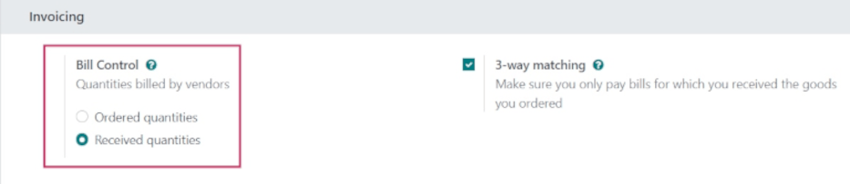
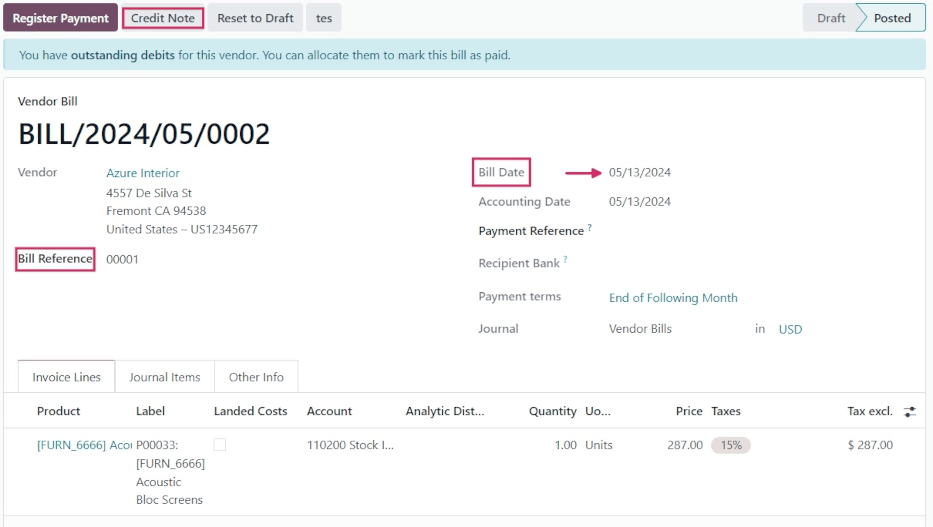
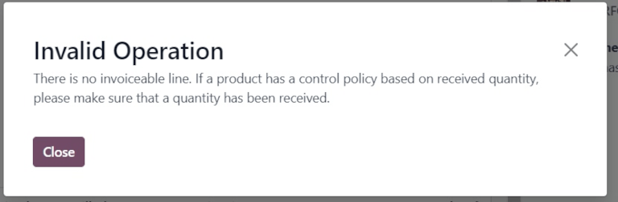
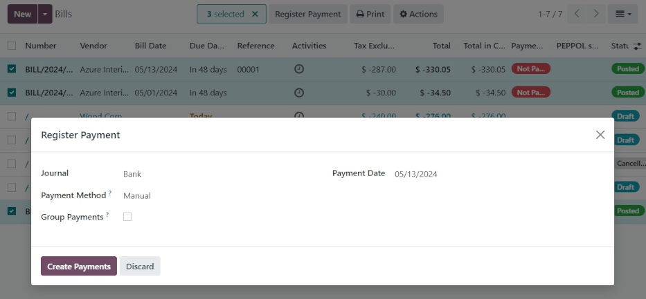

# Manage vendor bills

A *vendor bill* is an invoice received for products and/or services purchased by a company from a
vendor. Vendor bills record payables as they arrive from vendors, and can include amounts owed for
the goods and/or services purchased, sales taxes, freight and delivery charges, and more.

In Odoo, a vendor bill can be created at different points in the purchasing process, depending on
the *bill control* policy chosen in the *Purchase* app's settings.

## Bill control policies

To configure the default bill control policy, navigate to Purchase app ‣
Configuration ‣ Settings, and scroll to the Invoicing section.

The Bill Control feature lists two policy options: Ordered quantities and
Received quantities.

The policy selected acts as the default for any new product created. Each policy acts as follows:

- Ordered quantities: creates a vendor bill as soon as a purchase order is confirmed.
  The products and quantities in the purchase order are used to generate a draft bill.
- Received quantities: a bill is only created **after** all (or part) of the total order
  has been received. The products and quantities received are used to generate a draft bill.

Once a policy is selected, click Save to save the changes.

### Đối chiếu 3 bước

The *3-way matching* policy ensures vendor bills are only paid once all (or some) products in a
purchase order (PO) have been received.

To activate 3-way matching, navigate to Purchase app ‣ Configuration ‣
Settings, and scroll to the Invoicing section.

Tick the checkbox next to 3-way matching, and click Save.

#### IMPORTANT
The 3-way matching feature is **only** intended to work with the Bill
Control policy set to Received quantities.

## Create and manage vendor bills on receipts

When products are received into a company's warehouse, receipts are created. Once the company
processes the received quantities, they can choose to create a vendor bill directly from the
warehouse receipt form.

Depending on the bill control policy chosen in the settings, vendor bill creation is completed at
different steps of the procurement process.

### Số lượng đã đặt

To create and manage vendor bills for receipts with the *Bill Control* policy set to *Ordered
Quantities*, first navigate to the Purchase app, and click New from the
Requests for Quotation dashboard.

Doing so opens a new Request for Quotation (RfQ) form. On the blank  form, add a
Vendor, and click Add a line under the Product tab to add
products to the order.

On the product line, select a product from the drop-down menu in the Product field, and
enter the quantity to order in the Quantity field.

Once ready, click Confirm Order to confirm the  into a .

Then, click Create Bill to create a vendor bill. This opens a Vendor Bill
form in the Draft state. From here, add a billing date in the Bill Date
field.

Once ready, confirm the bill by clicking Confirm on the Vendor Bill page.

Once a payment has been received, click Register Payment at the top of the bill to
record it.

Doing so causes a Register Payment pop-up window to appear, wherein a payment
Journal can be chosen, and a Payment Method selected.

Additionally, the bill Amount, Payment Date, and Memo
() can be edited from this pop-up window, if necessary.

Once ready, click Create Payment to finish creating the Vendor Bill. Doing
so displays a green Paid banner on the  form.

### Số lượng đã nhận

To create and manage vendor bills for receipts with the bill control policy set to *Received
quantities*, first navigate to the Purchase app, and click New.

Doing so opens a new  form. On the blank  form, add a Vendor, and click
Add a line under the Product tab to add products to the order.

On the product line, select a product from the drop-down menu in the Product field, and
enter the quantity to order in the Quantity field.

Once ready, click Confirm Order to confirm the  into a .

#### IMPORTANT
When using the *Received quantities* control policy, clicking Create Bill before any
products are received causes an Invalid Operation pop-up window to appear.

Odoo requires at least partial quantities of the items included in the  to be received in
order to create a vendor bill.

On the , click the Receipt smart button to view the warehouse receipt form.

From here, click Validate to register the Done (received) quantities.

Then, navigate back to the , via the breadcrumb, and click Create Bill.

This opens a Vendor Bill form in the Draft state. From here, add a billing
date in the Bill Date field. Once ready, confirm the bill by clicking
Confirm at the top of the draft.

Once a payment has been received, click Register Payment at the top of the bill to
record it.

Doing so causes a Register Payment pop-up window to appear, wherein a payment
Journal can be chosen, and a Payment Method selected.

Additionally, the bill Amount, Payment Date, and Memo
() can be edited from this pop-up window, if necessary.

Once ready, click Create Payment to finish creating the Vendor Bill. Doing
so displays a green Paid banner on the  form.

## Manage vendor bills in Accounting

Vendor bills can also be created directly from the *Accounting* app, without having to create a
purchase order first.

Navigate to Accounting app ‣ Vendors ‣ Bills, and click New. Doing
so reveals a blank Vendor Bill form.

Add a vendor in the Vendor field. Then, in the Invoice Lines tab, click
Add a line to add products.

Select a product from the drop-down menu in the Product field, and enter the quantity to
order in the Quantity field.

Select a Bill Date, and configure any other necessary information. Finally, click
Confirm to confirm the bill.

Once confirmed, click the Journal Items tab to view the Account journals.
These journals are populated based on the configuration on the corresponding Vendor and
Product forms.

If necessary, click Credit Note to add a credit note to the bill. Additionally, a
Bill Reference number can be added.

Once ready, click Register Payment, followed by Create Payment, to complete
the Vendor Bill.

## Batch billing

Vendor bills can be processed and managed in batches in the *Accounting* app.

Navigate to Accounting app ‣ Vendors ‣ Bills. Then, click the
checkbox in the top-left corner, beside the Number column, under the
New button.

This selects all existing vendor bills with a Status of Posted or
Draft.

Click the <i class="fa fa-print"></i> Print button to print the selected invoices or bills.

Click Register Payment to create and process payments for multiple vendor bills at once.

#### NOTE
Only payments with their Status listed as Posted can be billed in
batches. Payments in the Draft stage **must** be posted before they can be included
in a batch billing.

Clicking Register Payment opens a Register Payment pop-up window. From the
pop-up window, select the Journal the bills should post to, choose a Payment
Date, and select a Payment Method.

There is also the option to Group Payments together from this pop-up window, as well. If
this checkbox is ticked, only one payment is created, instead of one per bill. This option only
appears if the *Batch Payments* feature is enabled in the settings of the
Accounting app.

Once ready, click the Create Payment button. This creates a list of journal entries on a
separate page. The journal entries on this list are all tied to their corresponding vendor bills.

#### SEE ALSO
[Bill control policies](control_bills.md)
