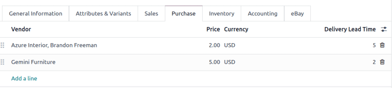
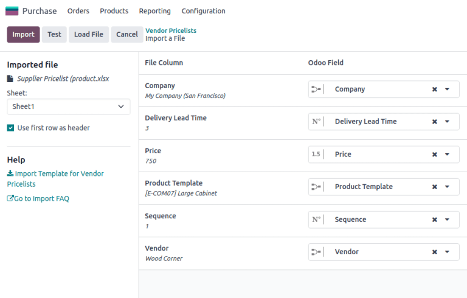

# Import vendor pricelist

Set vendor prices to auto-populate requests for quotations (RFQs) or purchase orders (POs) with the
unit price, once the product is added, which reduces errors and saves time.

In Odoo, vendor pricelists can be [added individually](#purchase-products-pricelist) on the
product form, or [imported in bulk](#purchase-products-import-pricelist), via an XLSX or CSV
file.

#### IMPORTANT
Please review this [import guide](../../../essentials/export_import_data.md) before uploading
vendor pricelists.

## On product form

To manually add the vendor price on the product form, go to the Purchase app ‣
Products ‣ Products, and click the desired product.

#### NOTE
Product forms are accessible from multiple apps, such as **Sales**, **Inventory**, and
**Manufacturing**.

In the Purchase tab of the product form, input the vendor and their price, to have this
information auto-populate on a request for quotation each time the product is listed.

#### SEE ALSO
[Vendor pricelist on product form](../manage_deals/rfq.md#purchase-manage-deals-vendor-pricelist)

## Import vendor pricelist

To import vendor pricelists, ensure the XLSX or CSV file is accurately completed. The best way to
obtain a correctly formatted template, including product names, references, and vendor details, is
to first [export a pricelist](#purchase-products-export-price) from the database.

Modify the exported file, as needed, then import it back into the Odoo database.

### Export pricelist

To export a pricelist, go to Purchase app ‣ Configuration ‣ Vendor Pricelists.

On the page, tick the checkbox(es) for the desired vendor pricelists.

Then, click the <i class="fa fa-cog"></i> Actions button that appears, and choose <i class="fa fa-upload"></i>
Export from the drop-down menu.

In the resulting pop-up window, fields listed under the Fields to export section are
included in the exported file. To add more fields, find the desired field in the
Available fields section, and click the <i class="fa fa-plus"></i> (plus) icon to the
right of the field.

#### NOTE
To update to existing records, tick the I want to update data (import-compatible
export) checkbox, and refer to the section on the [External ID](#purchase-products-external-id) field.

For details on commonly-used fields for importing vendor pricelists, see the [Common fields](#purchase-products-common-fields) section.

Select the desired Export Format: XLSX or CSV.

To save the selected fields as a template, click the Template field, and select
New template from the drop-down menu. Type the name of the new template, and click the
<i class="fa fa-floppy-o"></i> (save) icon. After that, the template is a selectable option when
clicking the Template field.

Finally, click Export.

#### NOTE
With [developer mode](../../../general/developer_mode.md#developer-mode) turned on, the column names of the exported file
display the *field name* with the *technical name* in parenthesis.

#### ID ngoài

*External ID* is a unique identifier used to update existing vendor pricelists. Without it, imported
records create new entries, instead of updating existing ones. Including this field in the XLSX or
CSV, indicates the line replaces an existing vendor pricelist in the Odoo database.

To look-up the External ID for a vendor pricelist, tick the I want to update
data (import-compatible export) checkbox at the top of the Export Data pop-up window.

#### NOTE
Selecting External ID from the Available fields section with the
I want to update data (import-compatible export) checkbox ticked results in an export
file with two columns containing the external ID.

#### Common fields

Below is a list of commonly-used fields when importing vendor pricelists:

#### Field name definitions

| Field name                                     | Used for                                                                                                                                                                                                  | Field in Odoo database                                                                                                                                                          | Technical name of field   |
|------------------------------------------------|-----------------------------------------------------------------------------------------------------------------------------------------------------------------------------------------------------------|---------------------------------------------------------------------------------------------------------------------------------------------------------------------------------|---------------------------|
| Nhà cung cấp                                   | The only required field for creating a vendor pricelist record. This field specifies the vendor associated with the product.                                                                          | Vendor field in the [vendor pricelist of the product form](#purchase-products-pricelist).                                                                                       | `partner_id`              |
| Mẫu sản phẩm                                   | The Odoo product the vendor pricelist entry is related to.                                                                                                                                                | Product field in the vendor pricelist.                                                                                                                                          | `product_tmpl_id`         |
| Số lượng                                       | The minimum quantity required to receive the product at the specified price.                                                                                                                              | Quantity field in the vendor pricelist. (If not visible, enable it by clicking the <i class="oi oi-settings-adjust"></i> (adjust) icon, and tick the Quantity checkbox) | `min_qty`                 |
| Đơn giá                                        | The purchase price for the product from the vendor.                                                                                                                                                       | Price field in the vendor pricelist.                                                                                                                                            | `price`                   |
| Thời gian giao hàng                            | [Number of days](../../inventory/warehouses_storage/replenishment/lead_times.md#inventory-warehouses-storage-purchase-lt) before receiving the product after confirming a purchase order.             | Delivery Lead Time field on the vendor pricelist.                                                                                                                               | `delay`                   |
| Trình tự                                       | Defines the order of vendors in the pricelist when multiple vendors are available. For example, if `Azure Interior` is listed first and Wood Corner second, their sequences would be `1` and `2`. | N/A                                                                                                                                                                             | `sequence`                |
| Công ty                                        | Name of company the product belongs to.                                                                                                                                                                   | Company field in the vendor pricelist.                                                                                                                                          | `company_id`              |
| [ID bên ngoài](#purchase-products-external-id) | Unique ID of a record used to update existing vendor pricelists.                                                                                                                                          | N/A                                                                                                                                                                             | `id`                      |

### Nhập bản ghi

With a template downloaded, fill out the XLSX or CSV file with the necessary information. After
inputting everything, import the file back into the Odoo database, by going to
Purchase app ‣ Configuration ‣ Vendor Pricelists.

On the page, click the <i class="fa fa-cog"></i> (gear) icon in the top-left corner. In the
drop-down menu that appears, click Import records.

Then, click Upload File in the upper-left corner, and after selecting the XLSX or CSV
file, confirm the correct fields, and click Import.

#### SEE ALSO
- [Xuất và nhập dữ liệu](../../../essentials/export_import_data.md)
- [Common fields](#purchase-products-common-fields)

#### Formatting import file

To understand how to format import files for vendor pricelists, consider the following example.

- `Storage Box` (Reference: `E-COM08`) is sold by `Wood Corner` for `$10`.
- `Large Desk` (Reference: `E-COM09`) has no records in the vendor pricelist.

An import file is created to do the following:

- Update the price for `Wood Corner` from `$10` to `$13`.
- Add pricelist for `Storage Box`: the vendor, `Ready Mat` intends to sell the product for `$14`.
- Add pricelist for `Large Desk`: vendor is `Wood Corner`, price is `$1299`.
- Add pricelist for `Large Desk`: vendor is `Azure Interior`, price is `$1399`.

#### Vendor pricelist data

| id                             | company_id                 |   delay | price   | product_tmpl_id       |   trình tự | partner_id     |
|--------------------------------|----------------------------|---------|---------|-----------------------|------------|----------------|
| product.product_supplierinfo_3 | My Company (San Francisco) |       3 | 13,00   | [E-COM08] Storage Box |          4 | Wood Corner    |
|                                | My Company (San Francisco) |       3 | 14,00   | [E-COM08] Storage Box |          5 | Ready Mat      |
|                                | My Company (San Francisco) |       2 | 1299,00 | [E-COM09] Large Desk  |          6 | Wood Corner    |
|                                | My Company (San Francisco) |       4 | 1399,00 | [E-COM09] Large Desk  |          7 | Azure Interior |

#### NOTE
The *technical field name* was used to create this information.

#### NOTE
Download the sample files for reference:

- [`Sample XLSX import file`](pricelist/pricelist-example.xlsx)
- [`Sample CSV import file`](pricelist/pricelist-example.csv)
