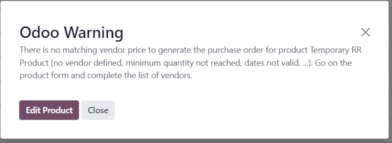

# Temporary reordering rules

Some businesses require certain products to always have a minimum quantity of stock on-hand at any\
given time. To avoid stock falling below a certain threshold, companies can create _reordering_\
_rules_ in Odoo to automate purchase orders for specific products.

Reordering rules keep the forecasted stock levels above a certain threshold, without exceeding a\
specified upper limit, or maximum amount. When a product with a reordering rule falls below a\
specified quantity, Odoo generates an order using the specified _route_ (e.g. _Buy_ o&#x72;_&#x4D;anufacture_) to replenish the stock.

In certain cases, businesses might opt for _temporary reordering rules_ when they do not want\
specific products to be replenished automatically.

In Odoo, a "temporary" reordering rule is created in the replenishment dashboard when a product:

1. is configured with a _Buy_ route
2. has no reordering rule configured
3. has `0` quantity in stock
4. is included in a sales order (SO).

This rule is deleted upon confirmation of the purchase order (PO) generated for the product.

#### SEE ALSO

* [Quy tắc tái đặt hàng](applications/inventory_and_mrp/inventory/warehouses_storage/replenishment/reordering_rules.md)
* [Configure reordering rules](applications/inventory_and_mrp/purchase/products/reordering.md)

## Cấu hình

To configure a product that triggers temporary reordering rules when its stock reaches `0`, begin by\
going to Inventory app ‣ Products ‣ Products, and click New.

#### NOTE

The same configurations can also be made on an existing product, by going to\
Inventory app ‣ Products ‣ Products, and selecting an existing product.

On the product form, enter the product name, and ensure the Can be Sold and\
Can be Purchased options are enabled, located beneath the Product Name\
field.

Then, set the Product Type to `Storable Product`, under the General\
Information tab.

Next, click the Purchase tab, and under Vendor, click Add a line\
to select a vendor from the drop-down menu. Then, set a purchase price under Price.

#### IMPORTANT

A vendor **must** be set for temporary reordering rules to work. While a can still be created automatically, attempting to replenish the product from the\
Replenishment dashboard in the _Inventory_ app triggers a warning to add a vendor on\
the product form.

Before creating a for the product, ensure the On Hand smart\
button on the product form reads `0.00 Units`. Then, ensure that the Reordering Rules\
smart button reads `0`, indicating there are no rules applied to this product.

## Trigger temporary reordering rule

To trigger a temporary reordering rule, create a new sales order for a product by navigating to\
Sales app ‣ New.

Then, add a customer in the Customer field, and click Add a product under\
the Product column in the Order Lines tab. Next, select the desired product\
from the drop-down menu. Lastly, Confirm the .

## Check replenishment report

To see the temporary reordering rule created for the out-of-stock product included in the sales\
order, navigate to Inventory app ‣ Operations ‣ Replenishment. Doing so opens\
the Replenishment dashboard.

On this dashboard, locate the product for which the temporary reordering rule was created. On its\
product line, its On Hand quantity, negative Forecast quantity, _Buy_\
Route, and To Order quantity to replenish can be seen.

Additionally, two replenishment options are located to the far-right of the row: Order\
Once and Automate.

To use the one-time, temporary reordering rule, click Order Once. This action triggers a\
confirmation pop-up window in the top-right corner, reading The following replenishment\
order has been generated, along with a new purchase order number.

## Complete purchase order

To view the purchase order created from the Replenishment dashboard, navigate to the\
Purchase app, and select the generated from the\
Requests for Quotation overview.

From here, click Confirm Order, then click Receive Products. Finally, click\
Validate to complete the purchase order.

Now, the original sales order can be delivered and invoiced.

#### NOTE

Once the is delivered and invoiced, ensure there are no reordering rules\
on the product form.

Go to Inventory app ‣ Products ‣ Products, select the product, and confirm\
that the Reordering Rules smart button displays `0`.
