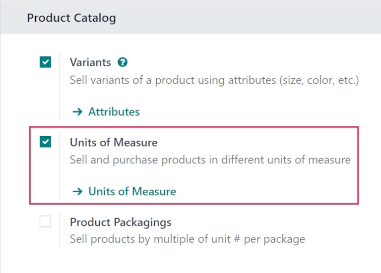
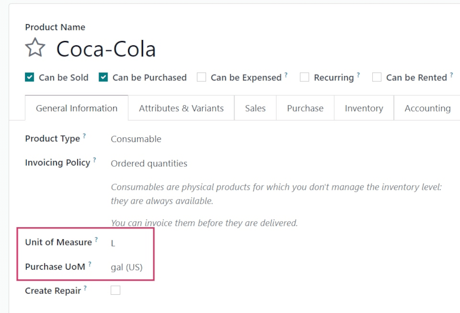
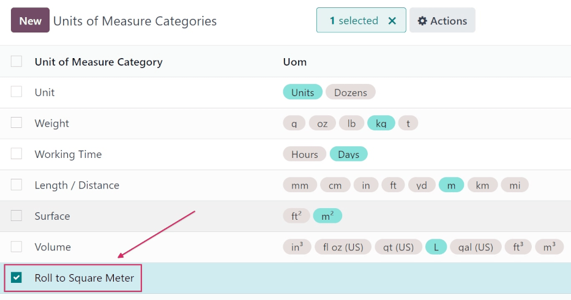
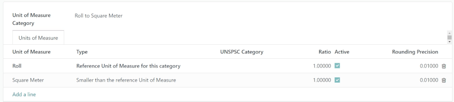
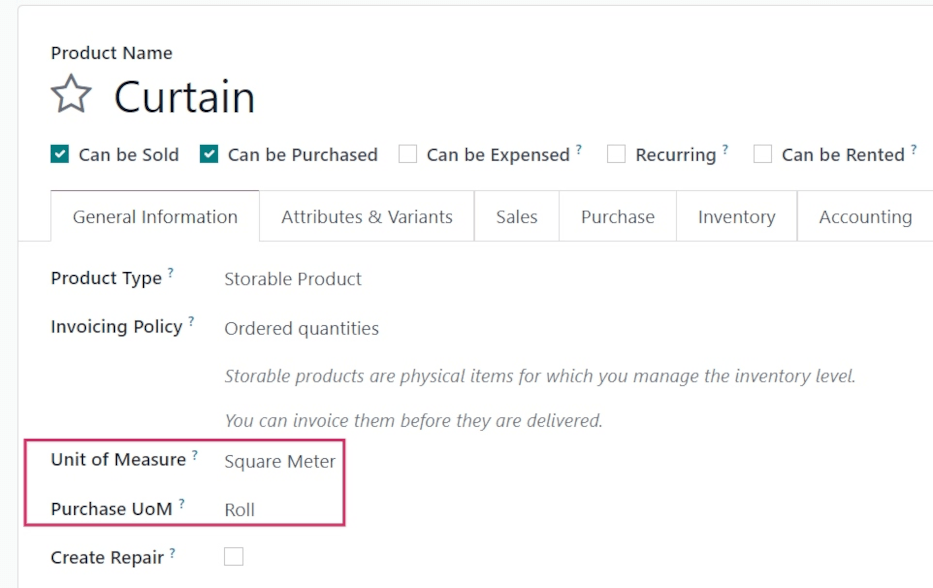

# Purchase units of measure

When you purchase a product, it may happen that your vendor uses a different unit of measure than\
when it is sold. This can cause confusion between sales and purchase representatives. It is also\
time-consuming to convert measures manually every time. With Odoo, you can configure your product\
once and let Odoo handle the conversion.

Consider the following examples:

1. You purchase orange juice from an American vendor, and they use **gallons**. However, your\
   customers are European and use **liters**.
2. You buy curtains from a vendor in the form of **rolls** and you sell pieces of the rolls to your\
   customers using **square meters**.

## Enable units of measure

Open your Sales app and go to Configuration ‣ Settings. Under Product Catalog,\
enable _Units of Measure_.

## Specify sales and purchase units of measure

### Standard units of measure

A variety of units of measure are available by default in your database. Each belongs to one of the\
five pre-configured units of measure categories: _Length / Distance_, _Unit_, _Volume_, _Weight_ an&#x64;_&#x57;orking Time_.

To specify different units of measures for sales and purchases, open the Purchase app and go to\
Products ‣ Products. Create a product or select an existing one. Under the\
product's _General Information_ tab, first select the _Unit of Measure_ to be used for sales (as\
well as for other apps such as inventory). Then, select the _Purchase Unit of Measure_ to be used\
for purchases.

Back to the first example, if you purchase orange juice from your vendor in **gallons** and sell it\
to your customers in **liters**, first select _L_ (liters) as the _Unit of Measure_, and _gal (US)_\
(gallons) as the _Purchase Unit of Measure_, then click on _Save_.

### Create new units of measure and units of measure categories

Sometimes you need to create your own units and categories, either because the measure is not\
pre-configured in Odoo or because the units do not relate with each other (e.g. kilos and\
centimeters).

If you take the second example where you buy curtains from a vendor in the form of **rolls** and you\
sell pieces of the rolls using **square meters**, you need to create a new _Units of Measure_\
_Category_ in order to relate both units of measure.

To do so, go to Configuration ‣ Units of Measure Categories. Click on _Create_\
and name the category.

The next step is to create the two units of measures. To do so, click into the Unit of\
Measure Category field and enter a name for the category. Then, under the Units of\
Measure tab, click Add a line.

First, create the unit of measure used as the reference point for converting to other units of\
measure inside the category. Name the unit, and select the units of measure category you just\
created. For the _Type_, select _Reference Unit of Measure for this category type_. Enter th&#x65;_&#x52;ounding Precision_ you would like to use. The quantity computed by Odoo is always a multiple of\
this value.

In the example, as you cannot purchase less than 1 roll and won't use fractions of a roll as a unit\
of measure, you can enter 1.

#### NOTE

Nếu bạn sử dụng _Độ chính xác làm tròn_ nhỏ hơn 0,01, một cảnh báo có thể xuất hiện để thông báo rằng nó cao hơn _Độ chính xác thập phân_ và có thể gây ra sự không nhất quán. Nếu bạn muốn sử dụng _Độ chính xác làm tròn_ nhỏ hơn 0,01, trước tiên hãy kích hoạt [chế độ lập trình viên](../../../general/developer_mode.md#developer-mode), sau đó đi tới Cài đặt ‣ Kỹ thuật ‣ Cấu trúc cơ sở dữ liệu ‣ Độ chính xác thập phân, chọn _Đơn vị tính sản phẩm_ và chỉnh sửa _Số chữ số_ cho phù hợp. Ví dụ, nếu bạn muốn sử dụng độ chính xác làm tròn là 0,00001, hãy đặt _Số chữ số_ thành 5.

Next, create a second unit of measure, name it, and select the same units of measure category as\
your reference unit. As _Type_, select _Smaller_ or _Bigger than the reference Unit of Measure_,\
depending on your situation.

As the curtain roll equals to 100 square meters, you should select _Smaller_.

Next, you need to enter the _Ratio_ between your reference unit and the second one. If the second\
unit is smaller, the _Ratio_ should be greater than 1. If the second unit is larger, the ratio\
should be smaller than 1.

For your curtain roll, the ratio should be set to 100.

You can now configure your product just as you would using Odoo's standard units of measure.

