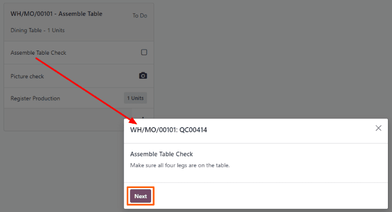

# Instructions quality check

In Odoo *Quality*, an *Instructions* check is one of the quality check types that can be selected
when creating a new quality check or quality control point (QCP). *Instructions* checks consist of a
text entry field that allows the creator to provide instructions for how to complete the check.

For a full overview of how to configure a quality check or a , see the documentation on
[quality checks](../quality_management/quality_checks.md#quality-quality-management-quality-checks) and [quality control points](../quality_management/quality_control_points.md#quality-quality-management-quality-control-points).

## Process an Instructions quality check

There are multiple ways that *Instructions* quality checks can be processed. If a quality check is
assigned to a specific manufacturing, inventory, or work order, the check can be processed on the
order itself. Alternatively, a check can be processed from the check's page.

### Process from the quality check's page

To process an *Instructions* quality check from the check's page, begin by navigating to
Quality ‣ Quality Control ‣ Quality Checks, and select a quality check. Follow
the Instructions for how to complete the check.

If the product passes the check, click the Pass button above the quality check form. If
the product does not pass the check, click the Fail button, instead.

### Process quality check on an order

Để thực hiện kiểm tra chất lượng *Hướng dẫn* trên một đơn hàng, hãy chọn một lệnh sản xuất hoặc phiếu kho (nhập kho, giao hàng, trả hàng,...) cần được kiểm tra. Các lệnh sản xuất có thể được chọn bằng cách đi đến Sản xuất ‣ Hoạt động ‣ Lệnh sản xuất và nhấp vào một lệnh. Các phiếu kho có thể được chọn bằng cách đi đến Tồn kho, nhấp vào nút # Cần xử lý trên thẻ hoạt động và chọn một phiếu.

On the selected manufacturing or inventory order, a purple Quality Checks button appears
above the order. Click the button to open the Quality Check pop-up window, from which
any quality checks created for the order can be processed.

To complete an *Instructions* quality check, follow the instructions detailed in the
Quality Check pop-up window. Finally, click Validate to confirm that the
check has been completed.

If an issue or defect is found during the quality check, a quality alert may need to be created to
notify a quality team. To do so, click the Quality Alert button that appears at the top
of the manufacturing or inventory order after the check is validated.

Clicking Quality Alert opens a quality alert form on a new page. For a complete guide on
how to fill out quality alert forms, view the documentation on [quality alerts](../quality_management/quality_alerts.md#quality-quality-management-quality-alerts).

### Process work order quality check

When configuring a  that is triggered by a manufacturing order, a specific work order can also
be specified in the Work Order Operation field on the  form. If a work order is
specified, an *Instructions* quality check is created for that specific work order, rather than the
 as a whole.

Quality checks configured for work orders **must** be completed from the *Shop Floor* module. To do
so, begin by navigating to Manufacturing ‣ Operations ‣ Manufacturing Orders.
Select an  that includes a work order for which an *Instructions* quality check is required.

On the , select the Work Orders tab, and click the Open Work Order
(square with arrow coming out of it) button on the line of the work order to be processed. On the
resulting Work Orders pop-up window, click the Open Shop Floor button to
open the *Shop Floor* module.

When accessed from a specific work order, the *Shop Floor* module opens to the page for the work
center where the order is configured to be processed, and isolates the work order's card so that no
other cards are shown.

Begin processing the work order's steps until the *Instructions* quality check step is reached.
Click on the step to open a pop-up window that details how to complete the quality check. Once
completed, click the Next button to complete the check, and move on to the next step.

Alternatively, an *Instructions* quality check can be completed by clicking the checkbox that
appears on the right side of the step's line on the work order card. When using this method, the
quality check automatically passes, without a pop-up window appearing.

#### NOTE
For a full guide to the *Shop Floor* module, see the [Shop Floor overview](../../manufacturing/shop_floor/shop_floor_overview.md#manufacturing-shop-floor-shop-floor-overview) documentation.
