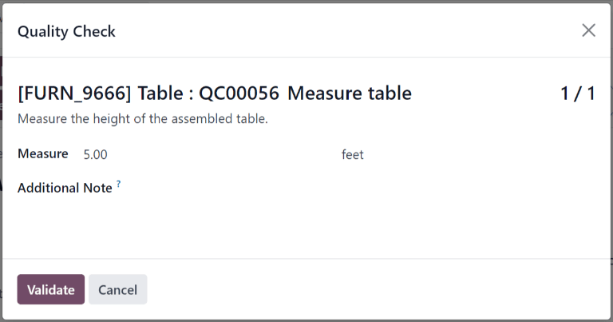

# Measure quality check

Trong Odoo *Chất lượng*, kiểm tra *Chỉ số* là một trong các loại kiểm tra chất lượng có thể chọn khi tạo điểm kiểm soát chất lượng (QCP) mới. Kiểm tra *Chỉ số* yêu cầu người dùng đo đạc một đặc tính sản phẩm và ghi lại kết quả trong Odoo. Để vượt qua kiểm tra, giá trị đo được phải nằm trong *dung sai* cho phép so với giá trị *chuẩn*.

## Create a Measure quality check

There are two distinct ways that *Measure* quality checks can be created. A single check can be
manually created. Alternatively, a  can be configured that automatically creates checks at a
predetermined interval.

This documentation only details the configuration options that are unique to *Measure* quality
checks and . For a full overview of all the configuration options available when creating a
single check or a , see the documentation on [quality checks](applications/inventory_and_mrp/quality/quality_management/quality_checks.md#quality-quality-management-quality-checks) and [quality control points](applications/inventory_and_mrp/quality/quality_management/quality_control_points.md#quality-quality-management-quality-control-points).

### Quality check

To create a single *Measure* quality check, navigate to Quality ‣ Quality Control
‣ Quality Checks, and click New. Fill out the new quality check form as follows:

- In the Type drop-down field, select the Measure quality check type.
- In the Team drop-down field, select the quality team responsible for managing the
  check.
- In the Instructions text field of the Notes tab, enter instructions for
  how the picture should be taken.

### Quality control point (QCP)

To create a  that generates *Measure* quality checks automatically, navigate to
Quality ‣ Quality Control ‣ Control Points, and click New. Fill out
the new  form as follows:

- In the Type drop-down field, select the Measure quality check type. Doing
  so causes two new fields to appear: Norm and Tolerance.
  - Use the first text-entry field of the Norm field to record the ideal measurement
    that the product should conform to. Use the second text-entry field to specify the unit of
    measurement that should be used.
  - The Tolerance field features two sub-fields: from and to.
    Use the from field to specify the minimum acceptable measurement, and the
    to field to specify the maximum acceptable measurement.
- In the Team drop-down field, select the quality team responsible for managing the
  checks created by the .
- In the Instructions text field, enter instructions for how the measurement should be
  taken.

## Process a Measure quality check

Once created, there are multiple ways that *Measure* quality checks can be processed. If a quality
check is assigned to a specific inventory, manufacturing, or work order, the check can be processed
on the order itself. Alternatively, a check can be processed from the check's page.

### From the check's page

To process a *Measure* quality check from the check's page, begin by navigating to
Quality ‣ Quality Control ‣ Quality Checks, and select a quality check. Follow
the Instructions for how to take the measurement.

After taking the measurement, record the value in the Measure field on the quality check
form. To manually pass or fail the check, click Pass or Fail at the top-left
corner of the check.

Alternatively, if the quality check is assigned to a  for which *norm* and *tolerance* values
have been specified, click Measure at the top-left corner of the check instead. Doing so
automatically marks the check as *Passed* if the recorded value is within the specified *tolerance*,
or *Failed* if the value is outside of it.

### On an order

Để thực hiện kiểm tra chất lượng *Chỉ số* trên một đơn hàng, hãy chọn một lệnh sản xuất hoặc phiếu kho (nhập kho, giao hàng, trả hàng,...) cần được kiểm tra. Các lệnh sản xuất có thể được chọn bằng cách đi đến Sản xuất ‣ Hoạt động ‣ Lệnh sản xuất và nhấp vào một lệnh. Các phiếu kho có thể được chọn bằng cách đi đến Tồn kho, nhấp vào nút # Cần xử lý trên thẻ hoạt động và chọn một phiếu.

On the selected manufacturing or inventory order, a purple Quality Checks button appears
at the top of the page. Click the button to open the Quality Check pop-up window, which
shows all of the quality checks required for that order.

To process a *Measure* quality check, measure the product as instructed, then enter the value in the
Measure field on the pop-up window. Finally, click Validate to register the
recorded value.

If the value entered is within the range specified in the Tolerance section of the
, the quality check passes and the pop-up window closes. The rest of the manufacturing or
inventory order can then be processed as usual.

Tuy nhiên, nếu giá trị nhập vào nằm ngoài phạm vi đã chỉ định, một cửa sổ bật lên mới sẽ xuất hiện, có tiêu đề là Kiểm tra chất lượng không thành công. Nội dung của cửa sổ bật lên hiển thị thông báo cảnh báo có nội dung Bạn đã đo # đơn vị và giá trị phải nằm trong khoảng từ # đơn vị đến # đơn vị, cũng như hướng dẫn được nhập vào tab Thông báo nếu không thành công của . Ở cuối cửa sổ bật lên, hai nút sẽ xuất hiện: Điều chỉnh thước đo và Xác nhận thước đo.

If the measurement was not entered correctly and should be changed, select Correct
Measure. Doing so re-opens the Quality Check pop-up window. Enter the corrected
measurement in the Measure field, and then click Validate to complete the
check.

If the measurement was entered correctly, click Confirm Measure instead, and the quality
check fails. Follow any instructions that were listed on the Quality Check Failed pop-up
window.

If a quality alert must be created, click the Quality Alert button that appears at the
top of the manufacturing or inventory order after the check fails. Clicking Quality
Alert opens a quality alert form on a new page.

#### SEE ALSO
For a complete guide on how to fill out the quality alert form, view the documentation on
[quality alerts](applications/inventory_and_mrp/quality/quality_management/quality_alerts.md).

### On a work order

When configuring a  that is triggered during manufacturing, a specific work order can also be
specified in the Work Order Operation field on the  form. If a work order is
specified, a *Measure* quality check is created for that specific work order, rather than the
manufacturing order as a whole.

*Measure* quality checks configured for work orders **must** be completed from the *Shop Floor*
module. To do so, begin by navigating to Manufacturing ‣ Operations ‣
Manufacturing Orders. Select an  that includes a work order for which a *Measure* quality check
is required.

On the , select the Work Orders tab, and click the Open Work Order
(external link icon) button on the line of the work order to be processed. On the resulting
Work Orders pop-up window, click the Open Shop Floor button to open the
*Shop Floor* module.

When accessed from a specific work order, the *Shop Floor* module opens to the page for the work
center where the order is configured to be processed, and isolates the work order's card, so no
other cards are shown.

Process the work order's steps until the *Measure* quality check step is reached. Click on the step
to open a pop-up window that includes instructions for how the measurement should be taken. After
taking the measurement, enter it in the Measure field of the pop-up window, and then
click Validate.

If the measurement entered is within the range specified in the Tolerance section of the
, the quality check passes, and the pop-up window moves on to the next step of the work order.
However, if the measurement entered is outside of the specified range, a new pop-up window appears,
titled Quality Check Failed.

Nội dung cửa sổ bật lên Kiểm tra chất lượng không đạt hiển thị thông báo: Bạn đã tính # đơn vị và nó phải nằm giữa # đơn vị và # đơn vị, cùng với hướng dẫn đã nhập trong tab Thông báo nếu không thành công của . Ở cuối cửa sổ bật lên xuất hiện hai nút: Điều chỉnh chỉ số và Xác nhận chỉ số.

If the measurement was not entered correctly, and should be changed, select Correct
Measure. Doing so opens a new pop-up window, titled Quality Check. Enter the corrected
measure in the Measure field, and then click Validate to complete the check
and close the pop-up window.

If the measurement was entered correctly, click Confirm Measure instead, and the quality
check fails. Follow any instructions that were listed on the Quality Check Failed pop-up
window.

If a quality alert must be created, exit the pop-up window by clicking the X (close)
button in the top-right corner.

Then, click the ⋮ (three vertical dots) button on the bottom-right corner of the work
order card to open the What do you want to do? pop-up window.

On the What do you want to do? pop-up window, select the Create a Quality
Alert button. Doing so opens a blank quality alert form in a new Quality Alerts pop-up
window.

#### SEE ALSO
For a complete guide on how to fill out quality alert forms, view the documentation on
[quality alerts](applications/inventory_and_mrp/quality/quality_management/quality_alerts.md).
