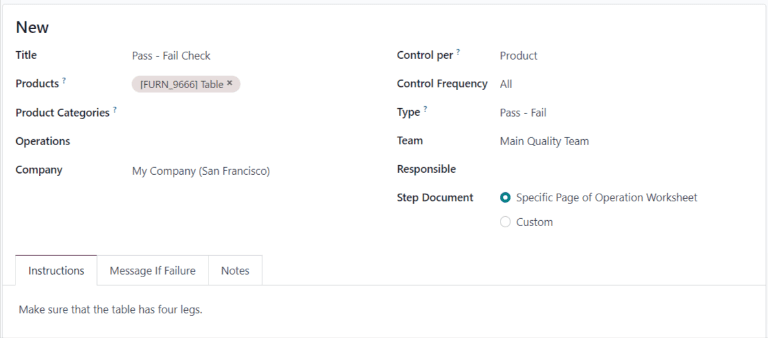
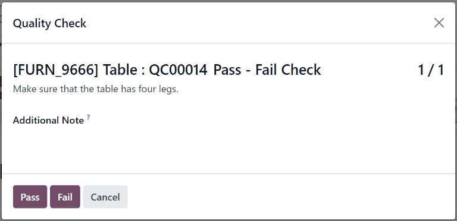

# Pass - Fail quality check

Trong Odoo *Chất lượng*, kiểm tra  *Đạt - Không đạt* là một trong các loại kiểm tra chất lượng có thể chọn khi tạo kiểm tra mới hoặc điểm kiểm soát chất lượng (QCP). Kiểm tra  *Đạt - Không đạt* bao gồm một trường văn bản cho phép người tạo chỉ định tiêu chí cụ thể mà sản phẩm phải đáp ứng để vượt qua kiểm tra.

## Create a Pass - Fail quality check

There are two distinct ways that *Pass - Fail* quality checks can be created. A single check can be
manually created. Alternatively, a  can be configured that automatically creates checks at a
predetermined interval.

This documentation only details the configuration options that are unique to *Pass - Fail* quality
checks and . For a full overview of all the configuration options available when creating a
single check or a , see the documentation on [quality checks](applications/inventory_and_mrp/quality/quality_management/quality_checks.md#quality-quality-management-quality-checks) and [quality control points](applications/inventory_and_mrp/quality/quality_management/quality_control_points.md#quality-quality-management-quality-control-points).

### Quality check

To create a single *Pass - Fail* quality check, navigate to Quality ‣ Quality
Control ‣ Quality Checks, and click New. Fill out the new quality check form as
follows:

- In the Type drop-down field, select the Pass - Fail quality check type.
- In the Team drop-down field, select the quality team responsible for managing the
  check.
- In the Instructions text field of the Notes tab, enter instructions for
  how to complete the quality check and the criteria that must be met for the check to pass.

### Quality Control Point (QCP)

To create a  that generates *Pass - Fail* quality checks automatically, begin by navigating to
Quality ‣ Quality Control ‣ Control Points, and click New. Fill out
the new  form as follows:

- In the Type drop-down field, select the Pass - Fail quality check type.
- In the Team drop-down field, select the quality team responsible for managing the
  checks created by the .
- In the Instructions text field, enter instructions for how to complete the quality
  check and the criteria that must be met for the check to pass.

## Process a Pass - Fail quality check

Once created, there are multiple ways that *Measure* quality checks can be processed. If a quality
check is assigned to a specific inventory, manufacturing, or work order, the check can be processed
on the order itself. Alternatively, a check can be processed from the check's page.

### From the check's page

To process a *Measure* quality check from the check's page, begin by navigating to
Quality ‣ Quality Control ‣ Quality Checks, and select a quality check. Follow
the Instructions for how to complete the check.

If the criteria for the check is met, click the Pass button at the top-left corner of
the page. If the criteria is not met, click the Fail button.

### On an order

Để thực hiện kiểm tra chất lượng  *Đạt - Không đạt* trên một đơn hàng, hãy chọn một lệnh sản xuất hoặc phiếu kho (nhập kho, giao hàng, trả hàng,...) cần được kiểm tra. Các lệnh sản xuất có thể được chọn bằng cách đi đến Sản xuất ‣ Hoạt động ‣ Lệnh sản xuất và nhấp vào một lệnh. Các phiếu kho có thể được chọn bằng cách đi đến Tồn kho, nhấp vào nút # Cần xử lý trên thẻ hoạt động và chọn một phiếu.

On the selected manufacturing or inventory order, a purple Quality Checks button appears
at the top of the order. Click the button to open the Quality Check pop-up window, which
shows all of the quality checks required for that order.

To process a *Pass - Fail* quality check, follow the instructions shown on the Quality
Check pop-up window. If the criteria for the check is met, click the Pass button at the
bottom of the window. If the criteria is not met, click the Fail button.

If a quality alert must be created, click the Quality Alert button that appears at the
top of the manufacturing or inventory order after the check fails. Clicking Quality
Alert opens a quality alert form on a new page.

#### SEE ALSO
For a complete guide on how to fill out quality alert forms, view the documentation on
[quality alerts](applications/inventory_and_mrp/quality/quality_management/quality_alerts.md#quality-quality-management-quality-alerts).

### On a work order

When configuring a  that is triggered during manufacturing, a specific work order can also be
specified in the Work Order Operation field on the  form. If a work order is
specified, a *Pass - Fail* quality check is created for that specific work order, rather than the
manufacturing order as a whole.

*Pass - Fail* quality checks configured for work orders **must** be completed from the *Shop Floor*
module. To do so, begin by navigating to Manufacturing ‣ Operations ‣
Manufacturing Orders. Select an  that includes a work order for which a *Pass - Fail* quality
check is required.

On the , select the Work Orders tab, and then click the Open Work Order
(external link icon) button on the line of the work order to be processed. On the resulting
Work Orders pop-up window, click the Open Shop Floor button to open the
*Shop Floor* module.

When accessed from a specific work order, the *Shop Floor* module opens to the page for the work
center where the order is configured to be processed, and isolates the work order's card so that no
other cards are shown.

Bắt đầu xử lý các bước của công đoạn cho đến khi đạt đến bước kiểm tra chất lượng  *Đạt - Không đạt*. Nhấp vào bước này để mở cửa sổ bật lên chi tiết tiêu chí đánh giá. Nhấp nút Đạt ở dưới cùng cửa sổ nếu kiểm tra đạt yêu cầu, hoặc nút Không đạt nếu kiểm tra không đạt yêu cầu.

If the Pass button is clicked, the pop-up window moves to the next step for the work
order. If the Fail button is clicked, a Quality Check Failed pop-up window
appears, detailing what should be done next.

