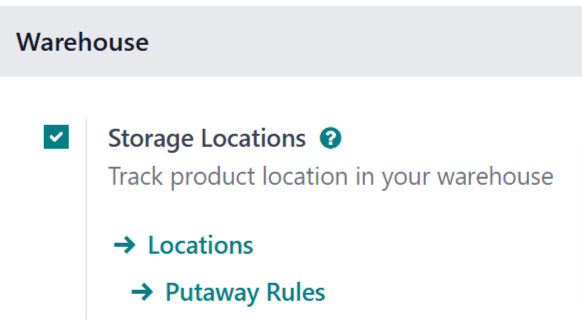
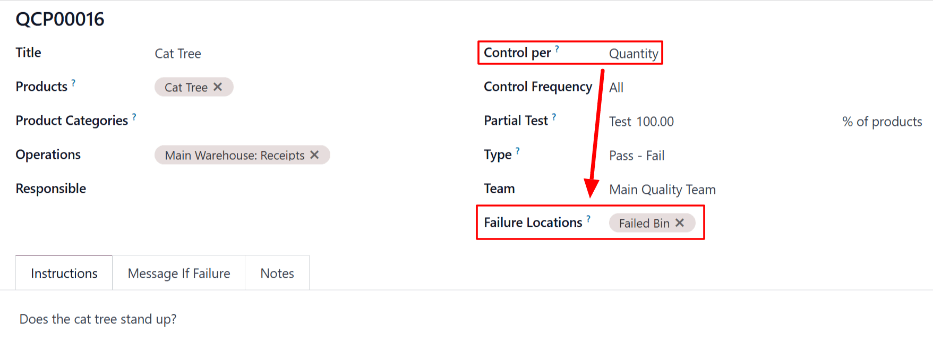
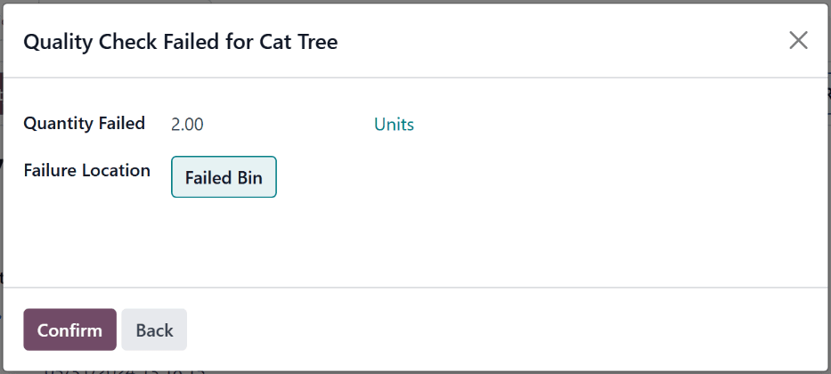

# Failure locations

In Odoo, *quality control points* (QCPs) are used to create *quality checks*, which prompt employees
to confirm the quality of products, when they are included in certain operations. By setting one or
more *failure locations* on a , products that fail the quality checks it creates can be sent to
one of the specified locations.

#### IMPORTANT
The *Failure Location* feature was added in version 17.0 of Odoo, and does **not** appear in any
previous version. To upgrade an Odoo database to a more recent version, see the documentation on
[database upgrades](administration/upgrade.md).

## Cấu hình

To use failure locations, the *Storage Locations* setting **must** be enabled in the settings of the
*Inventory* app. This setting allows for the creation of sub-locations within a warehouse, including
failure locations.

To enable the *Storage Locations* setting, navigate to Inventory app ‣
Configuration ‣ Settings, and tick the checkbox next to Storage Locations, under the
Warehouses heading. Then, click Save.

#### IMPORTANT
Failure locations are most effective when used for products configured as *storable products*.
This is because inventory counts are only tracked for storable products, versus *consumable*
products, for which exact counts are not tracked.

Quality checks can still be created for consumable products, and those products can be sent to a
failure location if they fail a check. However, Odoo does not track the exact quantity of a
consumable product stored at a failure location.

To configure a product as storable, navigate to Inventory app ‣ Products ‣
Products, and select a product. In the Product Type field on the General
Information tab, make sure that Storable Product is selected from the drop-down
menu.

## Add failure location to QCP

To add a failure location to a , navigate to Quality app ‣ Quality Control
‣ Control Points. Select an existing  from the list, or create a new one by clicking
New.

#### NOTE
The following instructions only detail the configuration settings necessary for adding a failure
location to a . For a full overview of  and all of the options available when
configuring them, see the documentation on [quality control points](applications/inventory_and_mrp/quality/quality_management/quality_control_points.md).

In the Control Per field on the  form, select the Quantity option.
Doing so causes a Failure Locations field to appear on the form. This field is only
available when the Quantity option is selected.

In the Failure Locations field, select one or more locations from the drop-down menu. To
create a new location, type the desired location name into the field, and then select
Create "[name]" from the drop-down menu.

## Send products to failure location

Once a  has been configured with one or more failure locations, products that fail a check
created by the  can be routed to one of the locations.

To do so, open an order that requires a quality check created by a  configured with a failure
location. For example, navigate to Inventory app ‣ Operations ‣ Receipts, and
select a receipt.

At the top of the selected order, click the Quality Checks button to open a pop-up
window, from which the quality check can be processed. At the bottom of the pop-up window, click the
Fail button to fail the quality check, which opens a second pop-up window, titled
Quality Check Failed for [Product].

In the Quantity Failed field, enter the quantity of the product that failed to pass the
quality check. In the Failure Location field, select a location to which the failed
quantity should be sent. Then, click Confirm at the bottom of the pop-up window to close
it.

Finally, on the order, click the Validate button at the top of the page. Doing so
confirms the products that failed the quality check were sent to the failure location, while
products that passed it were sent to their normal storage locations.

## View failure location inventory

To view the product quantities stored in a failure location, navigate to Inventory
app ‣ Configuration ‣ Locations. Select a failure location from the list. Then, click the
Current Stock smart button on the location's page.

A failure location's page lists all of the products stored within the location, along with the
quantity of each.
